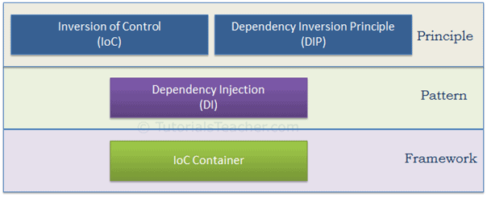
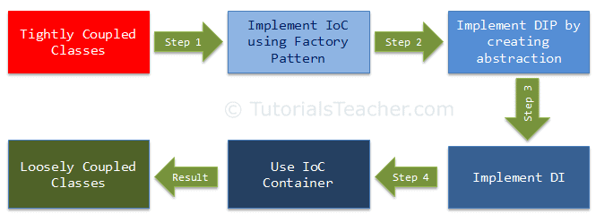
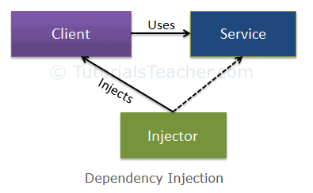

## 术语

- 控制反转(IoC)
- 依赖倒置原则(DIP)
- 依赖注入(DI)
- IoC容器


IoC和DIP是在设计应用程序类时应该使用的高级设计原则。依赖注入(DI)是一种模式，而IoC容器是一个框架。使用控制反转(IoC)、依赖倒置原则(DIP)、依赖注入(DI)就是为了实现松耦合设计，是代码更容易扩展和维护。



使用IOC将高耦合转向低耦合过程




IoC容器是一个用于在整个应用程序中管理自动依赖注入的框架，.net有各种各样的IoC容器，比如Unity, Ninject, StructureMap, Autofac等等。	


### 依赖倒置原则

当一个程序集依赖另一个程序集，一个类需要另一个类协作来完成工作的时候就产生了依赖。

依赖倒置原则是指：高级模块不应该直接依赖于低级模块。两者都应该依赖于抽象。抽象不应该依赖于细节。细节应该依赖于抽象。


### 依赖注入

依赖注入是一种用于实现控制反转的设计模式。它允许在类之外创建依赖对象，并通过不同的方式将这些对象提供给类。使用依赖注入可以将依赖对象的创建和绑定移到依赖它们的类之外。

依赖注入模式涉及3种类型的类

1. Client Class：客户端类(依赖类)是一个依赖于服务类的类。
2. Service Class：服务类(依赖项)是向客户端类提供服务的类。
3. Injector Class：注入器类将服务类对象注入到客户端类中。



注入器类创建了服务类的一个对象，并将该对象注入到客户机对象中。通过这种方式，依赖注入模式将创建服务类对象的责任从客户端类中分离出来。


注入器类将服务(依赖项)注入到客户端(依赖项)。注入器类通过三种方式广泛注入依赖项:通过构造函数、属性或方法。

- 构造函数注入：在构造函数注入中，注入器通过客户端类构造函数提供服务(依赖项)。
- 属性注入：在属性注入(又名Setter注入)中，注入器通过客户端类的公共属性提供依赖关系。
- 方法注入：这种类型的注入，客户端类实现一个接口，该接口声明提供依赖项的方法，注入器使用这个接口向客户端类提供依赖项。


### IoC容器

IoC容器(即依赖注入的容器)是一个用于实现自动依赖注入的框架。它管理对象的创建和生命周期，还向类注入依赖关系。IoC容器创建指定类的对象，并在运行时通过构造函数、属性或方法注入所有依赖项对象，并在适当的时候对其进行配置。这样做，我们就不必手动创建和管理对象。


## .NET Core DI

ASP.NET Core 底层设计支持和使用依赖注入，是轻量级的，默认最小功能集服务，并不取代其他容器。在.NET Core中DI的核心分为两个组件：IServiceCollection和 IServiceProvider。在ASP.NET Core 应用中基于依赖注入的编程主要涉及到两个方面，它们分别是将服务注册到ServiceCollection中，和采用注入的方式利 ServiceProvide 提供我们所需的服务。所在命名空间 using Microsoft.Extensions.DependencyInjection;

- IServiceCollection 负责注册

- IServiceProvider 负责提供实例

ASP.NET Core 应用中注册的服务大体可以分为两种类型，一种是 WebHostBuilder 在创建 WebHost 之前自动注册的服务（框架自动注册的服务），这些服务确保了后续管道能够顺利构建并能提供基本的请求处理能力。另一种则是用户根据自身的需要注册的，如果系统自动注册的服务不符合我们的需求，我们也可以注册自己的服务来覆盖它。

### 注册服务

- 框架自动注册服务

  ```c#
  // 输出框架自动注册服务
  Console.WriteLine("{0,-30}{1,-15}{2}", "Service Type", "Lifetime", "Implementation");
  Console.WriteLine("-------------------------------------------------------------");
  new WebHostBuilder().UseKestrel().Configure(app => { })
      .ConfigureServices(services => {
          IServiceProvider serviceProvider = services.BuildServiceProvider();
          foreach (var svc in services)
          {
              if (svc.ImplementationType != null)
              {
                  Console.WriteLine("{0,-30}{1,-15}{2}", svc.ServiceType.Name, svc.Lifetime, svc.ImplementationType.Name);
                  continue;
              }
              object instance = serviceProvider.GetService(svc.ServiceType);
              Console.WriteLine("{0,-30}{1,-15}{2}", svc.ServiceType.Name, svc.Lifetime, instance.GetType().Name);
          }
      }).Build();
  Console.WriteLine("-------------------------------------------------------------");
  ```

  ```c#
    Service Type                  Lifetime       Implementation
    -------------------------------------------------------------
    WebHostOptions                Singleton      WebHostOptions
    IWebHostEnvironment           Singleton      HostingEnvironment
    IHostEnvironment              Singleton      HostingEnvironment
    IHostingEnvironment           Singleton      HostingEnvironment
    IHostingEnvironment           Singleton      HostingEnvironment
    WebHostBuilderContext         Singleton      WebHostBuilderContext
    IConfiguration                Singleton      ConfigurationRoot
    DiagnosticListener            Singleton      DiagnosticListener
    DiagnosticSource              Singleton      DiagnosticListener
    ActivitySource                Singleton      ActivitySource
    DistributedContextPropagator  Singleton      LegacyPropagator
    IApplicationBuilderFactory    Transient      ApplicationBuilderFactory
    IHttpContextFactory           Transient      DefaultHttpContextFactory
    IMiddlewareFactory            Scoped         MiddlewareFactory
    IOptions`1                    Singleton      UnnamedOptionsManager`1
    IOptionsSnapshot`1            Scoped         OptionsManager`1
    IOptionsMonitor`1             Singleton      OptionsMonitor`1
    IOptionsFactory`1             Transient      OptionsFactory`1
    IOptionsMonitorCache`1        Singleton      OptionsCache`1
    ILoggerFactory                Singleton      LoggerFactory
    ILogger`1                     Singleton      Logger`1
    IConfigureOptions`1           Singleton      DefaultLoggerLevelConfigureOptions
    IServiceProviderFactory`1     Transient      DefaultServiceProviderFactory
    IMultiplexedConnectionListenerFactorySingleton      QuicTransportFactory
    IConnectionListenerFactory    Singleton      SocketTransportFactory
    IConfigureOptions`1           Transient      KestrelServerOptionsSetup
    IServer                       Singleton      KestrelServerImpl
    IStartup                      Singleton      DelegateStartup
    -------------------------------------------------------------
  ```


- 手动注册服务

  ASP.NET Core DI 容器需要在Startup类中配置，ASP.NET Core 框架使用一种约定来注册一组相关服务， 约定使用IServiceCollection 的 `Add{GROUP_NAME}` 扩展方法来注册该框架功能所需的服务。ServiceCollection 即服务集合。


  目前暂时总结以下几种注入方式：

  1. 使用 ServiceDescriptor 注册服务

  2. 以泛型的方式注册服务（推荐）

  3. 以类型的方式注册服务

  4. 以具体实例的方式注册服务

  5. 接管某些服务的实例化过程注册服务

  6. 服务依赖注册

     ```c#
     // Add services to the container.
     builder.Services.AddControllers();
     builder.Services.AddEndpointsApiExplorer();
     builder.Services.AddSwaggerGen();
     
     // 使用 ServiceDescriptor 注册服务
     //builder.Services.Add(new ServiceDescriptor(typeof(IUserService), typeof(UserService), ServiceLifetime.Transient));
     
     // 以泛型的方式注册服务（推荐）
     builder.Services.AddTransient<IUserService, UserService>();
     
     // 以类型的方式注册服务
     builder.Services.AddTransient(typeof(IUserRepository), typeof(UserRepository));
     
     // 接管某些服务的实例化过程注册服务
     //builder.Services.AddSingleton<ITestService>(sp => new TestService("接管某些服务的实例化过程"));
     builder.Services.AddTransient<ITestService, TestService>(sp =>
     {
       ITestService svc = sp.GetService<TestService>();
       return new TestService("接管某些服务的实例化过程");
     });
     
     // 服务依赖注册
     IServiceProvider provider = builder.Services.BuildServiceProvider();
     ITestService testService = provider.GetRequiredService<ITestService>();
     var test1Service = new Test1Service(testService);
     builder.Services.AddSingleton<ITest1Service>(test1Service);// 以具体实例的方式注册服务
     
     var app = builder.Build();
     ```


### 依赖注入

- 构造函数注入

  ```c#
  private readonly IUserService _userService;
  
  public UserController(IUserService userService)
  {
      // 构造函数注入
      _userService = userService;
  }
  
  [HttpGet]
  public IActionResult Users()
  { 
      var users = _userService.GetUsers();
      return Json(users);
  }
  
  ```

- 构造函数注入 IServiceProvider 服务再获取具体服务（不建议）

  ```c#
  [ApiController]
  [Route("api/[controller]")]
  public class TestController : Controller
  {
      private readonly IUserService _userService;
      private readonly IUserService _userService1;
      public TestController(IServiceProvider serviceProvider)
      {
          _userService = serviceProvider.GetService<IUserService>();
          _userService1 = serviceProvider.GetRequiredService<IUserService>();
      }
  
      [HttpGet]
      public IActionResult Users()
      {
          var users = _userService.GetUsers();
          return Json(users);
      }
      [HttpGet("GetById")]
      public IActionResult User(int id)
      {
          var user = _userService1.GetUserById(id);
          return Json(user);
      }
  }
  ```

  如果在使用某个依赖项之前没有注入，GetRequiredService 方法将会抛异常，相反GetService 会返回null。

- 在 Controller Action 中使用内置特性 FromServicesAttribute 注入

  ```c#
  [HttpGet("GetById")]
  public IActionResult User([FromServices] IUserService userService, int id)
  {
      // 在 Controller Action 中使用内置特性 FromServicesAttribute 注入
      var user = userService.GetUserById(id);
      return Json(user);
  }
  ```

- 中间件类型的构造函数和Invoke方法中注入服务

  ```c#
  public class MyMiddleware
  {
      // 中间件类型的构造函数和Invoke方法中注入服务
  
      private readonly RequestDelegate _next;
      private readonly ILogger _logger;
  
      public MyMiddleware(RequestDelegate next, ILogger<MyMiddleware> logger)
      {
          _logger = logger;
          _next = next;
      }
  
      public async Task InvokeAsync(HttpContext context, ITestService testService)
      {
          _logger.LogInformation("Middleware DI Test: " + testService.Msg);
  
          await _next(context);
      }
  }
  public static class MyMiddlewareExtensions
  {
      public static IApplicationBuilder UseMyMiddleware(this IApplicationBuilder builder)
      {
          return builder.UseMiddleware<MyMiddleware>();
      }
  }
  ```

- ASP.NET Core 的标准依赖注入容器不支持属性注入， 可以自定义属性注入特性实现属性注入

  ```c#
  // 属性注入特性
  [AttributeUsage(AttributeTargets.Property, AllowMultiple = false, Inherited = true)]
  public class PropertyFromServiceAttribute : Attribute, IBindingSourceMetadata
  {
      public BindingSource BindingSource => BindingSource.Services;
  }
  ```

  ```c#
  [ApiController]
  [Route("api/[controller]")]
  public class PropertyDITestController : Controller
  {
      // 属性注入
      [PropertyFromService] public IUserService userService { get; set; }
      [PropertyFromService] public ITestService testService { get; set; }
      [PropertyFromService] public ITest1Service test1Service { get; set; }
  
      [HttpGet]
      public IActionResult Users()
      {
          var users = userService.GetUsers();
          Console.WriteLine(testService.Msg);
          test1Service.HelloTest();
          return Json(users);
      }
  }
  ```

- Ｖiew中注入服务

  ```c#
  @inject IFoo Foo
  @inject IBar Baz
  ```

- 批量注入

  待补充。。。

- 通过特性注入

  待补充。。。


demo：

https://github.com/weichangk/DenpendencyInjectionDemo


参考：

https://www.tutorialsteacher.com/ioc

https://docs.microsoft.com/zh-cn/aspnet/core/fundamentals/dependency-injection?view=aspnetcore-5.0

https://www.cnblogs.com/artech/p/di-asp-net-core-pipeline-2.html

https://www.cnblogs.com/viter/p/11085318.html

