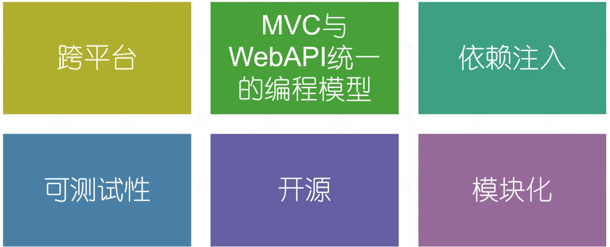
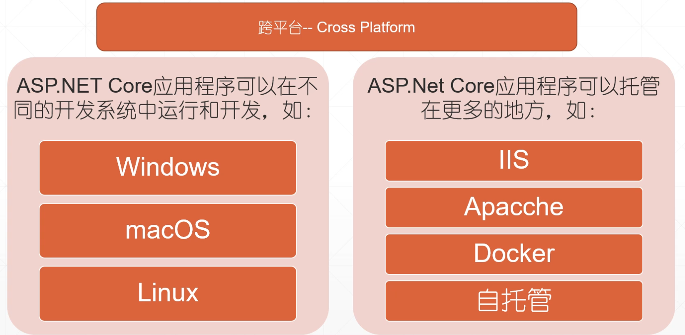
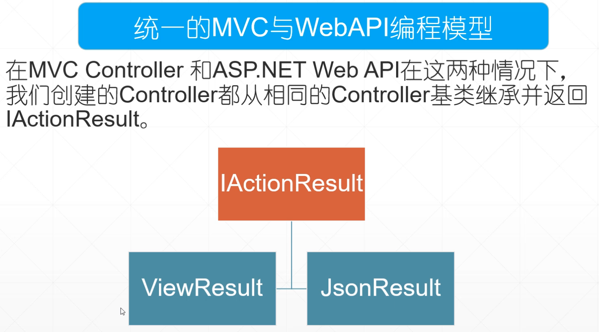
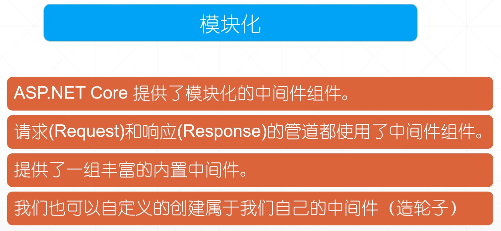
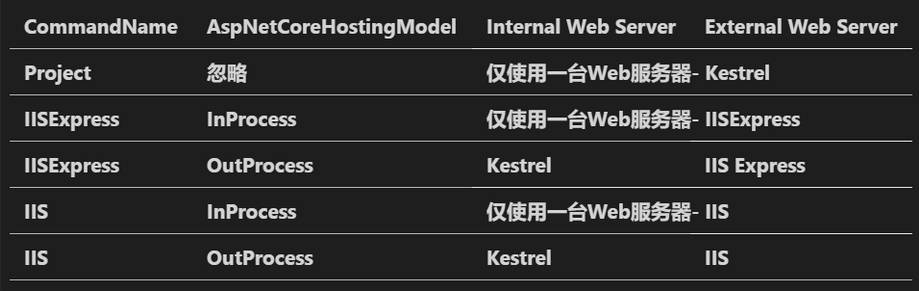
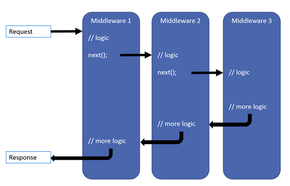
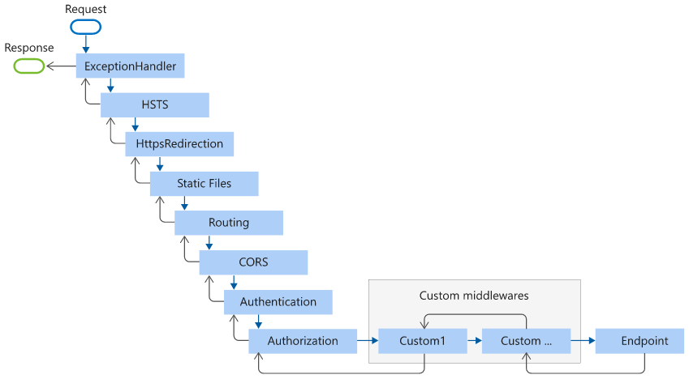
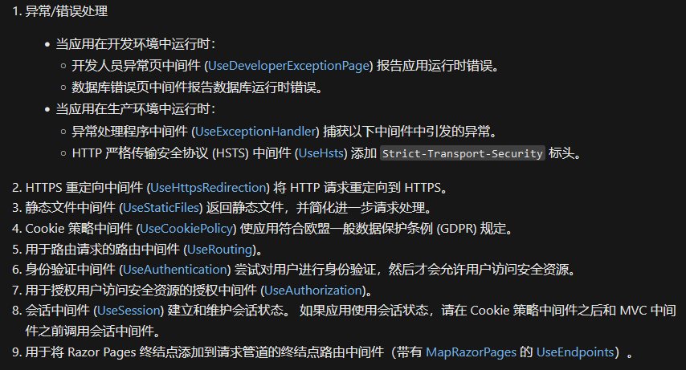

# Asp.Net Core 介绍

Asp.Net Core 是一个跨平台，高性能的开源框架，用于构建基于云连接互联网的应用程序。

https://docs.microsoft.com/zh-cn/aspnet/core/introduction-to-aspnet-core?view=aspnetcore-5.0


**Asp.Net Core 亮点特性**













创建 Asp.Net Core Mvc 项目来了解 ASP.NET Core 基础代码

```shell
dotnet new mvc -lang c# -o StudentManagement --framework NET5.0 
cd .\StudentManagement\
dotnet build
dotnet run
```


# ASP.NET Core 基础

https://docs.microsoft.com/zh-cn/aspnet/core/fundamentals/?view=aspnetcore-5.0&tabs=windows

https://www.cnblogs.com/zh7791/category/1936344.html

# Main 方法

```c#
    public class Program
    {
        public static void Main(string[] args)
        {
            CreateHostBuilder(args).Build().Run();
        }

        public static IHostBuilder CreateHostBuilder(string[] args) =>
            Host.CreateDefaultBuilder(args)
                .ConfigureWebHostDefaults(webBuilder =>
                {
                    webBuilder.UseStartup<Startup>();
                });
    }
```

Main() 方法是应用程序的入口点，配置 Asp.Net Core 应用并启动它。在 Main 方法中可以看到，CreateDefaultBuilder() 方法创建和配置了实现了 IHostBuilder接口的主机生成器对象，在此对象上调用 Build() 方法初始化主机，Run() 方法运行主机后，Asp.Net Core Web 应用程序就开始侦听传入的 HTTP 请求。

https://docs.microsoft.com/zh-cn/aspnet/core/fundamentals/host/generic-host?view=aspnetcore-5.0

# 启动类 Startup

在设置主机时，还使用 IWebHostBuilder 类的 UseStartup() 扩展方法配置启动类。启动类有两种方法

- ConfigureServices() 方法配置应用程序所需的服务（内置的IoC容器）。
- Configure() 方法设置应用程序的请求处理管道（中间件）。

https://docs.microsoft.com/zh-cn/aspnet/core/fundamentals/startup?view=aspnetcore-5.0


# 托管模型

- 在项目文件中使用 AspNetCoreHostingModel 指定应用托管形式

- InProcess 进程内托管，即在IIS工作进程（w3wp.exe）中 托管 Asp.Net Core 应用

- OutOfProcess 进程外托管，Asp.Net Core 应用运行在 Asp.Net Core 内置 Kestrel Web 跨平台服务器


https://docs.microsoft.com/zh-cn/aspnet/core/fundamentals/servers/?view=aspnetcore-5.0&tabs=windows#hosting-models

https://www.cnblogs.com/zh7791/p/14503055.html


launchSettings.json文件的commandName属性值以及应用程序项目文件中的AspNetCoreHostingModel元素值将确定将要使用和处理传入HTTP请求的内部和外部Web服务器（反向代理服务器）



https://www.cnblogs.com/zh7791/p/14505997.html

话说了解托管模式有什么用？？？ 


# 配置

若要在 Startup 类中使用配置信息，需要使用ASP.NET Core框架提供的IConfiguration服务。
因此，只需要通过Startup类的构造函数注入IConfiguration服务后通过IConfiguration对象[xxx]访问即可。

https://docs.microsoft.com/zh-cn/aspnet/core/fundamentals/configuration/?view=aspnetcore-5.0


# 请求处理管道

ASP.NET Core 请求管道包含一系列请求委托，依次调用。每个中间件组件都可以在使用next方法调用下一个组件之前和之后执行一些操作。 中间件组件还可以决定不调用下一个中间件组件，这称为短路请求管道。
asp.net核心中的中间件组件可以访问传入请求和传出响应。
要牢记的最重要的一点是，在Startup类的Configure方法中添加中间件组件的顺序定义了将在请求时调用这些中间件组件的顺序以及对它们的相反顺序。  因此，顺序对于定义应用程序的安全性，性能和功能至关重要。




# 中间件

ASP.NET Core应用程序中的每个中间件组件都执行以下任务。

- 选择是否将 HTTP 请求传递给管道中的下一个组件。这可以通过在中间件中调用下一个 next() 方法实现。
- 可以在管道中的下一个组件之前和之后执行工作。


每当要在任何类型的.net核心应用程序中配置任何中间件组件时，都需要通过在IApplicationBuilder对象上调用Use方法在Startup类的Configure() 方法中对其进行配置。

在ASP.NET Core应用程序中，中间件组件可以访问传入的HTTP请求和传出的HTTP响应。 因此，ASP.NET Core中的中间件组件可以:

- 通过生成HTTP响应来处理传入的HTTP请求。
- 处理传入的HTTP请求，对其进行修改，然后将其传递给下一个中间件组件
- 处理传出的HTTP响应，进行修改，然后将其传递给下一个中间件组件或ASP.NET Core Web服务器。


以下 `Startup.Configure` 方法将为常见应用方案添加中间件组件



```c#
public void Configure(IApplicationBuilder app, IWebHostEnvironment env)
{
    if (env.IsDevelopment())
    {
        app.UseDeveloperExceptionPage();
        app.UseDatabaseErrorPage();
    }
    else
    {
        app.UseExceptionHandler("/Error");
        app.UseHsts();
    }

    app.UseHttpsRedirection();
    app.UseStaticFiles();
    app.UseCookiePolicy();
    app.UseRouting();
    app.UseAuthentication();
    app.UseAuthorization();
    app.UseSession();

    app.UseEndpoints(endpoints =>
    {
        endpoints.MapRazorPages();
    });
}
```



https://docs.microsoft.com/zh-cn/aspnet/core/fundamentals/middleware/?view=aspnetcore-5.0

https://www.cnblogs.com/zh7791/p/14518884.html


自定义中间件

```c#
    public class ExceptionHandleMiddleware
    {
        private readonly RequestDelegate _next;
        private readonly IHostEnvironment _env;
        private readonly ILogger _logger;

        public ExceptionHandleMiddleware(RequestDelegate next, IHostEnvironment env, ILogger<ExceptionHandleMiddleware> logger)
        {
            _next = next;
            _env = env;
            _logger = logger;
        }

        public async Task InvokeAsync(HttpContext httpContext)
        {
            try
            {
                await _next(httpContext);
            }
            catch (Exception ex)
            {
                await HandleExceptionAsync(httpContext, ex);
            }
        }

        private Task HandleExceptionAsync(HttpContext context, Exception exception)
        {
            context.Response.ContentType = "application/json";
            context.Response.StatusCode = (int)HttpStatusCode.InternalServerError;

            var error = _env.IsDevelopment() ? exception.ToString() : exception.Message;

            _logger.LogError(error);

            return context.Response.WriteAsync(JsonHelper.SerializeJSON(ResultModel.Failed(error, 500)));
        }
    }
```

```c#
	app.UseMiddleware<ExceptionHandleMiddleware>();
```


