# RESTful

REST（REpresentational State Transfer）表征性状态转移

RESTful REST风格的


**RESTful 基本特点**

- 无状态
- 面向资源
- 使用 http 动词
- HATOAS 超媒体即应用状态引擎

**RESTful 优缺点**

- 面向对象（资源），如增删查改就很好用
- 面向过程不好用，如登录（动词）
- 颗粒度粗（数据塑性）

RESTful 并不是万金油，他只是一种设计风格，指导性原则，一种代码的风格


RESTful api 范例

- https://developer.github.com/v3/


# RESTful 6约束与最佳实现

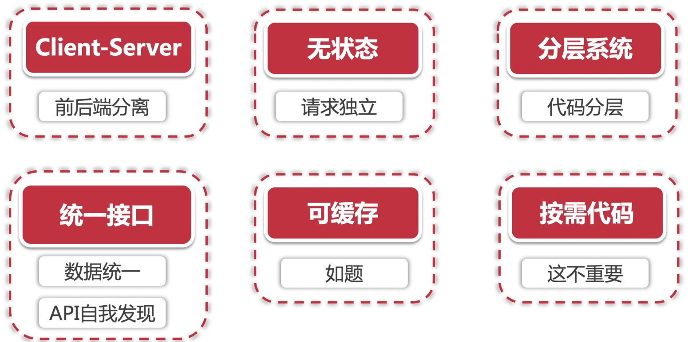


大部分后端服务都不会100%满足这六个约束，RESTful是一种架构风格，但不是 api 设计的标准。


# HTTP请求方法与资源交互

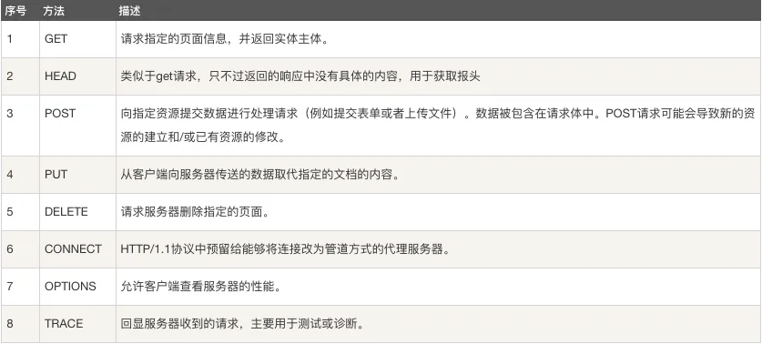


# Richardson成熟度模型与HATOAS（超媒体即应用引擎）

**参考**

- https://martinfowler.com/articles/richardsonMaturityModel.html
- https://blog.csdn.net/dm_vincent/article/details/51341037


**RESTful成熟度**

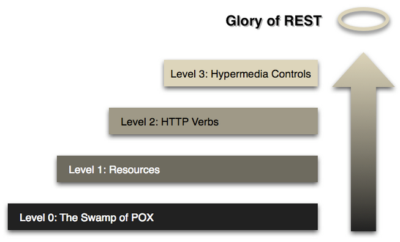


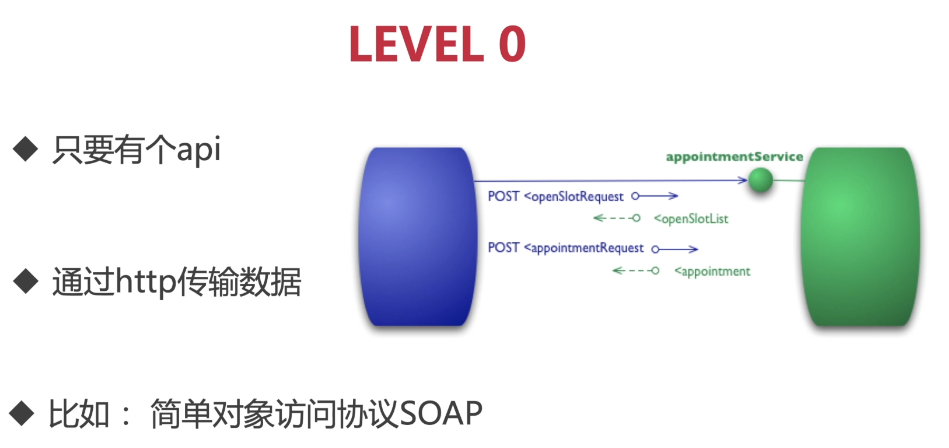


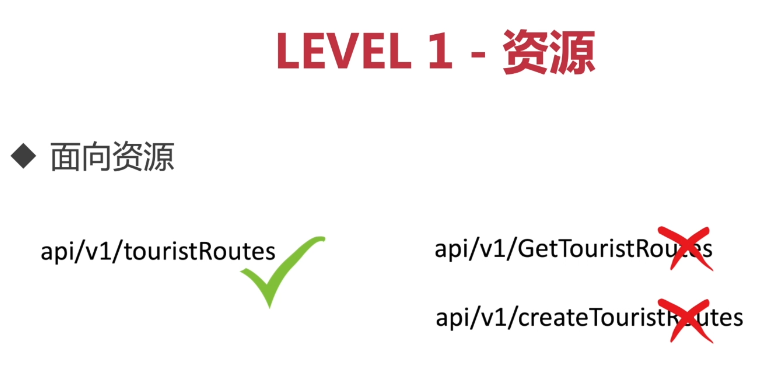


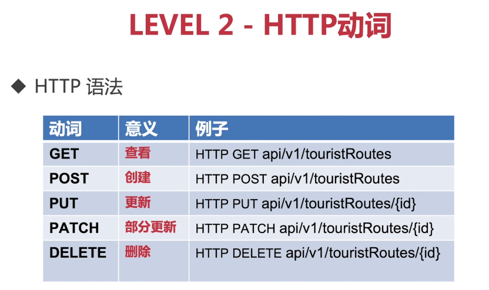


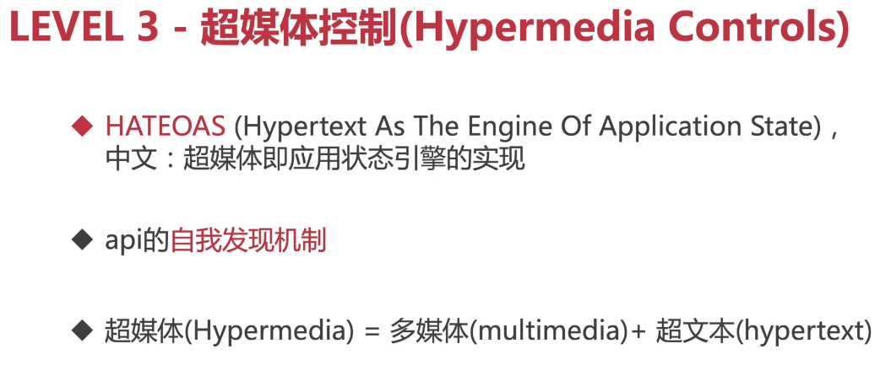


# Http 状态码

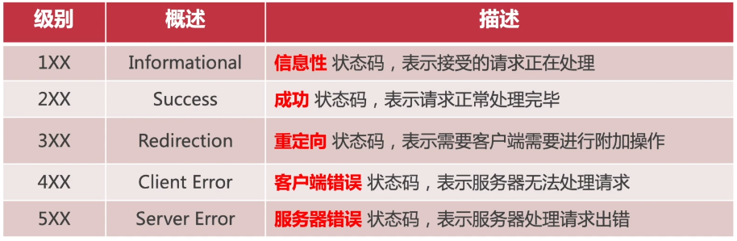


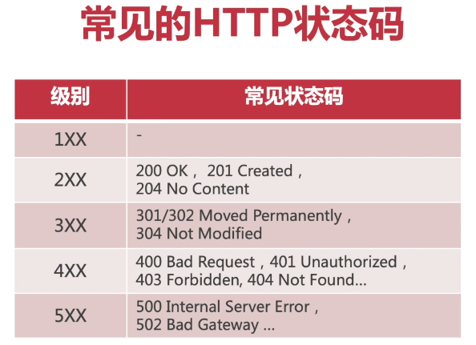


# 内容协商

允许客户端和服务器通过协商来决定相互之间的数据传输格式

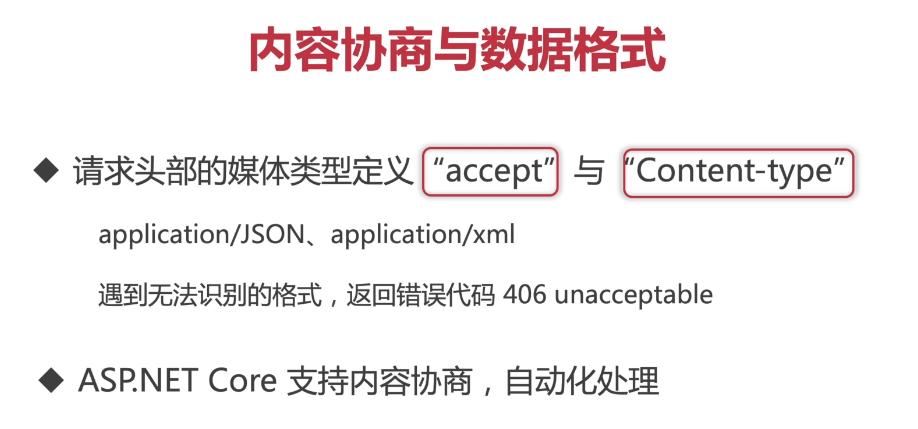


添加支持 xml 格式

```
services.AddControllers( setupAction =>{
	setupAction.RespectBrowserAcceptHeader = true;
}).AddXmlDataContractSerializerFormatters();
```


# 向 api 传入参数

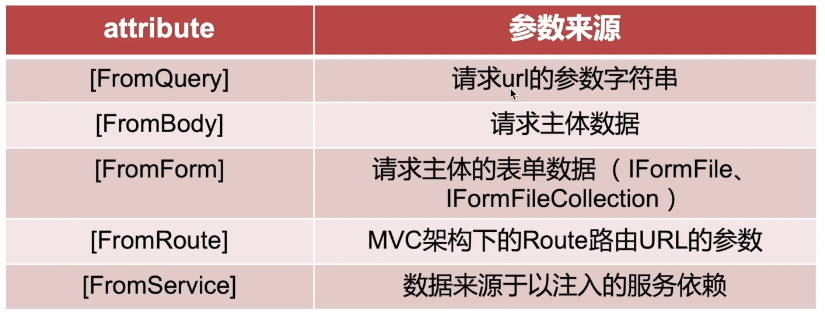


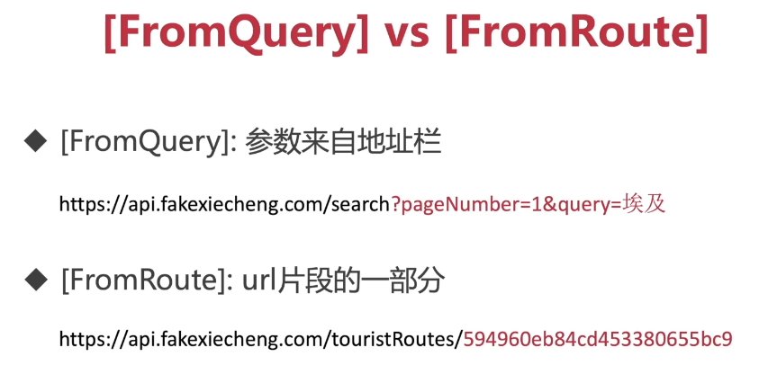


# 封装资源过滤器


# mvc 与 webapi

webapi 是基于 asp.net core mvc 框架的，mvc 框架不仅可以创建 api 还可以创建复杂的基于 razor 页面的全后端统一的网站


**什么是 mvc**

- 软件工程的架构方式
- 模型（model）、视图（view）、控制器（controller）
  - 视图
    - 用户交互界面
    - 仅展示数据
    - 接收用户输入
  - 模型
    - mvc 架构核心
    - 表示业务模型或数据模型
    - 业务逻辑、算法实现、数据管理、输出对象封装
  - 控制器
    - 接收用户输入并调用模型和视图去完成用户的请求处理
    - 不处理数据
    - 返回视图、请求数据
- 分离业务操作、数据显示、逻辑控制


# mvc vs 三层架构

**mvc**

- ui 表示用户界面
- bll 业务逻辑层、处理核心业务以及数据封装
- dal 层、表示数据访问

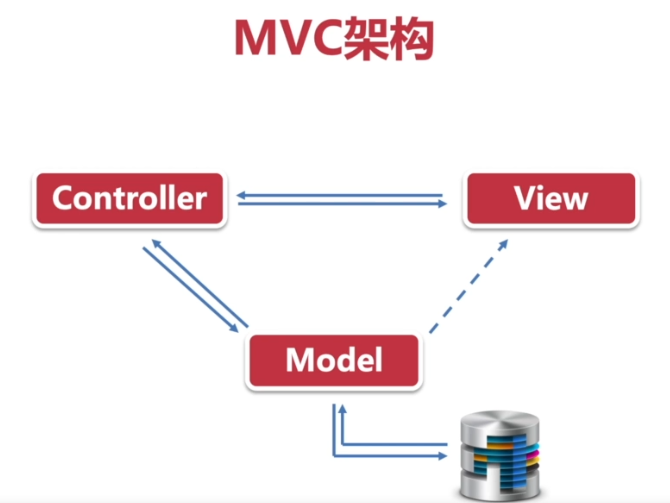

**三层架构**

- 三层架构面向接口编程，而三层之间的完全解耦、完全可替换
- mvc 的每个部分都是紧密结合的、他的核心不是解耦而是重用

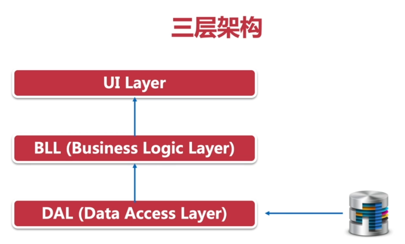


**mvc 优点**

- 耦合度低
- 可复用性高
- 可维护高


# 创建一个 webapi 项目

```shell
mkdir RESTfulApiDemo
cd .\RESTfulApiDemo\
dotnet new webapi -lang c# -o RESTfulApiDemo --framework net5.0
dotnet new sln
dotnet  sln add .\RESTfulApiDemo\RESTfulApiDemo.csproj
dotnet build
```


项目两个重要文件 `Program` 和 `Startup` 分别主管了程序的入口和生命周期。`Program` 中通过 `CreateHostBuilder` 方法创建并且运行了一个虚拟托管服务器， `Startup` 集中管理了系统的依赖注入、中间件、请求管道等。


Host.CreateDefaultBuilder 执行以下过程

- 查看程序的运行环境
- 通过运行环境启用相应的配置文件
- 加载程序集运行所有系统的核心代码
- 设置环境变量
- 设置日志
- 系统的反转控制 ioc 容器


asp .net core config 信息，如注入依赖、配置中间件处理请求通道都会使用 `Startup`进行集中管理，`Startup` 主要有两个方法

ConfigureServices

注入各种服务组件的依赖


Configure

创建中间件，设置请求通道

