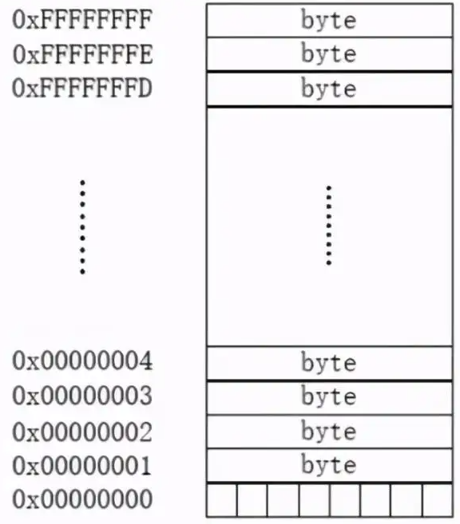

## 第八章 指针

### 1. 指针变量的定义

#### 1.1 内存概述

在 32 位平台，每一个进程拥有 4G 的空间，系统为内存的每一个字节分配一个 32 位的地址编码（虚拟地址），这个编号称为地址。无论什么类型的地址都是存储单元的编号，在 32 位平台下都是 4 个字节，即任何类型的指针变量都是 4 个字节大小。

地址的编码格式决定了他能识别的范围，所以内存过大也没有，所以说当内存超过 8g 最好装个 64 位系统。

比如定义一个 int num；给 num 开辟四个字节的空间，每个字节都有对应的地址，但是要变现这个 num 的地址编号只能对变量 num 取地址，即变量首地址。

### 2. 指针变量指向类型的作用

### 3. 数组元素的指针

