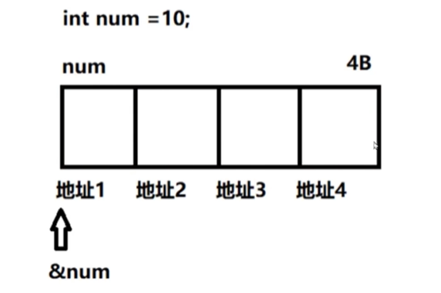

## 第八章 指针

### 1. 指针变量的定义

#### 1.1 内存概述

在 32 位平台，每一个进程拥有 4G 的空间，系统为内存的每一个字节分配一个 32 位的地址编码（虚拟地址），这个编号称为地址。无论什么类型的地址都是存储单元的编号，在 32 位平台下都是 4 个字节，即任何类型的指针变量都是 4 个字节大小。

地址的编码格式决定了他能识别的范围，所以内存过大也没有，所以说当内存超过 8g 最好装个 64 位系统。


比如定义一个 int num；给 num 开辟四个字节的空间，每个字节都有对应的地址，但是要表现这个 num 的地址编号只能对变量 num 取地址，即变量首地址。



#### 1.2 地址和指针变量的关系

地址就是内存的地址编号。指针变量本质是变量，只是该变量保存的是内存地址的编号。


#### 1.3 指针变量的定义

**定义步骤：**

- *修饰指针变量p
- 保存谁的地址就先定义谁
- 从上往下整体替换

```c
//案例1：
定义一个指针变量 p 保存 int num 的地址： int *p;
1. *p
2. int num
3. int (*p) 括号可舍弃 int *p

定义一个指针变量 p 保存数组 int arr[5] 首地址： int (*p)[5];
1. *p
2. int arr[5]
3. int (*p)[5]

定义一个指针变量 p 保存函数的入口地址 int fun(int, int) 的地址： int (*p)(int, int);
1. *p
2. int fun(int, int)
3. int (*p)(int, int)

定义一个指针变量 p 保存结构体变量地址 struct stu lucy： struct stu *p;
1. *p
2. struct stu lucy
3. struct stu (*p) 括号可舍弃 struct stu *p
    
定义一个指针变量 p 保存指针变量 int *p 的地址： int **p;
1. *p
2. int *p
3. int *(*p) 括号可舍弃 int **p
```

**测试指针变量大小**

```c
//在32位平台任何类型的指针变量都是4字节，64位平台是8字节
cout << sizeof(char *) << endl;
cout << sizeof(short *) << endl;
cout << sizeof(int *) << endl;
cout << sizeof(long *) << endl;
cout << sizeof(float *) << endl;
cout << sizeof(double *) << endl;
cout << sizeof(int ********) << endl;
```

**指针变量和普通变量建立关系**

```c
int num = 10;
int *p;
p = &num;//普通变量和指针变量建立关系
```


**指针变量的初始化**

指针变量如果不初始化立即操作会出现错误，指针变量在操作之前必须指向合法的地址空间，如果没有指向合法的空间建议初始化为NULL，不要操作指向NULL的指针变量。

```c
int *p = NULL;//NULL是赋值给p  int *p; p = NULL;
```


### 2. 指针变量指向类型的作用


### 3. 数组元素的指针


