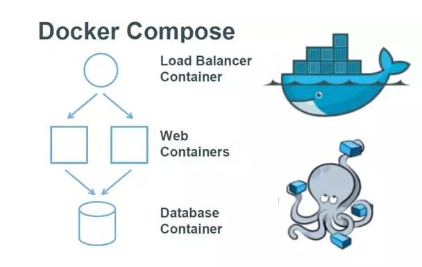
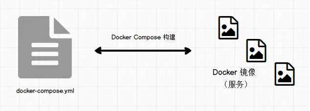

# docker compose 介绍

Compose 是用于定义和运行多容器 Docker 应用程序的工具。通过 Compose，您可以使用 YML 文件来配置应用程序需要的所有服务。然后，使用一个命令，就可以从 YML 文件配置中创建并启动所有服务。他是用来描述和处理复杂的但是又具有统一性和可预测性的形式来管理应用程序，他的描述文件里包含了卷、网络、容器等详细内容，通过Compose文件可以组成一个应用程序以及描述他们之间的关系。

Compose 使用的三个步骤：

- 使用 Dockerfile 定义应用程序的环境。
- 使用 docker-compose.yml 定义构成应用程序的服务，这样它们可以在隔离环境中一起运行。
- 最后，执行 docker-compose up 命令来启动并运行整个应用程序。

   

对于 docker-compose 有两个基本的概念：

- 服务(service)：一个应用容器，即 docker 容器，比如说mysql 容器、nginx 容器
- 项目(project)：由一组关联的应用容器组成的一个完整业务单元，比如由 mysql、web app、nginx 容器组成的网站。docker-compose 面向项目进行管理。


再简单说下 YAML 文件格式。

1.大小写敏感，缩进表示表示层级关系

2.缩进空格数不重要，相同层级左侧对齐即可。

3.由冒号分隔的键值对表示对象；一组连词线开头的行，构成一个数组；字符串默认不使用引号

参考 [YAML 入门教程](https://www.runoob.com/w3cnote/yaml-intro.html)。







# docker compose 的安装

Windows和Mac在默认安装了docker desktop以后，docker-compose随之自动安装

```shell
C:\Windows\system32>docker-compose --version
docker-compose version 1.29.2, build 5becea4c
```


Linux用户需要自行安装

最新版本号可以在这里查询 <https://github.com/docker/compose/releases>

运行以下命令以下载 Docker Compose 

```shell
sudo curl -L "https://github.com/docker/compose/releases/download/v2.2.2/docker-compose-$(uname -s)-$(uname -m)" -o /usr/local/bin/docker-compose
```

将可执行权限应用于二进制文件

```shell
sudo chmod +x /usr/local/bin/docker-compose
```

创建连接

```she&#39;l&#39;l
sudo ln -s /usr/local/bin/docker-compose /usr/bin/docker-compose
```

测试是否安装成功

```shell
docker-compose --version
```


# compose 文件的结构和版本

基本语法结构

```yaml
version: "3.8"

services: # 容器
  servicename: # 服务名字，这个名字也是内部 bridge网络可以使用的 DNS name
    image: # 镜像的名字
    command: # 可选，如果设置，则会覆盖默认镜像里的 CMD命令
    environment: # 可选，相当于 docker run里的 --env
    volumes: # 可选，相当于docker run里的 -v
    networks: # 可选，相当于 docker run里的 --network
    ports: # 可选，相当于 docker run里的 -p
  servicename2:

volumes: # 可选，相当于 docker volume create

networks: # 可选，相当于 docker network create
```

参考

Docker Compose 概述 https://docs.docker.com/compose/

Docker Compose 命令 https://docs.docker.com/compose/reference/

Docker Compose 文件 https://docs.docker.com/compose/compose-file/


# docker compose 水平扩展


# docker compose 环境变量


# docker compose 服务依赖和健康检查

