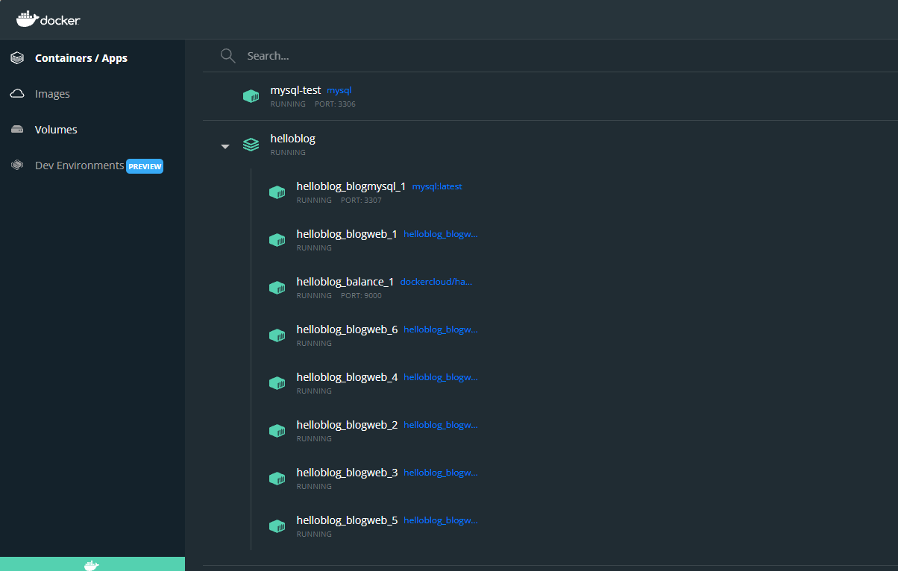

Compose 是用于定义和运行多容器 Docker 应用程序的工具。通过 Compose 可以使用  YML  文件来配置应用程序需要的所有服务。然后，使用一个命令，就可以从  YML  文件配置中创建并启动所有服务。他是用来描述和处理复杂的但是又具有统一性和可预测性的形式来管理应用程序，他的描述文件里包含了卷、网络、容器等详细内容，通过 Compose 文件可以组成一个应用程序以及描述他们之间的关系。


这个案例笔记是在之前的[多个Docker容器组网实现负载均衡的方案](https://www.cnblogs.com/weichangk/p/16006802.html)的基础上改进的，有关 docker compose 教程参考 [docker compose 介绍](https://www.cnblogs.com/weichangk/p/16019225.html)


docker compose 文件

```yaml
version: '3.8'

networks:
  blogfrontend:
  blogbackend:

volumes:
  blogdata:

services:
  blogmysql:
    restart: always
    image: "mysql:latest"
    ports:
      - 3307:3306
    volumes:
      - blogdata:/var/lib/mysql
    networks:
      - blogbackend
    environment:
      MYSQL_ROOT_PASSWORD: 123456
      BIND-ADDRESS: 0.0.0.0
    command:
      --lower_case_table_names=1

  blogweb:
    restart: always
    build: 
      context: .
      dockerfile: Dockerfile
    networks:
      - blogbackend
      - blogfrontend
    environment:
      DBNAME: appsoft
      DBHOST: blogmysql
      DBPORT: 3306
      DBPWD: 123456
    depends_on:
      - blogmysql #连接数据库

  balance:
    restart: always
    image: dockercloud/haproxy:1.2.1
    ports:
      - 9000:80
    links:
      - blogweb
    volumes:
      - /var/run/docker.sock:/var/run/docker.sock
    networks:
      - blogfrontend
```


docker compose 服务包括以下内容

- mysql 服务
- mvc 项目服务
- 负载均衡服务


compose 服务中有两个网络，后台网络（blogbackend）使 mysql 和 mvc 连接；前台网络（blogfrontend）使 mvc 和 负载均衡（balance）连接。


构建

```shell
docker-compose build
```


启动

```shell
docker-compose up
```


水平伸缩扩展服务

```shell
docker-compose scale blogweb=6
```


删除

```shell
docker-compose down
# docker-compose down -v # 删除并删除挂载
```





以上操作是部署在本地 windows 开发环境的。在 linux 上部署可以使用本地 vscode ssh远程连接 linux 服务器将代码下载到服务器后直接使用 docker compose 构建运行。后续再改用CI/CD。


