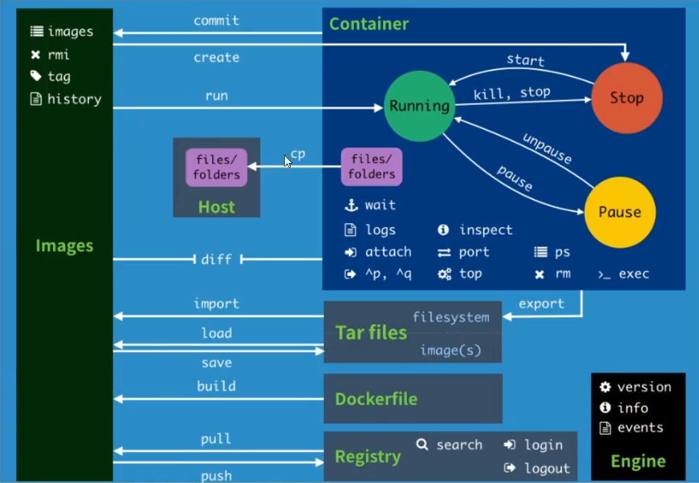

### 帮助命令

```shell
# 帮助命令
docker --help
# 显示 docker 的版本信息
docker version 
# 显示 docker 的系统信息
docker info
```

```shell
[root@VM-20-7-centos /]# docker --help

Usage:  docker [OPTIONS] COMMAND

A self-sufficient runtime for containers

Options:
      --config string      Location of client config files (default "/root/.docker")
  -c, --context string     Name of the context to use to connect to the daemon (overrides DOCKER_HOST env var and default context
                           set with "docker context use")
  -D, --debug              Enable debug mode
  -H, --host list          Daemon socket(s) to connect to
  -l, --log-level string   Set the logging level ("debug"|"info"|"warn"|"error"|"fatal") (default "info")
      --tls                Use TLS; implied by --tlsverify
      --tlscacert string   Trust certs signed only by this CA (default "/root/.docker/ca.pem")
      --tlscert string     Path to TLS certificate file (default "/root/.docker/cert.pem")
      --tlskey string      Path to TLS key file (default "/root/.docker/key.pem")
      --tlsverify          Use TLS and verify the remote
  -v, --version            Print version information and quit

Management Commands:
  app*        Docker App (Docker Inc., v0.9.1-beta3)
  builder     Manage builds
  buildx*     Docker Buildx (Docker Inc., v0.7.1-docker)
  config      Manage Docker configs
  container   Manage containers
  context     Manage contexts
  image       Manage images
  manifest    Manage Docker image manifests and manifest lists
  network     Manage networks
  node        Manage Swarm nodes
  plugin      Manage plugins
  scan*       Docker Scan (Docker Inc., v0.12.0)
  secret      Manage Docker secrets
  service     Manage services
  stack       Manage Docker stacks
  swarm       Manage Swarm
  system      Manage Docker
  trust       Manage trust on Docker images
  volume      Manage volumes

Commands:
  attach      Attach local standard input, output, and error streams to a running container
  build       Build an image from a Dockerfile
  commit      Create a new image from a container's changes
  cp          Copy files/folders between a container and the local filesystem
  create      Create a new container
  diff        Inspect changes to files or directories on a container's filesystem
  events      Get real time events from the server
  exec        Run a command in a running container
  export      Export a container's filesystem as a tar archive
  history     Show the history of an image
  images      List images
  import      Import the contents from a tarball to create a filesystem image
  info        Display system-wide information
  inspect     Return low-level information on Docker objects
  kill        Kill one or more running containers
  load        Load an image from a tar archive or STDIN
  login       Log in to a Docker registry
  logout      Log out from a Docker registry
  logs        Fetch the logs of a container
  pause       Pause all processes within one or more containers
  port        List port mappings or a specific mapping for the container
  ps          List containers
  pull        Pull an image or a repository from a registry
  push        Push an image or a repository to a registry
  rename      Rename a container
  restart     Restart one or more containers
  rm          Remove one or more containers
  rmi         Remove one or more images
  run         Run a command in a new container
  save        Save one or more images to a tar archive (streamed to STDOUT by default)
  search      Search the Docker Hub for images
  start       Start one or more stopped containers
  stats       Display a live stream of container(s) resource usage statistics
  stop        Stop one or more running containers
  tag         Create a tag TARGET_IMAGE that refers to SOURCE_IMAGE
  top         Display the running processes of a container
  unpause     Unpause all processes within one or more containers
  update      Update configuration of one or more containers
  version     Show the Docker version information
  wait        Block until one or more containers stop, then print their exit codes

Run 'docker COMMAND --help' for more information on a command.

To get more help with docker, check out our guides at https://docs.docker.com/go/guides/
[root@VM-20-7-centos /]# docker version
Client: Docker Engine - Community
 Version:           20.10.12
 API version:       1.41
 Go version:        go1.16.12
 Git commit:        e91ed57
 Built:             Mon Dec 13 11:45:41 2021
 OS/Arch:           linux/amd64
 Context:           default
 Experimental:      true

Server: Docker Engine - Community
 Engine:
  Version:          20.10.12
  API version:      1.41 (minimum version 1.12)
  Go version:       go1.16.12
  Git commit:       459d0df
  Built:            Mon Dec 13 11:44:05 2021
  OS/Arch:          linux/amd64
  Experimental:     false
 containerd:
  Version:          1.4.13
  GitCommit:        9cc61520f4cd876b86e77edfeb88fbcd536d1f9d
 runc:
  Version:          1.0.3
  GitCommit:        v1.0.3-0-gf46b6ba
 docker-init:
  Version:          0.19.0
  GitCommit:        de40ad0
[root@VM-20-7-centos /]# docker info
Client:
 Context:    default
 Debug Mode: false
 Plugins:
  app: Docker App (Docker Inc., v0.9.1-beta3)
  buildx: Docker Buildx (Docker Inc., v0.7.1-docker)
  scan: Docker Scan (Docker Inc., v0.12.0)

Server:
 Containers: 1
  Running: 0
  Paused: 0
  Stopped: 1
 Images: 1
 Server Version: 20.10.12
 Storage Driver: overlay2
  Backing Filesystem: extfs
  Supports d_type: true
  Native Overlay Diff: true
  userxattr: false
 Logging Driver: json-file
 Cgroup Driver: cgroupfs
 Cgroup Version: 1
 Plugins:
  Volume: local
  Network: bridge host ipvlan macvlan null overlay
  Log: awslogs fluentd gcplogs gelf journald json-file local logentries splunk syslog
 Swarm: inactive
 Runtimes: io.containerd.runtime.v1.linux runc io.containerd.runc.v2
 Default Runtime: runc
 Init Binary: docker-init
 containerd version: 9cc61520f4cd876b86e77edfeb88fbcd536d1f9d
 runc version: v1.0.3-0-gf46b6ba
 init version: de40ad0
 Security Options:
  seccomp
   Profile: default
 Kernel Version: 3.10.0-1160.49.1.el7.x86_64
 Operating System: CentOS Linux 7 (Core)
 OSType: linux
 Architecture: x86_64
 CPUs: 2
 Total Memory: 3.7GiB
 Name: VM-20-7-centos
 ID: M7CZ:SMA2:6ILO:GQSC:XTYI:GNY7:6STF:CLON:ZIMY:J2GI:A4D6:5RBH
 Docker Root Dir: /var/lib/docker
 Debug Mode: false
 Registry: https://index.docker.io/v1/
 Labels:
 Experimental: false
 Insecure Registries:
  127.0.0.0/8
 Registry Mirrors:
  https://ym3asuuv.mirror.aliyuncs.com/
 Live Restore Enabled: false

[root@VM-20-7-centos /]# 

```

### 镜像命令

- images

- search

- pull

- rmi

- tag

- build

- history

- save

- load

- import


查看主机上的所有镜像

```shell
[root@VM-20-7-centos /]# docker images --help

Usage:  docker images [OPTIONS] [REPOSITORY[:TAG]]

List images

Options:
  -a, --all             Show all images (default hides intermediate images)
      --digests         Show digests
  -f, --filter filter   Filter output based on conditions provided
      --format string   Pretty-print images using a Go template
      --no-trunc        Don't truncate output
  -q, --quiet           Only show image IDs
[root@VM-20-7-centos /]# docker images -a
REPOSITORY    TAG       IMAGE ID       CREATED        SIZE
hello-world   latest    feb5d9fea6a5   5 months ago   13.3kB
[root@VM-20-7-centos /]# 
```

搜索镜像

```shell
[root@VM-20-7-centos /]# docker search --help

Usage:  docker search [OPTIONS] TERM

Search the Docker Hub for images

Options:
  -f, --filter filter   Filter output based on conditions provided
      --format string   Pretty-print search using a Go template
      --limit int       Max number of search results (default 25)
      --no-trunc        Don't truncate output
[root@VM-20-7-centos /]# docker search mysql
NAME                             DESCRIPTION                                     STARS     OFFICIAL   AUTOMATED
mysql                            MySQL is a widely used, open-source relation…   12215     [OK]       
mariadb                          MariaDB Server is a high performing open sou…   4689      [OK]       
mysql/mysql-server               Optimized MySQL Server Docker images. Create…   907                  [OK]
percona                          Percona Server is a fork of the MySQL relati…   570       [OK]       
phpmyadmin                       phpMyAdmin - A web interface for MySQL and M…   465       [OK]       
mysql/mysql-cluster              Experimental MySQL Cluster Docker images. Cr…   93                   
centos/mysql-57-centos7          MySQL 5.7 SQL database server                   92                   
bitnami/mysql                    Bitnami MySQL Docker Image                      64                   [OK]
databack/mysql-backup            Back up mysql databases to... anywhere!         56                   
circleci/mysql                   MySQL is a widely used, open-source relation…   25                   
ubuntu/mysql                     MySQL open source fast, stable, multi-thread…   24                   
mysql/mysql-router               MySQL Router provides transparent routing be…   23                   
centos/mysql-56-centos7          MySQL 5.6 SQL database server                   22                   
google/mysql                     MySQL server for Google Compute Engine          19                   [OK]
mysqlboy/mydumper                mydumper for mysql logcial backups              3                    
mysqlboy/docker-mydumper         docker-mydumper containerizes MySQL logical …   3                    
bitnami/mysqld-exporter                                                          2                    
ibmcom/mysql-s390x               Docker image for mysql-s390x                    1                    
ibmcom/tidb-ppc64le              TiDB is a distributed NewSQL database compat…   0                    
mysqlboy/elasticsearch                                                           0  
```

拉取镜像

```shell
[root@VM-20-7-centos /]# docker pull --help

Usage:  docker pull [OPTIONS] NAME[:TAG|@DIGEST]

Pull an image or a repository from a registry

Options:
  -a, --all-tags                Download all tagged images in the repository
      --disable-content-trust   Skip image verification (default true)
      --platform string         Set platform if server is multi-platform capable
  -q, --quiet                   Suppress verbose output
[root@VM-20-7-centos /]# docker pull mysql
Using default tag: latest # 如果不写 tag 默认最新版本；指定版本 docker pull mysql:5.7
latest: Pulling from library/mysql
72a69066d2fe: Pull complete 
93619dbc5b36: Pull complete 
99da31dd6142: Pull complete 
626033c43d70: Pull complete 
37d5d7efb64e: Pull complete 
ac563158d721: Pull complete 
d2ba16033dad: Pull complete 
688ba7d5c01a: Pull complete 
00e060b6d11d: Pull complete 
1c04857f594f: Pull complete 
4d7cfa90e6ea: Pull complete 
e0431212d27d: Pull complete 
Digest: sha256:e9027fe4d91c0153429607251656806cc784e914937271037f7738bd5b8e7709
Status: Downloaded newer image for mysql:latest
docker.io/library/mysql:latest
[root@VM-20-7-centos /]# docker images -a
REPOSITORY    TAG       IMAGE ID       CREATED        SIZE
mysql         latest    3218b38490ce   2 months ago   516MB
hello-world   latest    feb5d9fea6a5   5 months ago   13.3kB

```

删除镜像

```shell
docker rmi -f 镜像id # 删除指定镜像
docker rmi -f 镜像1id 镜像2id 镜像3id # 删除多个镜像
docker rmi -f $(docker images -aq) # 删除全部的镜像
```


### 容器命令

- create
- run
- start/stop/restart
- pause/unpause
- exec
- kill
- rm
- ps
- inspect
- top
- attach
- event
- logs
- wait
- export
- port


创建一个新的容器并运行

```shell
[root@VM-20-7-centos /]# docker run --help

Usage:  docker run [OPTIONS] IMAGE [COMMAND] [ARG...]

Run a command in a new container

Options:
      --add-host list                  Add a custom host-to-IP mapping (host:ip)
  -a, --attach list                    Attach to STDIN, STDOUT or STDERR
      --blkio-weight uint16            Block IO (relative weight), between 10 and 1000, or 0 to disable (default 0)
      --blkio-weight-device list       Block IO weight (relative device weight) (default [])
      --cap-add list                   Add Linux capabilities
      --cap-drop list                  Drop Linux capabilities
      --cgroup-parent string           Optional parent cgroup for the container
      --cgroupns string                Cgroup namespace to use (host|private)
                                       'host':    Run the container in the Docker host's cgroup namespace
                                       'private': Run the container in its own private cgroup namespace
                                       '':        Use the cgroup namespace as configured by the
                                                  default-cgroupns-mode option on the daemon (default)
      --cidfile string                 Write the container ID to the file
      --cpu-period int                 Limit CPU CFS (Completely Fair Scheduler) period
      --cpu-quota int                  Limit CPU CFS (Completely Fair Scheduler) quota
      --cpu-rt-period int              Limit CPU real-time period in microseconds
      --cpu-rt-runtime int             Limit CPU real-time runtime in microseconds
  -c, --cpu-shares int                 CPU shares (relative weight)
      --cpus decimal                   Number of CPUs
      --cpuset-cpus string             CPUs in which to allow execution (0-3, 0,1)
      --cpuset-mems string             MEMs in which to allow execution (0-3, 0,1)
  -d, --detach                         Run container in background and print container ID
      --detach-keys string             Override the key sequence for detaching a container
      --device list                    Add a host device to the container
      --device-cgroup-rule list        Add a rule to the cgroup allowed devices list
      --device-read-bps list           Limit read rate (bytes per second) from a device (default [])
      --device-read-iops list          Limit read rate (IO per second) from a device (default [])
      --device-write-bps list          Limit write rate (bytes per second) to a device (default [])
      --device-write-iops list         Limit write rate (IO per second) to a device (default [])
      --disable-content-trust          Skip image verification (default true)
      --dns list                       Set custom DNS servers
      --dns-option list                Set DNS options
      --dns-search list                Set custom DNS search domains
      --domainname string              Container NIS domain name
      --entrypoint string              Overwrite the default ENTRYPOINT of the image
  -e, --env list                       Set environment variables
      --env-file list                  Read in a file of environment variables
      --expose list                    Expose a port or a range of ports
      --gpus gpu-request               GPU devices to add to the container ('all' to pass all GPUs)
      --group-add list                 Add additional groups to join
      --health-cmd string              Command to run to check health
      --health-interval duration       Time between running the check (ms|s|m|h) (default 0s)
      --health-retries int             Consecutive failures needed to report unhealthy
      --health-start-period duration   Start period for the container to initialize before starting health-retries countdown
                                       (ms|s|m|h) (default 0s)
      --health-timeout duration        Maximum time to allow one check to run (ms|s|m|h) (default 0s)
      --help                           Print usage
  -h, --hostname string                Container host name
      --init                           Run an init inside the container that forwards signals and reaps processes
  -i, --interactive                    Keep STDIN open even if not attached
      --ip string                      IPv4 address (e.g., 172.30.100.104)
      --ip6 string                     IPv6 address (e.g., 2001:db8::33)
      --ipc string                     IPC mode to use
      --isolation string               Container isolation technology
      --kernel-memory bytes            Kernel memory limit
  -l, --label list                     Set meta data on a container
      --label-file list                Read in a line delimited file of labels
      --link list                      Add link to another container
      --link-local-ip list             Container IPv4/IPv6 link-local addresses
      --log-driver string              Logging driver for the container
      --log-opt list                   Log driver options
      --mac-address string             Container MAC address (e.g., 92:d0:c6:0a:29:33)
  -m, --memory bytes                   Memory limit
      --memory-reservation bytes       Memory soft limit
      --memory-swap bytes              Swap limit equal to memory plus swap: '-1' to enable unlimited swap
      --memory-swappiness int          Tune container memory swappiness (0 to 100) (default -1)
      --mount mount                    Attach a filesystem mount to the container
      --name string                    Assign a name to the container
      --network network                Connect a container to a network
      --network-alias list             Add network-scoped alias for the container
      --no-healthcheck                 Disable any container-specified HEALTHCHECK
      --oom-kill-disable               Disable OOM Killer
      --oom-score-adj int              Tune host's OOM preferences (-1000 to 1000)
      --pid string                     PID namespace to use
      --pids-limit int                 Tune container pids limit (set -1 for unlimited)
      --platform string                Set platform if server is multi-platform capable
      --privileged                     Give extended privileges to this container
  -p, --publish list                   Publish a container's port(s) to the host
  -P, --publish-all                    Publish all exposed ports to random ports
      --pull string                    Pull image before running ("always"|"missing"|"never") (default "missing")
      --read-only                      Mount the container's root filesystem as read only
      --restart string                 Restart policy to apply when a container exits (default "no")
      --rm                             Automatically remove the container when it exits
      --runtime string                 Runtime to use for this container
      --security-opt list              Security Options
      --shm-size bytes                 Size of /dev/shm
      --sig-proxy                      Proxy received signals to the process (default true)
      --stop-signal string             Signal to stop a container (default "SIGTERM")
      --stop-timeout int               Timeout (in seconds) to stop a container
      --storage-opt list               Storage driver options for the container
      --sysctl map                     Sysctl options (default map[])
      --tmpfs list                     Mount a tmpfs directory
  -t, --tty                            Allocate a pseudo-TTY
      --ulimit ulimit                  Ulimit options (default [])
  -u, --user string                    Username or UID (format: <name|uid>[:<group|gid>])
      --userns string                  User namespace to use
      --uts string                     UTS namespace to use
  -v, --volume list                    Bind mount a volume
      --volume-driver string           Optional volume driver for the container
      --volumes-from list              Mount volumes from the specified container(s)
  -w, --workdir string                 Working directory inside the container

```

```shell
-a stdin: 指定标准输入输出内容类型，可选 STDIN/STDOUT/STDERR 三项；
-d: 后台运行容器，并返回容器ID；
-i: 以交互模式运行容器，通常与 -t 同时使用；
-P: 随机端口映射，容器内部端口随机映射到主机的端口
-p: 指定端口映射，格式为：主机(宿主)端口:容器端口
-t: 为容器重新分配一个伪输入终端，通常与 -i 同时使用；
--name="nginx-lb": 为容器指定一个名称；
--dns 8.8.8.8: 指定容器使用的DNS服务器，默认和宿主一致；
--dns-search example.com: 指定容器DNS搜索域名，默认和宿主一致；
-h "mars": 指定容器的hostname；
-e username="ritchie": 设置环境变量；
--env-file=[]: 从指定文件读入环境变量；
--cpuset="0-2" or --cpuset="0,1,2": 绑定容器到指定CPU运行；
-m :设置容器使用内存最大值；
--net="bridge": 指定容器的网络连接类型，支持 bridge/host/none/container: 四种类型；
--link=[]: 添加链接到另一个容器；
--expose=[]: 开放一个端口或一组端口；
--volume , -v: 绑定一个卷
```

```shell
# 启动并进入容器
[root@VM-20-7-centos /]# docker run -it centos /bin/bash

# 退出
[root@0e3672bdebb4 /]# exit
exit
[root@VM-20-7-centos /]#
```

```shell
# -d 后台运行
# --name 给容器命名
# -p 宿主机端口：容器端口 映射
[root@VM-20-7-centos /]# docker run -d --name nginx01 -p 80:80 nginx
Unable to find image 'nginx:latest' locally
latest: Pulling from library/nginx
a2abf6c4d29d: Pull complete 
a9edb18cadd1: Pull complete 
589b7251471a: Pull complete 
186b1aaa4aa6: Pull complete 
b4df32aa5a72: Pull complete 
a0bcbecc962e: Pull complete 
Digest: sha256:0d17b565c37bcbd895e9d92315a05c1c3c9a29f762b011a10c54a66cd53c9b31
Status: Downloaded newer image for nginx:latest
9f33b059f359c685737b61e7d59613c04e3fc7d227f37c6d917f9acee391b759
[root@VM-20-7-centos /]# docker ps
CONTAINER ID   IMAGE     COMMAND                  CREATED         STATUS         PORTS                               NAMES
9f33b059f359   nginx     "/docker-entrypoint.…"   9 seconds ago   Up 7 seconds   0.0.0.0:80->80/tcp, :::80->80/tcp   nginx01
[root@VM-20-7-centos /]# 

# docker run 执行过程
# 在本地查找是否存在镜像
# 没有就去 docker hub 远程拉取最新
# 基于镜像创建一个容器并准备运行
# docker engine 分配给这个容器一个虚拟 ip 地址
# 宿主机打开对应端口映射到容器对应端口
# 启动容器，运行指定命令
```

列出所有运行的容器

```shell
[root@VM-20-7-centos /]# docker ps
CONTAINER ID   IMAGE     COMMAND   CREATED   STATUS    PORTS     NAMES
[root@VM-20-7-centos /]# docker ps -a
CONTAINER ID   IMAGE          COMMAND       CREATED         STATUS                     PORTS     NAMES
0e3672bdebb4   centos         "/bin/bash"   7 minutes ago   Exited (0) 5 minutes ago             compassionate_dhawan
3e5e1f3b3119   hello-world    "/hello"      5 hours ago     Exited (0) 5 hours ago               agitated_ptolemy

```

```shell
-a :显示所有的容器，包括未运行的。
-f :根据条件过滤显示的内容。
--format :指定返回值的模板文件。
-l :显示最近创建的容器。
-n :列出最近创建的n个容器。
--no-trunc :不截断输出。
-q :静默模式，只显示容器编号。
-s :显示总的文件大小。
```

在容器内部退出容器

```shell
exit # 停止容器并退出
Ctrl + p + q # 容器不停止退出
```

删除容器

```shell
docker rm 容器id # 删除指定容器，不能删除正在运行的容器
docker rm -f $(docker ps -aq) # 删除所有容器
docker ps -a -q|xargs docker rm # 删除所有容器
```

启动停止容器

```shell
docker start [OPTIONS] CONTAINER [CONTAINER...]
docker stop [OPTIONS] CONTAINER [CONTAINER...]
docker restart [OPTIONS] CONTAINER [CONTAINER...]
docker kill [OPTIONS] CONTAINER [CONTAINER...]
```

进入当前正在运行的容器

```shell
[root@VM-20-7-centos /]# docker ps
CONTAINER ID   IMAGE     COMMAND       CREATED          STATUS          PORTS     NAMES
6efb78533571   centos    "/bin/bash"   43 seconds ago   Up 41 seconds             
[root@VM-20-7-centos /]# docker exec -it 6efb78533571 /bin/bash # 通过 exec 命令对指定的容器执行 bash:
[root@6efb78533571 /]# exit #退出容器
exit
[root@VM-20-7-centos /]# docker ps
CONTAINER ID   IMAGE     COMMAND       CREATED          STATUS          PORTS     NAMES
6efb78533571   centos    "/bin/bash"   45 minutes ago   Up 45 minutes             silly_ardinghelli
[root@VM-20-7-centos /]# 


```

从容器内拷贝文件到主机上

```shell
[root@VM-20-7-centos home]# docker cp 6efb78533571:home/dockerstudy.txt /home/test
[root@VM-20-7-centos home]# cd test
[root@VM-20-7-centos test]# ls
dockerstudy.txt
[root@VM-20-7-centos test]# 
```

从主机拷贝文件到容器中

```shell
[root@VM-20-7-centos test]# touch xxx.txt
[root@VM-20-7-centos test]# ls
dockerstudy.txt  xxx.txt
[root@VM-20-7-centos test]# docker cp xxx.txt 6efb78533571:home/
[root@VM-20-7-centos test]# docker exec -it 6efb78533571 /bin/bash
[root@6efb78533571 /]# cd home
[root@6efb78533571 home]# ls
dockerstudy.txt  xxx.txt

```


常用命令总结

```
attach    Attach to a running container                 # 当前 shell 下 attach 连接指定运行镜像

build     Build an im from a Docker registry server          # 从当前 Docker registry 退出

logs      Fetch the logs of a container                 # 输出当前容器日志信息

port      Lookup the public-facing port which is NAT-ed to PRIVATE_PORT    # 查看映射端口对应的容器内部源端口

pause     Pause all processes within a container        # 暂停容器

ps        List containers                               # 列出容器列表

pull      Pull an image or a repository from the docker registry server   # 从docker镜像源服务器拉取指定镜像或者库镜像

push      Push an image or a repository to the docker registry server    # 推送指定镜像或者库镜像至docker源服务器

restart   Restart a running container                   # 重启运行的容器

rm        Remove one or more containers                 # 移除一个或者多个容器

rmi       Remove one or more images             # 移除一个或多个镜像[无容器使用该镜像才可删除，否则需删除相关容器才可继续或 -f 强制删除]

run       Run a command in a new container              # 创建一个新的容器并运行一个命令

save      Save an image to a tar archive                # 保存一个镜像为一个 tar 包[对应 load]

search    Search for an image on the Docker Hub         # 在 docker hub 中搜索镜像

start     Start a stopped containers                    # 启动容器

stop      Stop a running containers                     # 停止容器

tag       Tag an image into a repository                # 给源中镜像打标签

top       Lookup the running processes of a container   # 查看容器中运行的进程信息

unpause   Unpause a paused container                    # 取消暂停容器

version   Show the docker version information           # 查看 docker 版本号

wait      Block until a container stops, then print its exit code   # 截取容器停止时的退出状态值

age from a Dockerfile              # 通过 Dockerfile 定制镜像

commit    Create a new image from a container changes   # 提交当前容器为新的镜像

cp        Copy files/folders from the containers filesystem to the host path   #从容器中拷贝指定文件或者目录到宿主机中

create    Create a new container                        # 创建一个新的容器，同 run，但不启动容器

diff      Inspect changes on a containers filesystem   # 查看 docker 容器变化

events    Get real time events from the server          # 从 docker 服务获取容器实时事件

exec      Run a command in an existing container        # 在已存在的容器上运行命令

export    Stream the contents of a container as a tar archive   # 导出容器的内容流作为一个 tar 归档文件[对应 import ]

history   Show the history of an image                  # 展示一个镜像形成历史

images    List images                                   # 列出系统当前镜像

import    Create a new filesystem image from the contents of a tarball # 从tar包中的内容创建一个新的文件系统映像[对应export]

info      Display system-wide information               # 显示系统相关信息

inspect   Return low-level information on a container   # 查看容器详细信息

kill      Kill a running container                      # kill 指定 docker 容器

load      Load an image from a tar archive              # 从一个 tar 包中加载一个镜像[对应 save]

login     Register or Login to the docker registry server    # 注册或者登陆一个 docker 源服务器

logout    Log out


```




### 参考

https://docs.docker.com/engine/reference/commandline/docker/

https://www.coonote.com/docker/docker-cmd-manual.html

