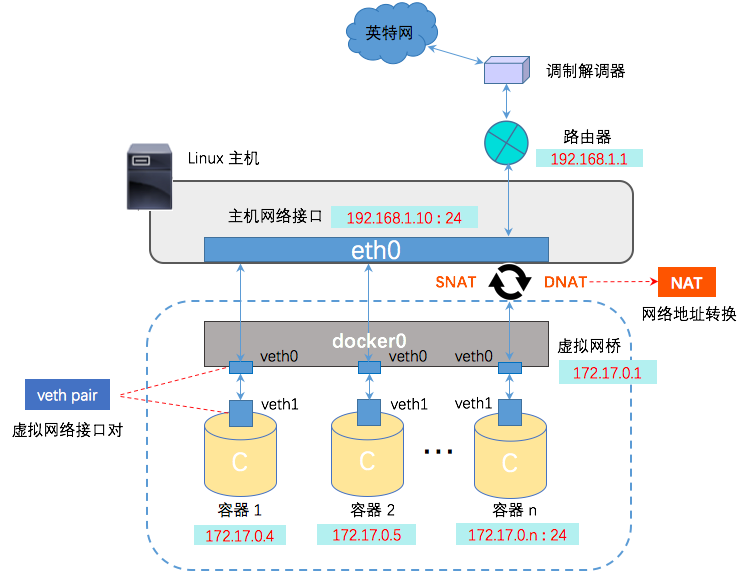

# 网络基础知识回顾

IP、子网掩码、网关、DNS、端口号

参考：

<https://zhuanlan.zhihu.com/p/65226634>

https://blog.csdn.net/kingshown_WZ/article/details/46423771?spm=1001.2101.3001.6650.2&utm_medium=distribute.pc_relevant.none-task-blog-2%7Edefault%7ECTRLIST%7ERate-2.pc_relevant_antiscanv2&depth_1-utm_source=distribute.pc_relevant.none-task-blog-2%7Edefault%7ECTRLIST%7ERate-2.pc_relevant_antiscanv2&utm_relevant_index=4


Internet如何工作的

参考：

<https://www.hp.com/us-en/shop/tech-takes/how-does-the-internet-work>

<https://www.homenethowto.com/advanced-topics/traffic-example-the-full-picture/>


# 网络常用命令

## IP地址的查看

- Windows
  - ipconfig
- Linux
  - ifconfig
  - ip addr

## 网络连通性测试

- ping命令
- telnet命令测试端口的连通性
- traceroute路径探测跟踪，Windows下使用 TRACERT.EXE
- curl命令请求web服务的


# Docker Bridge 网络


## Docker Bridge 网络图





## 创建两个容器

```shell
[root@VM-20-7-centos ~]# docker container run -d --rm --name box1 busybox /bin/sh -c "while true; do sleep 3600; done"
96d53e1518fb9e70b014e558901f7d296d702897c1235cae4a96510dcda07139
[root@VM-20-7-centos ~]# docker container run -d --rm --name box2 busybox /bin/sh -c "while true; do sleep 3600; done"
256275c6db181940bf581c63d3cb7f20066f166b1b8a112bca4ae75af0e4a9ef
[root@VM-20-7-centos ~]# docker exec -it box1 ip a
1: lo: <LOOPBACK,UP,LOWER_UP> mtu 65536 qdisc noqueue qlen 1000
    link/loopback 00:00:00:00:00:00 brd 00:00:00:00:00:00
    inet 127.0.0.1/8 scope host lo
       valid_lft forever preferred_lft forever
84: eth0@if85: <BROADCAST,MULTICAST,UP,LOWER_UP,M-DOWN> mtu 1500 qdisc noqueue 
    link/ether 02:42:ac:11:00:05 brd ff:ff:ff:ff:ff:ff
    inet 172.17.0.5/16 brd 172.17.255.255 scope global eth0
       valid_lft forever preferred_lft forever
[root@VM-20-7-centos ~]# docker exec -it box2 ip a
1: lo: <LOOPBACK,UP,LOWER_UP> mtu 65536 qdisc noqueue qlen 1000
    link/loopback 00:00:00:00:00:00 brd 00:00:00:00:00:00
    inet 127.0.0.1/8 scope host lo
       valid_lft forever preferred_lft forever
86: eth0@if87: <BROADCAST,MULTICAST,UP,LOWER_UP,M-DOWN> mtu 1500 qdisc noqueue 
    link/ether 02:42:ac:11:00:06 brd ff:ff:ff:ff:ff:ff
    inet 172.17.0.6/16 brd 172.17.255.255 scope global eth0
       valid_lft forever preferred_lft forever
[root@VM-20-7-centos ~]# 

```


## 查看 linux 的网络配置

可以看到 linux 的一个 虚拟网桥 docker0（安装了docker的情况下才有），网关为 172.17.0.1

```shell
[root@VM-20-7-centos ~]# ifconfig
docker0: flags=4163<UP,BROADCAST,RUNNING,MULTICAST>  mtu 1500
        inet 172.17.0.1  netmask 255.255.0.0  broadcast 172.17.255.255
        inet6 fe80::42:9dff:fe4f:7735  prefixlen 64  scopeid 0x20<link>
        ether 02:42:9d:4f:77:35  txqueuelen 0  (Ethernet)
        RX packets 47944  bytes 6713246 (6.4 MiB)
        RX errors 0  dropped 0  overruns 0  frame 0
        TX packets 49436  bytes 83117172 (79.2 MiB)
        TX errors 0  dropped 0 overruns 0  carrier 0  collisions 0

eth0: flags=4163<UP,BROADCAST,RUNNING,MULTICAST>  mtu 1500
        inet 10.0.20.7  netmask 255.255.252.0  broadcast 10.0.23.255
        inet6 fe80::5054:ff:fe5c:7c93  prefixlen 64  scopeid 0x20<link>
        ether 52:54:00:5c:7c:93  txqueuelen 1000  (Ethernet)
        RX packets 11094942  bytes 3838850708 (3.5 GiB)
        RX errors 0  dropped 0  overruns 0  frame 0
        TX packets 10278913  bytes 3508603761 (3.2 GiB)
        TX errors 0  dropped 0 overruns 0  carrier 0  collisions 0

lo: flags=73<UP,LOOPBACK,RUNNING>  mtu 65536
        inet 127.0.0.1  netmask 255.0.0.0
        inet6 ::1  prefixlen 128  scopeid 0x10<host>
        loop  txqueuelen 1000  (Local Loopback)
        RX packets 550  bytes 69160 (67.5 KiB)
        RX errors 0  dropped 0  overruns 0  frame 0
        TX packets 550  bytes 69160 (67.5 KiB)
        TX errors 0  dropped 0 overruns 0  carrier 0  collisions 0

veth4039039: flags=4163<UP,BROADCAST,RUNNING,MULTICAST>  mtu 1500
        inet6 fe80::bc5c:5bff:fef5:5cdb  prefixlen 64  scopeid 0x20<link>
        ether be:5c:5b:f5:5c:db  txqueuelen 0  (Ethernet)
        RX packets 0  bytes 0 (0.0 B)
        RX errors 0  dropped 0  overruns 0  frame 0
        TX packets 9  bytes 714 (714.0 B)
        TX errors 0  dropped 0 overruns 0  carrier 0  collisions 0

veth42be0cc: flags=4163<UP,BROADCAST,RUNNING,MULTICAST>  mtu 1500
        inet6 fe80::c4b5:b3ff:fe04:f427  prefixlen 64  scopeid 0x20<link>
        ether c6:b5:b3:04:f4:27  txqueuelen 0  (Ethernet)
        RX packets 0  bytes 0 (0.0 B)
        RX errors 0  dropped 0  overruns 0  frame 0
        TX packets 9  bytes 714 (714.0 B)
        TX errors 0  dropped 0 overruns 0  carrier 0  collisions 0

veth4359ef6: flags=4163<UP,BROADCAST,RUNNING,MULTICAST>  mtu 1500
        inet6 fe80::4c0e:b5ff:feaf:d5c6  prefixlen 64  scopeid 0x20<link>
        ether 4e:0e:b5:af:d5:c6  txqueuelen 0  (Ethernet)
        RX packets 805  bytes 1085571 (1.0 MiB)
        RX errors 0  dropped 0  overruns 0  frame 0
        TX packets 1063  bytes 87873 (85.8 KiB)
        TX errors 0  dropped 0 overruns 0  carrier 0  collisions 0

veth5e1ed63: flags=4163<UP,BROADCAST,RUNNING,MULTICAST>  mtu 1500
        inet6 fe80::280a:d0ff:fee8:a7e7  prefixlen 64  scopeid 0x20<link>
        ether 2a:0a:d0:e8:a7:e7  txqueuelen 0  (Ethernet)
        RX packets 6347  bytes 892240 (871.3 KiB)
        RX errors 0  dropped 0  overruns 0  frame 0
        TX packets 7256  bytes 667962 (652.3 KiB)
        TX errors 0  dropped 0 overruns 0  carrier 0  collisions 0

vethbbb98bb: flags=4163<UP,BROADCAST,RUNNING,MULTICAST>  mtu 1500
        inet6 fe80::e82e:11ff:fe08:79eb  prefixlen 64  scopeid 0x20<link>
        ether ea:2e:11:08:79:eb  txqueuelen 0  (Ethernet)
        RX packets 4740  bytes 2691759 (2.5 MiB)
        RX errors 0  dropped 0  overruns 0  frame 0
        TX packets 5212  bytes 2472332 (2.3 MiB)
        TX errors 0  dropped 0 overruns 0  carrier 0  collisions 0

[root@VM-20-7-centos ~]# 

```


## 查看 docker 的网络模式

默认情况下拥有以下四中网络模式

```shell
[root@VM-20-7-centos ~]# docker network ls
NETWORK ID     NAME      DRIVER    SCOPE
2c17dbcbabe9   bridge    bridge    local
6865d230d3d0   host      host      local
5b42063e94fc   none      null      local
[root@VM-20-7-centos ~]# 

```


## 查看 bridge 网桥信息

bridge 模式就是 linux 的虚拟网桥 docker0，创建容器在不指定  network 的情况下，默认使用 bridge，从 bridge 信息中的 Containers节点内容可看出。

```shell
[root@VM-20-7-centos ~]# docker network inspect bridge
[
    {
        "Name": "bridge",
        "Id": "2c17dbcbabe9b72faa1f34847520dd4d1b1dd4b926c83b8601a0adcf1816dd4c",
        "Created": "2022-03-06T19:31:14.759954652+08:00",
        "Scope": "local",
        "Driver": "bridge",
        "EnableIPv6": false,
        "IPAM": {
            "Driver": "default",
            "Options": null,
            "Config": [
                {
                    "Subnet": "172.17.0.0/16",
                    "Gateway": "172.17.0.1"
                }
            ]
        },
        "Internal": false,
        "Attachable": false,
        "Ingress": false,
        "ConfigFrom": {
            "Network": ""
        },
        "ConfigOnly": false,
        "Containers": {
            "256275c6db181940bf581c63d3cb7f20066f166b1b8a112bca4ae75af0e4a9ef": {
                "Name": "box2",
                "EndpointID": "c3549d452e3ffcfc48a8ed988be1b8df59bd085492a23ebf4ec8e9ff9eed0156",
                "MacAddress": "02:42:ac:11:00:06",
                "IPv4Address": "172.17.0.6/16",
                "IPv6Address": ""
            },
            "566e3d764f8b63f5924c58ab4df35c5a8e6340e5ce0f17d40b7e4b86f980d8f3": {
                "Name": "mysql-latest",
                "EndpointID": "04b78528a037eb37da2a2502bd4ed2ea4352a6859a2af674259143f4ffc8486e",
                "MacAddress": "02:42:ac:11:00:04",
                "IPv4Address": "172.17.0.4/16",
                "IPv6Address": ""
            },
            "5c1bbec1a07c8521ce5daf4df5cb6efddc6773d08032af56e7a4f57f4942992f": {
                "Name": "HelloDockerApp5400",
                "EndpointID": "a40c4e470b8fff87be18e061ea823909e78761d3468cf1bac6ecff348cc5d38b",
                "MacAddress": "02:42:ac:11:00:03",
                "IPv4Address": "172.17.0.3/16",
                "IPv6Address": ""
            },
            "96d53e1518fb9e70b014e558901f7d296d702897c1235cae4a96510dcda07139": {
                "Name": "box1",
                "EndpointID": "72d5c384d551c03afa379d1b606c527a52815e6ec1a90a9ff8ea58dea97e743e",
                "MacAddress": "02:42:ac:11:00:05",
                "IPv4Address": "172.17.0.5/16",
                "IPv6Address": ""
            },
            "9f33b059f359c685737b61e7d59613c04e3fc7d227f37c6d917f9acee391b759": {
                "Name": "nginx01",
                "EndpointID": "fd369214f22a9dfcfb81a49062870e6d8863b4efa5ebfbf1552666bbde5cad28",
                "MacAddress": "02:42:ac:11:00:02",
                "IPv4Address": "172.17.0.2/16",
                "IPv6Address": ""
            }
        },
        "Options": {
            "com.docker.network.bridge.default_bridge": "true",
            "com.docker.network.bridge.enable_icc": "true",
            "com.docker.network.bridge.enable_ip_masquerade": "true",
            "com.docker.network.bridge.host_binding_ipv4": "0.0.0.0",
            "com.docker.network.bridge.name": "docker0",
            "com.docker.network.driver.mtu": "1500"
        },
        "Labels": {}
    }
]
[root@VM-20-7-centos ~]# 

```

## 自定义 docker 的 bridge

可以自定义创建 docker 的 bridge，查看 linux 的网络配置，可以看到 linux 的多了一个 虚拟网桥 br-bf6bc38588b5，看到网关对应的是新创建的 bridge

```shell
[root@VM-20-7-centos ~]# docker network create -d bridge my-bridge-network
bf6bc38588b5e306c7402ce39c625c53080d8d1aaa362a2a6b1d84bdc47425b8
[root@VM-20-7-centos ~]# docker network ls
NETWORK ID     NAME                DRIVER    SCOPE
2c17dbcbabe9   bridge              bridge    local
6865d230d3d0   host                host      local
bf6bc38588b5   my-bridge-network   bridge    local
5b42063e94fc   none                null      local
[root@VM-20-7-centos ~]# docker network inspect my-bridge-network
[
    {
        "Name": "my-bridge-network",
        "Id": "bf6bc38588b5e306c7402ce39c625c53080d8d1aaa362a2a6b1d84bdc47425b8",
        "Created": "2022-03-12T23:21:44.05522434+08:00",
        "Scope": "local",
        "Driver": "bridge",
        "EnableIPv6": false,
        "IPAM": {
            "Driver": "default",
            "Options": {},
            "Config": [
                {
                    "Subnet": "172.18.0.0/16",
                    "Gateway": "172.18.0.1"
                }
            ]
        },
        "Internal": false,
        "Attachable": false,
        "Ingress": false,
        "ConfigFrom": {
            "Network": ""
        },
        "ConfigOnly": false,
        "Containers": {},
        "Options": {},
        "Labels": {}
    }
]
[root@VM-20-7-centos ~]# ifconfig
br-bf6bc38588b5: flags=4099<UP,BROADCAST,MULTICAST>  mtu 1500
        inet 172.18.0.1  netmask 255.255.0.0  broadcast 172.18.255.255
        ether 02:42:a3:a0:70:bb  txqueuelen 0  (Ethernet)
        RX packets 4740  bytes 2691759 (2.5 MiB)
        RX errors 0  dropped 0  overruns 0  frame 0
        TX packets 5212  bytes 2472332 (2.3 MiB)
        TX errors 0  dropped 0 overruns 0  carrier 0  collisions 0

docker0: flags=4163<UP,BROADCAST,RUNNING,MULTICAST>  mtu 1500
        inet 172.17.0.1  netmask 255.255.0.0  broadcast 172.17.255.255
        inet6 fe80::42:9dff:fe4f:7735  prefixlen 64  scopeid 0x20<link>
        ether 02:42:9d:4f:77:35  txqueuelen 0  (Ethernet)
        RX packets 47944  bytes 6713246 (6.4 MiB)
        RX errors 0  dropped 0  overruns 0  frame 0
        TX packets 49436  bytes 83117172 (79.2 MiB)
        TX errors 0  dropped 0 overruns 0  carrier 0  collisions 0

eth0: flags=4163<UP,BROADCAST,RUNNING,MULTICAST>  mtu 1500
        inet 10.0.20.7  netmask 255.255.252.0  broadcast 10.0.23.255
        inet6 fe80::5054:ff:fe5c:7c93  prefixlen 64  scopeid 0x20<link>
        ether 52:54:00:5c:7c:93  txqueuelen 1000  (Ethernet)
        RX packets 11097742  bytes 3839091117 (3.5 GiB)
        RX errors 0  dropped 0  overruns 0  frame 0
        TX packets 10281704  bytes 3509157644 (3.2 GiB)
        TX errors 0  dropped 0 overruns 0  carrier 0  collisions 0

lo: flags=73<UP,LOOPBACK,RUNNING>  mtu 65536
        inet 127.0.0.1  netmask 255.0.0.0
        inet6 ::1  prefixlen 128  scopeid 0x10<host>
        loop  txqueuelen 1000  (Local Loopback)
        RX packets 550  bytes 69160 (67.5 KiB)
        RX errors 0  dropped 0  overruns 0  frame 0
        TX packets 550  bytes 69160 (67.5 KiB)
        TX errors 0  dropped 0 overruns 0  carrier 0  collisions 0

veth4039039: flags=4163<UP,BROADCAST,RUNNING,MULTICAST>  mtu 1500
        inet6 fe80::bc5c:5bff:fef5:5cdb  prefixlen 64  scopeid 0x20<link>
        ether be:5c:5b:f5:5c:db  txqueuelen 0  (Ethernet)
        RX packets 0  bytes 0 (0.0 B)
        RX errors 0  dropped 0  overruns 0  frame 0
        TX packets 9  bytes 714 (714.0 B)
        TX errors 0  dropped 0 overruns 0  carrier 0  collisions 0

veth42be0cc: flags=4163<UP,BROADCAST,RUNNING,MULTICAST>  mtu 1500
        inet6 fe80::c4b5:b3ff:fe04:f427  prefixlen 64  scopeid 0x20<link>
        ether c6:b5:b3:04:f4:27  txqueuelen 0  (Ethernet)
        RX packets 0  bytes 0 (0.0 B)
        RX errors 0  dropped 0  overruns 0  frame 0
        TX packets 9  bytes 714 (714.0 B)
        TX errors 0  dropped 0 overruns 0  carrier 0  collisions 0

veth4359ef6: flags=4163<UP,BROADCAST,RUNNING,MULTICAST>  mtu 1500
        inet6 fe80::4c0e:b5ff:feaf:d5c6  prefixlen 64  scopeid 0x20<link>
        ether 4e:0e:b5:af:d5:c6  txqueuelen 0  (Ethernet)
        RX packets 805  bytes 1085571 (1.0 MiB)
        RX errors 0  dropped 0  overruns 0  frame 0
        TX packets 1063  bytes 87873 (85.8 KiB)
        TX errors 0  dropped 0 overruns 0  carrier 0  collisions 0

veth5e1ed63: flags=4163<UP,BROADCAST,RUNNING,MULTICAST>  mtu 1500
        inet6 fe80::280a:d0ff:fee8:a7e7  prefixlen 64  scopeid 0x20<link>
        ether 2a:0a:d0:e8:a7:e7  txqueuelen 0  (Ethernet)
        RX packets 6347  bytes 892240 (871.3 KiB)
        RX errors 0  dropped 0  overruns 0  frame 0
        TX packets 7256  bytes 667962 (652.3 KiB)
        TX errors 0  dropped 0 overruns 0  carrier 0  collisions 0

vethbbb98bb: flags=4163<UP,BROADCAST,RUNNING,MULTICAST>  mtu 1500
        inet6 fe80::e82e:11ff:fe08:79eb  prefixlen 64  scopeid 0x20<link>
        ether ea:2e:11:08:79:eb  txqueuelen 0  (Ethernet)
        RX packets 4740  bytes 2691759 (2.5 MiB)
        RX errors 0  dropped 0  overruns 0  frame 0
        TX packets 5212  bytes 2472332 (2.3 MiB)
        TX errors 0  dropped 0 overruns 0  carrier 0  collisions 0


```

## 使用 brctl show 查询网桥信息

`brctl` 使用前需要安装, 对于CentOS, 可以通过 `sudo yum install -y bridge-utils` 安装. 对于Ubuntu, 可以通过 `sudo apt-get install -y bridge-utils

```shell
[root@VM-20-7-centos ~]# brctl show
bridge name			bridge id			STP enabled		interfaces
br-bf6bc38588b5		8000.0242a3a070bb	no		
docker0				8000.02429d4f7735	no				veth4039039
														veth42be0cc
														veth4359ef6
														veth5e1ed63
														vethbbb98bb

```

brctl 命令参考：https://www.jianshu.com/p/665382d70ab1


## 端口转发

同一服务器中同一网络的容器是网络互通的，在不同的网络下也可以通过配置使他们网络联通。但是不同服务器的容器要实现网络联通的话需要端口转发，也就是将容器端口映射到服务器主机端口。只要服务器互通，一个服务器内的容器就能访问另一个服务器内的容器，因为被访问的服务器的容器端口已经通过服务器端口暴露出来。

在创建容器时通过 -p xx:yy 就是将服务器端口xx映射到容器端口yy。


## 总结

宿主机可以 ping 通容器的 ip；在同一 bridge 下的容器的 ip 可以互 ping 通，不同 bridge 下的容器也可以通过 network connect 打通；容器也能 ping 通外网（ iptable 转发规则如：实现docker0 => eth0）；不同服务器下的容器也可以联通（ iptable 转发，端口转发）


# 创建和使用 bridge

## 创建 bridge

```shell
[root@VM-20-7-centos ~]# docker network create -d bridge my-bridge-network
bf6bc38588b5e306c7402ce39c625c53080d8d1aaa362a2a6b1d84bdc47425b8
[root@VM-20-7-centos ~]# docker network ls
NETWORK ID     NAME                DRIVER    SCOPE
2c17dbcbabe9   bridge              bridge    local
6865d230d3d0   host                host      local
bf6bc38588b5   my-bridge-network   bridge    local
5b42063e94fc   none                null      local
[root@VM-20-7-centos ~]# docker network inspect my-bridge-network
[
    {
        "Name": "my-bridge-network",
        "Id": "bf6bc38588b5e306c7402ce39c625c53080d8d1aaa362a2a6b1d84bdc47425b8",
        "Created": "2022-03-12T23:21:44.05522434+08:00",
        "Scope": "local",
        "Driver": "bridge",
        "EnableIPv6": false,
        "IPAM": {
            "Driver": "default",
            "Options": {},
            "Config": [
                {
                    "Subnet": "172.18.0.0/16",
                    "Gateway": "172.18.0.1"
                }
            ]
        },
        "Internal": false,
        "Attachable": false,
        "Ingress": false,
        "ConfigFrom": {
            "Network": ""
        },
        "ConfigOnly": false,
        "Containers": {},
        "Options": {},
        "Labels": {}
    }
]

```


## 使用创建容器使用自定义的bridge

```shell
[root@VM-20-7-centos ~]# docker container run -d --rm --name box3 --network my-bridge-network busybox /bin/sh -c "while true; do sleep 3600; done"
09b8fcac9d486c57a7bab0e695c769839d63448fc84ba1b70e7928ce5b36d44d
[root@VM-20-7-centos ~]# docker network inspect my-bridge-network
[
    {
        "Name": "my-bridge-network",
        "Id": "bf6bc38588b5e306c7402ce39c625c53080d8d1aaa362a2a6b1d84bdc47425b8",
        "Created": "2022-03-12T23:21:44.05522434+08:00",
        "Scope": "local",
        "Driver": "bridge",
        "EnableIPv6": false,
        "IPAM": {
            "Driver": "default",
            "Options": {},
            "Config": [
                {
                    "Subnet": "172.18.0.0/16",
                    "Gateway": "172.18.0.1"
                }
            ]
        },
        "Internal": false,
        "Attachable": false,
        "Ingress": false,
        "ConfigFrom": {
            "Network": ""
        },
        "ConfigOnly": false,
        "Containers": {
            "09b8fcac9d486c57a7bab0e695c769839d63448fc84ba1b70e7928ce5b36d44d": {
                "Name": "box3",
                "EndpointID": "0b176662908838ddb12cd3253abcf6a783e99bc7b5d4aac6a9fd31134a4d8a45",
                "MacAddress": "02:42:ac:12:00:02",
                "IPv4Address": "172.18.0.2/16",
                "IPv6Address": ""
            }
        },
        "Options": {},
        "Labels": {}
    }
]
[root@VM-20-7-centos ~]# 

```

## 将容器连接到bridge中

box1 和 box2 在同一 bridge 下可以互 ping 通，但 box3 在my-bridge-network下则box1 ping 不通 box3

```shell
[root@VM-20-7-centos ~]# docker exec -it box1 sh
/ # ping 172.17.0.6
PING 172.17.0.6 (172.17.0.6): 56 data bytes
64 bytes from 172.17.0.6: seq=0 ttl=64 time=0.172 ms
64 bytes from 172.17.0.6: seq=1 ttl=64 time=0.084 ms
64 bytes from 172.17.0.6: seq=2 ttl=64 time=0.089 ms
64 bytes from 172.17.0.6: seq=3 ttl=64 time=0.085 ms
64 bytes from 172.17.0.6: seq=4 ttl=64 time=0.089 ms
64 bytes from 172.17.0.6: seq=5 ttl=64 time=0.097 ms
64 bytes from 172.17.0.6: seq=6 ttl=64 time=0.086 ms
64 bytes from 172.17.0.6: seq=7 ttl=64 time=0.100 ms
64 bytes from 172.17.0.6: seq=8 ttl=64 time=0.101 ms
^Z[1]+  Stopped                    ping 172.17.0.6
/ # ping 172.18.0.2
PING 172.18.0.2 (172.18.0.2): 56 data bytes
^Z[2]+  Stopped                    ping 172.18.0.2
/ # 

```

将box1连接到my-bridge-network 使用box1和box3能互通

```shell
[root@VM-20-7-centos ~]# docker network connect my-bridge-network box1
[root@VM-20-7-centos ~]# docker network inspect my-bridge-network
[
    {
        "Name": "my-bridge-network",
        "Id": "bf6bc38588b5e306c7402ce39c625c53080d8d1aaa362a2a6b1d84bdc47425b8",
        "Created": "2022-03-12T23:21:44.05522434+08:00",
        "Scope": "local",
        "Driver": "bridge",
        "EnableIPv6": false,
        "IPAM": {
            "Driver": "default",
            "Options": {},
            "Config": [
                {
                    "Subnet": "172.18.0.0/16",
                    "Gateway": "172.18.0.1"
                }
            ]
        },
        "Internal": false,
        "Attachable": false,
        "Ingress": false,
        "ConfigFrom": {
            "Network": ""
        },
        "ConfigOnly": false,
        "Containers": {
            "09b8fcac9d486c57a7bab0e695c769839d63448fc84ba1b70e7928ce5b36d44d": {
                "Name": "box3",
                "EndpointID": "0b176662908838ddb12cd3253abcf6a783e99bc7b5d4aac6a9fd31134a4d8a45",
                "MacAddress": "02:42:ac:12:00:02",
                "IPv4Address": "172.18.0.2/16",
                "IPv6Address": ""
            },
            "96d53e1518fb9e70b014e558901f7d296d702897c1235cae4a96510dcda07139": {
                "Name": "box1",
                "EndpointID": "42be04dbe26e85d1b93bd2934e95f72cc31e994704cf304ca12421458a0148dd",
                "MacAddress": "02:42:ac:12:00:03",
                "IPv4Address": "172.18.0.3/16",
                "IPv6Address": ""
            }
        },
        "Options": {},
        "Labels": {}
    }
]
[root@VM-20-7-centos ~]# docker exec -it box3 sh
/ # ping box1
PING box1 (172.18.0.3): 56 data bytes
64 bytes from 172.18.0.3: seq=0 ttl=64 time=0.110 ms
64 bytes from 172.18.0.3: seq=1 ttl=64 time=0.083 ms
64 bytes from 172.18.0.3: seq=2 ttl=64 time=0.137 ms
64 bytes from 172.18.0.3: seq=3 ttl=64 time=0.106 ms
64 bytes from 172.18.0.3: seq=4 ttl=64 time=0.099 ms
64 bytes from 172.18.0.3: seq=5 ttl=64 time=0.085 ms
64 bytes from 172.18.0.3: seq=6 ttl=64 time=0.089 ms
^Z[1]+  Stopped                    ping box1
/ # 

```

自定义的bridge可以使用容器名代替容器ip。默认的bridge不支持该操作。将连接了docker0网络的容器连接到自定义的bridge后也可以通过容器名直接连接。由于容器创建会随机分配ip，所以使用自定义的bridge创建容器可以不用考虑ip的不确定性。

docker network 指令：https://docs.docker.com/engine/reference/commandline/network/


# Docker Host 网络

创建容器指定网络为host 发现该容器的网络配置和服务器的是一样的，容器和服务器主机共享网络。Docker中的host模式指定是容器与主机享受相同的network namespace，在这种情况下，我们访问主机端口就能访问我们的容器。

```shell
[root@VM-20-7-centos ~]# docker container run -d --rm --name box4 --network host busybox /bin/sh -c "while true; do sleep 3600; done"
1e5499f49ebc129d5422bafb2c93e7e7034f9394a2f02fecf02fd4c8c13865d9
[root@VM-20-7-centos ~]# docker exec -it box4 sh
/ # ip a
1: lo: <LOOPBACK,UP,LOWER_UP> mtu 65536 qdisc noqueue qlen 1000
    link/loopback 00:00:00:00:00:00 brd 00:00:00:00:00:00
    inet 127.0.0.1/8 scope host lo
       valid_lft forever preferred_lft forever
    inet6 ::1/128 scope host 
       valid_lft forever preferred_lft forever
2: eth0: <BROADCAST,MULTICAST,UP,LOWER_UP> mtu 1500 qdisc mq qlen 1000
    link/ether 52:54:00:5c:7c:93 brd ff:ff:ff:ff:ff:ff
    inet 10.0.20.7/22 brd 10.0.23.255 scope global eth0
       valid_lft forever preferred_lft forever
    inet6 fe80::5054:ff:fe5c:7c93/64 scope link 
       valid_lft forever preferred_lft forever
3: docker0: <BROADCAST,MULTICAST,UP,LOWER_UP> mtu 1500 qdisc noqueue 
    link/ether 02:42:9d:4f:77:35 brd ff:ff:ff:ff:ff:ff
    inet 172.17.0.1/16 brd 172.17.255.255 scope global docker0
       valid_lft forever preferred_lft forever
    inet6 fe80::42:9dff:fe4f:7735/64 scope link 
       valid_lft forever preferred_lft forever
19: veth5e1ed63@if18: <BROADCAST,MULTICAST,UP,LOWER_UP,M-DOWN> mtu 1500 qdisc noqueue master docker0 
    link/ether 2a:0a:d0:e8:a7:e7 brd ff:ff:ff:ff:ff:ff
    inet6 fe80::280a:d0ff:fee8:a7e7/64 scope link 
       valid_lft forever preferred_lft forever
21: veth4359ef6@if20: <BROADCAST,MULTICAST,UP,LOWER_UP,M-DOWN> mtu 1500 qdisc noqueue master docker0 
    link/ether 4e:0e:b5:af:d5:c6 brd ff:ff:ff:ff:ff:ff
    inet6 fe80::4c0e:b5ff:feaf:d5c6/64 scope link 
       valid_lft forever preferred_lft forever
83: vethbbb98bb@if82: <BROADCAST,MULTICAST,UP,LOWER_UP,M-DOWN> mtu 1500 qdisc noqueue master docker0 
    link/ether ea:2e:11:08:79:eb brd ff:ff:ff:ff:ff:ff
    inet6 fe80::e82e:11ff:fe08:79eb/64 scope link 
       valid_lft forever preferred_lft forever
85: veth4039039@if84: <BROADCAST,MULTICAST,UP,LOWER_UP,M-DOWN> mtu 1500 qdisc noqueue master docker0 
    link/ether be:5c:5b:f5:5c:db brd ff:ff:ff:ff:ff:ff
    inet6 fe80::bc5c:5bff:fef5:5cdb/64 scope link 
       valid_lft forever preferred_lft forever
87: veth42be0cc@if86: <BROADCAST,MULTICAST,UP,LOWER_UP,M-DOWN> mtu 1500 qdisc noqueue master docker0 
    link/ether c6:b5:b3:04:f4:27 brd ff:ff:ff:ff:ff:ff
    inet6 fe80::c4b5:b3ff:fe04:f427/64 scope link 
       valid_lft forever preferred_lft forever
88: br-bf6bc38588b5: <BROADCAST,MULTICAST,UP,LOWER_UP> mtu 1500 qdisc noqueue 
    link/ether 02:42:a3:a0:70:bb brd ff:ff:ff:ff:ff:ff
    inet 172.18.0.1/16 brd 172.18.255.255 scope global br-bf6bc38588b5
       valid_lft forever preferred_lft forever
    inet6 fe80::42:a3ff:fea0:70bb/64 scope link 
       valid_lft forever preferred_lft forever
90: veth2973402@if89: <BROADCAST,MULTICAST,UP,LOWER_UP,M-DOWN> mtu 1500 qdisc noqueue master br-bf6bc38588b5 
    link/ether 42:2e:37:41:39:f7 brd ff:ff:ff:ff:ff:ff
    inet6 fe80::402e:37ff:fe41:39f7/64 scope link 
       valid_lft forever preferred_lft forever
92: veth36af7e7@if91: <BROADCAST,MULTICAST,UP,LOWER_UP,M-DOWN> mtu 1500 qdisc noqueue master br-bf6bc38588b5 
    link/ether 0e:52:e6:28:cc:d4 brd ff:ff:ff:ff:ff:ff
    inet6 fe80::c52:e6ff:fe28:ccd4/64 scope link 
       valid_lft forever preferred_lft forever
/ # exit
[root@VM-20-7-centos ~]# docker exec -it box3 sh
/ # ip a
1: lo: <LOOPBACK,UP,LOWER_UP> mtu 65536 qdisc noqueue qlen 1000
    link/loopback 00:00:00:00:00:00 brd 00:00:00:00:00:00
    inet 127.0.0.1/8 scope host lo
       valid_lft forever preferred_lft forever
89: eth0@if90: <BROADCAST,MULTICAST,UP,LOWER_UP,M-DOWN> mtu 1500 qdisc noqueue 
    link/ether 02:42:ac:12:00:02 brd ff:ff:ff:ff:ff:ff
    inet 172.18.0.2/16 brd 172.18.255.255 scope global eth0
       valid_lft forever preferred_lft forever
/ # exit
[root@VM-20-7-centos ~]# 
```

对于host模式总结
1.host模式下是怎么占领端口的？
host模式端口占用模式是你的容器占用你主机上当前所监听的端口(官网描述为publish)，比如我们都知道tomcat占用8080端口，那么当我们用host模式启动的时候，主机上的8080端口会被tomcat占用，这个时候其他的容器就不能指定我们的8080端口了，但是可以指定其他端口，所以说一台主机上可以运行多个host模式的容器，只要彼此监听的端口不一样就行。

2.host模式下使用-p或者-P会出现WARNING: Published ports are discarded when using host network mode
当你是host模式的时候，主机会自动把他上面的端口分配给容器，这个时候使用-p或者-P是无用的。但是还是可以在Dockerfile中声明EXPOSE端口。

3.host模式设计的原因
host模式设计出来就是为了性能，访问主机的端口就能访问到我们的容器，使容器直接暴露在公网下，但是这却对docker的隔离性造成了破坏，使得安全性大大降低。这种模式有利有弊，对于每个人来说看法都不一样，具体取舍看个人。

# Docker None 网络

使用none网络的容器，只有一个lo网卡，路由表为空。也就是说这类容器是无法与其他容器通信的，是完全被隔离的容器。
它的用途是执行主机范围内的计算，还可以被其它network plugin（calico, weave）用来禁用docker自身的网络，进而提供network plugin的network stack。


# 网络命名空间

Linux的Namespace（命名空间）技术是一种隔离技术，常用的Namespace有 user namespace, process namespace, network namespace等

在Docker容器中，不同的容器通过Network namespace进行了隔离，也就是不同的容器有各自的IP地址，路由表等，互不影响。


# 备注

镜像无ifconfig和ping命令  bash: ifconfig: command not found

需要自己安装

```shell
apt-get update 
apt install net-tools # ifconfig 
apt install iputils-ping # ping
```

