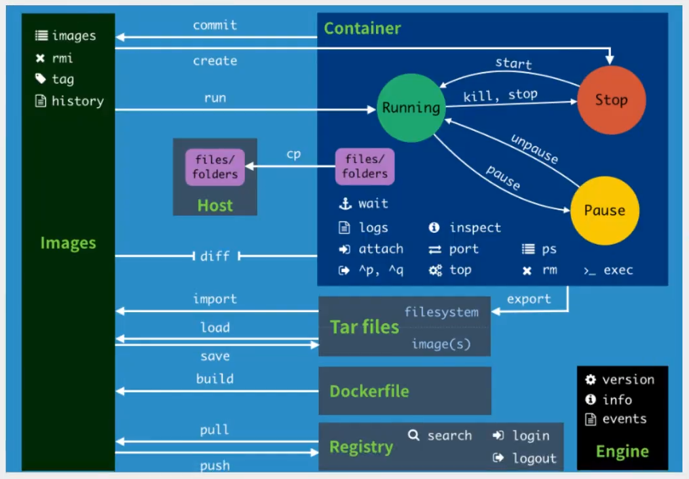
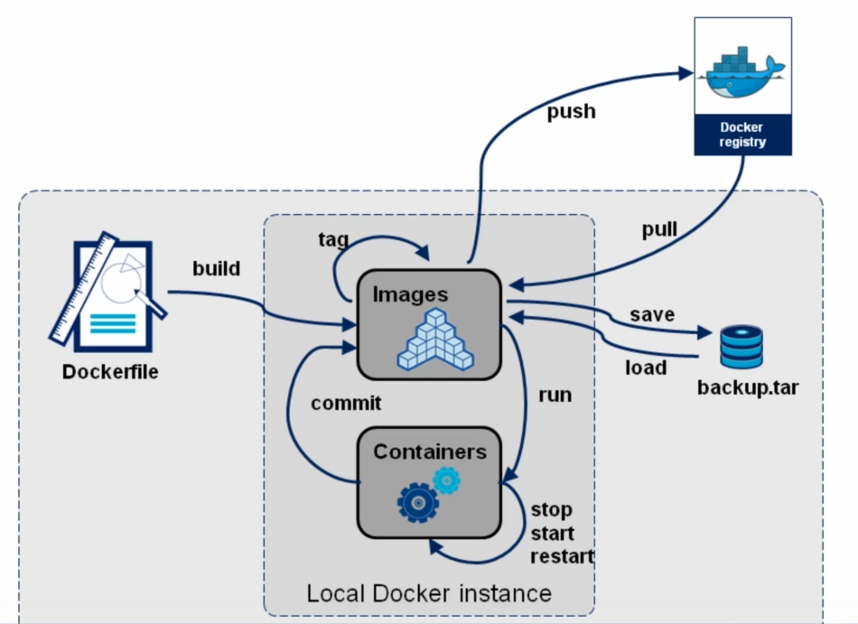

### Docker 流程图







### 镜像获取

- pull from registry  (online) 
  - public
  - private
- build from Dockerfile  (online)
- load from file  (offlline)


### 镜像基本操作

```shell
[root@VM-20-7-centos /]# docker image

Usage:  docker image COMMAND

Manage images

Commands:
  build       Build an image from a Dockerfile #从Dockerfile构建一个镜像
  history     Show the history of an image #显示一个镜像的历史
  import      Import the contents from a tarball to create a filesystem image #从tarball文件中导入内容以创建文件系统镜像
  inspect     Display detailed information on one or more images #显示一个或多个镜像的详细信息
  load        Load an image from a tar archive or STDIN #从tar存档文件或STDIN加载镜像
  ls          List images #镜像列表
  prune       Remove unused images #删除未使用的镜像
  pull        Pull an image or a repository from a registry #从registry中提取镜像或存储库
  push        Push an image or a repository to a registry #将镜像或存储库推送到registry
  rm          Remove one or more images #删除一个或多个镜像
  save        Save one or more images to a tar archive (streamed to STDOUT by default) #将一个或多个镜像保存到tar存档文件(默认情况下流到STDOUT)
  tag         Create a tag TARGET_IMAGE that refers to SOURCE_IMAGE #创建引用SOURCE_IMAGE的标记TARGET_IMAGE

Run 'docker image COMMAND --help' for more information on a command.
[root@VM-20-7-centos /]# 

```

查看镜像

```shell
[root@VM-20-7-centos /]# docker image ls
REPOSITORY    TAG       IMAGE ID       CREATED        SIZE
nginx         latest    605c77e624dd   2 months ago   141MB
mysql         latest    3218b38490ce   2 months ago   516MB
hello-world   latest    feb5d9fea6a5   5 months ago   13.3kB
centos        latest    5d0da3dc9764   5 months ago   231MB

```

拉去指定版本镜像

```shell
[root@VM-20-7-centos /]# docker pull mysql:5.7 #若不指定版本则最新版本
5.7: Pulling from library/mysql
72a69066d2fe: Already exists 
93619dbc5b36: Already exists 
99da31dd6142: Already exists 
626033c43d70: Already exists 
37d5d7efb64e: Already exists 
ac563158d721: Already exists 
d2ba16033dad: Already exists 
0ceb82207cd7: Pull complete 
37f2405cae96: Pull complete 
e2482e017e53: Pull complete 
70deed891d42: Pull complete 
Digest: sha256:f2ad209efe9c67104167fc609cca6973c8422939491c9345270175a300419f94
Status: Downloaded newer image for mysql:5.7
docker.io/library/mysql:5.7

```

查看镜像详细信息

```shell
[root@VM-20-7-centos /]# docker image ls
REPOSITORY    TAG       IMAGE ID       CREATED        SIZE
nginx         latest    605c77e624dd   2 months ago   141MB
mysql         5.7       c20987f18b13   2 months ago   448MB
mysql         latest    3218b38490ce   2 months ago   516MB
hello-world   latest    feb5d9fea6a5   5 months ago   13.3kB
centos        latest    5d0da3dc9764   5 months ago   231MB
[root@VM-20-7-centos /]# docker image inspect c20
[
    {
        "Id": "sha256:c20987f18b130f9d144c9828df630417e2a9523148930dc3963e9d0dab302a76",
        "RepoTags": [
            "mysql:5.7"
        ],
        "RepoDigests": [
            "mysql@sha256:f2ad209efe9c67104167fc609cca6973c8422939491c9345270175a300419f94"
        ],
        "Parent": "",
        "Comment": "",
        "Created": "2021-12-21T02:56:51.419272329Z",
        "Container": "6ab3c250aff0cce746e68539255208e6468cfe4a745272cd0d765394038caa18",
        "ContainerConfig": {
            "Hostname": "6ab3c250aff0",
            "Domainname": "",
            "User": "",
            "AttachStdin": false,
            "AttachStdout": false,
            "AttachStderr": false,
            "ExposedPorts": {
                "3306/tcp": {},
                "33060/tcp": {}
            },
            "Tty": false,
            "OpenStdin": false,
            "StdinOnce": false,
            "Env": [
                "PATH=/usr/local/sbin:/usr/local/bin:/usr/sbin:/usr/bin:/sbin:/bin",
                "GOSU_VERSION=1.12",
                "MYSQL_MAJOR=5.7",
                "MYSQL_VERSION=5.7.36-1debian10"
            ],
            "Cmd": [
                "/bin/sh",
                "-c",
                "#(nop) ",
                "CMD [\"mysqld\"]"
            ],
            "Image": "sha256:ed97f3d66e845171cbe80f781d68532b453046984fc643508bd13f0e0d22d0b6",
            "Volumes": {
                "/var/lib/mysql": {}
            },
            "WorkingDir": "",
            "Entrypoint": [
                "docker-entrypoint.sh"
            ],
            "OnBuild": null,
            "Labels": {}
        },
        "DockerVersion": "20.10.7",
        "Author": "",
        "Config": {
            "Hostname": "",
            "Domainname": "",
            "User": "",
            "AttachStdin": false,
            "AttachStdout": false,
            "AttachStderr": false,
            "ExposedPorts": {
                "3306/tcp": {},
                "33060/tcp": {}
            },
            "Tty": false,
            "OpenStdin": false,
            "StdinOnce": false,
            "Env": [
                "PATH=/usr/local/sbin:/usr/local/bin:/usr/sbin:/usr/bin:/sbin:/bin",
                "GOSU_VERSION=1.12",
                "MYSQL_MAJOR=5.7",
                "MYSQL_VERSION=5.7.36-1debian10"
            ],
            "Cmd": [
                "mysqld"
            ],
            "Image": "sha256:ed97f3d66e845171cbe80f781d68532b453046984fc643508bd13f0e0d22d0b6",
            "Volumes": {
                "/var/lib/mysql": {}
            },
            "WorkingDir": "",
            "Entrypoint": [
                "docker-entrypoint.sh"
            ],
            "OnBuild": null,
            "Labels": null
        },
        "Architecture": "amd64",
        "Os": "linux",
        "Size": 448342182,
        "VirtualSize": 448342182,
        "GraphDriver": {
            "Data": {
                "LowerDir": "/var/lib/docker/overlay2/fa14924d6473f3d93b719fba4630be84990bb23ca089473c0487b79886d7865a/diff:/var/lib/docker/overlay2/7fc71a072ab31089823adb010c98ddbe589e6b1b550339f44b15353aead7bd2f/diff:/var/lib/docker/overlay2/2e759bc672de4341b424dea8c014ac45f798cf863607a9e2259f9c969204465e/diff:/var/lib/docker/overlay2/05ca5d179d0aa58afb33d96c855cd057f0389ba4624ef1503c4e9cf904272bb7/diff:/var/lib/docker/overlay2/cab011d5339726976af4757e8e16a6fc9fd7aa12a145d8260bec82aa3d1e1de8/diff:/var/lib/docker/overlay2/ad01dbee4d60722939a0bcf501a702e6a4bb9391dee95bfa3c041b5699af229e/diff:/var/lib/docker/overlay2/56fd3af37eebee09a89f78ad3ed7fe96bbd9e2d898c99aa2ef34350b2bdb7d24/diff:/var/lib/docker/overlay2/b433e2d5d89ad351fc8a3966782860fe613adf3c5a6a294343a4020003c36d22/diff:/var/lib/docker/overlay2/1da1d5640a87742575469df5b4af9944f0ca0abdf2dc06ddfaaa38bb9d44ecf1/diff:/var/lib/docker/overlay2/fee5f676b3377785837739f8d0570e6c3a414bef19f530ff7afd3ef2c6dccff9/diff",
                "MergedDir": "/var/lib/docker/overlay2/b46fd23e7c896bcaf5890c6a5ec4661e515eba3fd6284aeffa462e30acb0aff0/merged",
                "UpperDir": "/var/lib/docker/overlay2/b46fd23e7c896bcaf5890c6a5ec4661e515eba3fd6284aeffa462e30acb0aff0/diff",
                "WorkDir": "/var/lib/docker/overlay2/b46fd23e7c896bcaf5890c6a5ec4661e515eba3fd6284aeffa462e30acb0aff0/work"
            },
            "Name": "overlay2"
        },
        "RootFS": {
            "Type": "layers",
            "Layers": [
                "sha256:ad6b69b549193f81b039a1d478bc896f6e460c77c1849a4374ab95f9a3d2cea2",
                "sha256:fba7b131c5c350d828ebea6ce6d52cdc751219c6287c4a7f13a51435b35eac06",
                "sha256:0798f2528e8383f031ebd3c6d351f7d9f7731b3fd12007e5f2fdcdc4e1efc31a",
                "sha256:a0c2a050fee24f87fde784c197a8b3eb66a3881b96ea261165ac1a01807ffb80",
                "sha256:d7a777f6c3a4ded4667f61398eb1f9b380db07bf48876f64d93bf30fb1393f96",
                "sha256:0d17fee8db40d61d9ca0d85bff8b32ef04bbd09d77e02cc67c454c8f84edb3d8",
                "sha256:aad27784b7621a3e58bd03e5d798e505fb80b081a5070d7c822e41606b90a5c0",
                "sha256:9b64bb048d04da7fcd2641c65bd60c94e0512aeb4526f19d122dcb0d6b8f3958",
                "sha256:35ba198e64f5b7a95c3177cc90eb30e34eb84e22c44ed8c4bf8c6400eaf6b8e3",
                "sha256:789f3aa31b3f292f7c778fe0f2cfcc9759d792a41628ecba1a745f69b4368904",
                "sha256:e889c671872c4d8585274e8928bce7d06cd13525c3be9f45e79e80b0dd21907a"
            ]
        },
        "Metadata": {
            "LastTagTime": "0001-01-01T00:00:00Z"
        }
    }
]
[root@VM-20-7-centos /]# 

```

删除镜像

```shell
[root@VM-20-7-centos /]# docker image ls
REPOSITORY    TAG       IMAGE ID       CREATED        SIZE
nginx         latest    605c77e624dd   2 months ago   141MB
mysql         5.7       c20987f18b13   2 months ago   448MB
mysql         latest    3218b38490ce   2 months ago   516MB
hello-world   latest    feb5d9fea6a5   5 months ago   13.3kB
centos        latest    5d0da3dc9764   5 months ago   231MB
[root@VM-20-7-centos /]# docker image rm 5d0
Untagged: centos:latest
Untagged: centos@sha256:a27fd8080b517143cbbbab9dfb7c8571c40d67d534bbdee55bd6c473f432b177
Deleted: sha256:5d0da3dc976460b72c77d94c8a1ad043720b0416bfc16c52c45d4847e53fadb6
Deleted: sha256:74ddd0ec08fa43d09f32636ba91a0a3053b02cb4627c35051aff89f853606b59
[root@VM-20-7-centos /]# docker image ls
REPOSITORY    TAG       IMAGE ID       CREATED        SIZE
nginx         latest    605c77e624dd   2 months ago   141MB
mysql         5.7       c20987f18b13   2 months ago   448MB
mysql         latest    3218b38490ce   2 months ago   516MB
hello-world   latest    feb5d9fea6a5   5 months ago   13.3kB
[root@VM-20-7-centos /]# # docker image rm -f $(docker images -aq) # 删除全部的镜像

```


### 镜像导入导出

```shell
[root@VM-20-7-centos /]# docker image save mysql:5.7 -o mysql.image #导出镜像文件 （.image .tar .tar.gz）
[root@VM-20-7-centos /]# ls
bin   data  etc   lib    lost+found  mnt          opt   root  sbin  sys  usr  www
boot  dev   home  lib64  media       mysql.image  proc  run   srv   tmp  var
[root@VM-20-7-centos /]# docker rmi c20
Untagged: mysql:5.7
Untagged: mysql@sha256:f2ad209efe9c67104167fc609cca6973c8422939491c9345270175a300419f94
Deleted: sha256:c20987f18b130f9d144c9828df630417e2a9523148930dc3963e9d0dab302a76
Deleted: sha256:6567396b065ee734fb2dbb80c8923324a778426dfd01969f091f1ab2d52c7989
Deleted: sha256:0910f12649d514b471f1583a16f672ab67e3d29d9833a15dc2df50dd5536e40f
Deleted: sha256:6682af2fb40555c448b84711c7302d0f86fc716bbe9c7dc7dbd739ef9d757150
Deleted: sha256:5c062c3ac20f576d24454e74781511a5f96739f289edaadf2de934d06e910b92
[root@VM-20-7-centos /]# docker image ls
REPOSITORY    TAG       IMAGE ID       CREATED        SIZE
nginx         latest    605c77e624dd   2 months ago   141MB
mysql         latest    3218b38490ce   2 months ago   516MB
hello-world   latest    feb5d9fea6a5   5 months ago   13.3kB
[root@VM-20-7-centos /]# docker image load -i mysql.image #导入镜像文件还原镜像
9b64bb048d04: Loading layer [==================================================>]  3.584kB/3.584kB
35ba198e64f5: Loading layer [==================================================>]  313.2MB/313.2MB
789f3aa31b3f: Loading layer [==================================================>]  17.92kB/17.92kB
e889c671872c: Loading layer [==================================================>]  1.536kB/1.536kB
Loaded image: mysql:5.7
[root@VM-20-7-centos /]# docker image ls
REPOSITORY    TAG       IMAGE ID       CREATED        SIZE
nginx         latest    605c77e624dd   2 months ago   141MB
mysql         5.7       c20987f18b13   2 months ago   448MB
mysql         latest    3218b38490ce   2 months ago   516MB
hello-world   latest    feb5d9fea6a5   5 months ago   13.3kB
[root@VM-20-7-centos /]# 

```


### Dockerfile介绍

- Dockerfile 是用于构建 docker 镜像的文件
- Dockerfile  有特定语法规则

- Dockerfile 里包含了构造镜像所需要的指令
- Dockerfile  是面向开发的，构建镜像发布项目就需要编写 Dockerfile  文件，
- Docker 镜像逐渐成为项目交付标准，Dockerfile必须要掌握

 

### 镜像构建分享

**docker build**  命令用于使用 Dockerfile 创建镜像。

语法

```she&#39;l&#39;l
docker build [OPTIONS] PATH | URL | -
```


OPTIONS说明：

```shell
docker build [OPTIONS] PATH | URL | -
```

- **--build-arg=[] :**设置镜像创建时的变量；
- **--cpu-shares :**设置 cpu 使用权重；
- **--cpu-period :**限制 CPU CFS周期；
- **--cpu-quota :**限制 CPU CFS配额；
- **--cpuset-cpus :**指定使用的CPU id；
- **--cpuset-mems :**指定使用的内存 id；
- **--disable-content-trust :**忽略校验，默认开启；
- **-f :**指定要使用的Dockerfile路径；
- **--force-rm :**设置镜像过程中删除中间容器；
- **--isolation :**使用容器隔离技术；
- **--label=[] :**设置镜像使用的元数据；
- **-m :**设置内存最大值；
- **--memory-swap :**设置Swap的最大值为内存+swap，"-1"表示不限swap；
- **--no-cache :**创建镜像的过程不使用缓存；
- **--pull :**尝试去更新镜像的新版本；
- **--quiet, -q :**安静模式，成功后只输出镜像 ID；
- **--rm :**设置镜像成功后删除中间容器；
- **--shm-size :**设置/dev/shm的大小，默认值是64M；
- **--ulimit :**Ulimit配置。
- **--squash :**将 Dockerfile 中所有的操作压缩为一层。
- **--tag, -t:** 镜像的名字及标签，通常 name:tag 或者 name 格式；可以在一次构建中为一个镜像设置多个标签。
- **--network:** 默认 default。在构建期间设置RUN指令的网络模式


举例

```shell
PS D:\baocai\docker\DockerDemo\HelloDocker\HelloDockerfile\FROM> docker build -t hellofromcommand . # build 镜像
[+] Building 0.1s (5/5) FINISHED
 => [internal] load build definition from Dockerfile                                                                                                         0.0s
 => => transferring dockerfile: 81B                                                                                                                          0.0s 
 => [internal] load .dockerignore                                                                                                                            0.0s 
 => => transferring context: 2B                                                                                                                              0.0s 
 => [internal] load build context                                                                                                                            0.0s 
 => => transferring context: 58B                                                                                                                             0.0s 
 => [1/1] ADD index.html /app/index.html                                                                                                                     0.0s 
 => exporting to image                                                                                                                                       0.0s
 => => exporting layers                                                                                                                                      0.0s 
 => => writing image sha256:0bb471cee6654012ea664d2f329fa3b5388035631a249f321754a7dfe6a4419b                                                                 0.0s 
 => => naming to docker.io/library/hellofromcommand                                                                                                          0.0s 

Use 'docker scan' to run Snyk tests against images to find vulnerabilities and learn how to fix them
PS D:\baocai\docker\DockerDemo\HelloDocker\HelloDockerfile\FROM> docker image ls
REPOSITORY                                                TAG       IMAGE ID       CREATED          SIZE
hellofromcommand                                          latest    0bb471cee665   22 seconds ago   21B
weichangk/hellodocker                                     3.0       62942fd6a177   24 hours ago     271MB
registry.cn-shenzhen.aliyuncs.com/weichangk/hellodocker   3.0       62942fd6a177   24 hours ago     271MB
hellodocker                                               2.0       1d769fdffbd1   24 hours ago     271MB
hellodocker                                               1.0       8c91717e9f23   27 hours ago     217MB
mysql                                                     latest    b05128b000dd   3 months ago     516MB
PS D:\baocai\docker\DockerDemo\HelloDocker\HelloDockerfile\FROM> docker history hellofromcommand # history 查看指定镜像的创建历史。
IMAGE          CREATED              CREATED BY                                  SIZE      COMMENT
0bb471cee665   About a minute ago   ADD index.html /app/index.html # buildkit   21B       buildkit.dockerfile.v0
PS D:\baocai\docker\DockerDemo\HelloDocker\HelloDockerfile\FROM> 
```


docker push :将本地的镜像上传到镜像仓库，要先登陆到镜像仓库

语法

```shell
docker push [OPTIONS] NAME[:TAG]
```


### commit 创建镜像


### scratch 镜像


