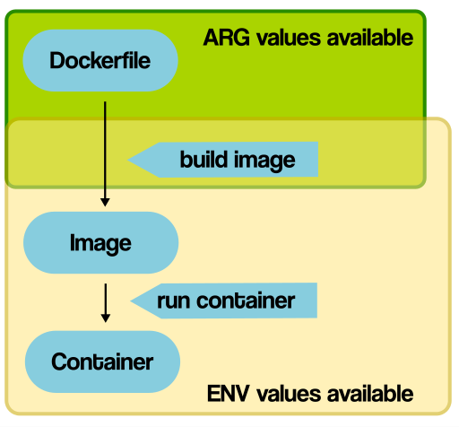
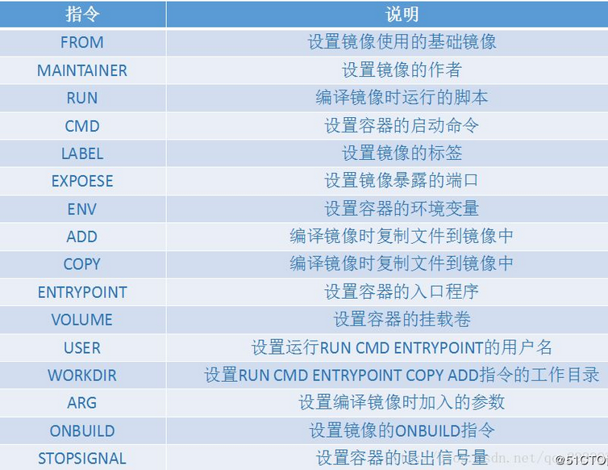

# 基础镜像的选择 (FROM)

## 原则

- 官方镜像优于非官方的镜像，如果没有官方镜像，则尽量选择Dockerfile开源的
- 固定版本tag而不是每次都使用latest
- 尽量选择体积小的镜像

## Dockerfile

```she&#39;l&#39;l
FROM scratch
ADD index.html /app/index.html
```

```shell
PS D:\baocai\docker\DockerDemo\HelloDocker\HelloDockerfile\FROM> docker build -t hellofromcommand .
[+] Building 0.1s (5/5) FINISHED
 => [internal] load build definition from Dockerfile                                                                                                         0.0s
 => => transferring dockerfile: 81B                                                                                                                          0.0s 
 => [internal] load .dockerignore                                                                                                                            0.0s 
 => => transferring context: 2B                                                                                                                              0.0s 
 => [internal] load build context                                                                                                                            0.0s 
 => => transferring context: 58B                                                                                                                             0.0s 
 => [1/1] ADD index.html /app/index.html                                                                                                                     0.0s 
 => exporting to image                                                                                                                                       0.0s
 => => exporting layers                                                                                                                                      0.0s 
 => => writing image sha256:0bb471cee6654012ea664d2f329fa3b5388035631a249f321754a7dfe6a4419b                                                                 0.0s 
 => => naming to docker.io/library/hellofromcommand                                                                                                          0.0s 

Use 'docker scan' to run Snyk tests against images to find vulnerabilities and learn how to fix them
PS D:\baocai\docker\DockerDemo\HelloDocker\HelloDockerfile\FROM> docker image ls
REPOSITORY                                                TAG       IMAGE ID       CREATED          SIZE
hellofromcommand                                          latest    0bb471cee665   22 seconds ago   21B
weichangk/hellodocker                                     3.0       62942fd6a177   24 hours ago     271MB
registry.cn-shenzhen.aliyuncs.com/weichangk/hellodocker   3.0       62942fd6a177   24 hours ago     271MB
hellodocker                                               2.0       1d769fdffbd1   24 hours ago     271MB
hellodocker                                               1.0       8c91717e9f23   27 hours ago     217MB
mysql                                                     latest    b05128b000dd   3 months ago     516MB
PS D:\baocai\docker\DockerDemo\HelloDocker\HelloDockerfile\FROM> docker history hellofromcommand
IMAGE          CREATED              CREATED BY                                  SIZE      COMMENT
0bb471cee665   About a minute ago   ADD index.html /app/index.html # buildkit   21B       buildkit.dockerfile.v0
PS D:\baocai\docker\DockerDemo\HelloDocker\HelloDockerfile\FROM> 
```


# 通过 RUN 执行指令

`RUN` 主要用于在Image里执行指令，比如在服务器中安装软件，下载文件等。

```shell
$ apt-get update
$ apt-get install wget
$ wget https://github.com/ipinfo/cli/releases/download/ipinfo-2.0.1/ipinfo_2.0.1_linux_amd64.tar.gz
$ tar zxf ipinfo_2.0.1_linux_amd64.tar.gz
$ mv ipinfo_2.0.1_linux_amd64 /usr/bin/ipinfo
$ rm -rf ipinfo_2.0.1_linux_amd64.tar.gz
```

## Dockerfile

```shell
FROM ubuntu:21.04
RUN apt-get update
RUN apt-get install -y wget
RUN wget https://github.com/ipinfo/cli/releases/download/ipinfo-2.0.1/ipinfo_2.0.1_linux_amd64.tar.gz
RUN tar zxf ipinfo_2.0.1_linux_amd64.tar.gz
RUN mv ipinfo_2.0.1_linux_amd64 /usr/bin/ipinfo
RUN rm -rf ipinfo_2.0.1_linux_amd64.tar.gz
```


每一行的RUN命令都会产生一层image layer, 导致镜像的臃肿。

## 改进版Dockerfile

```shell
FROM ubuntu:21.04
RUN apt-get update && \
    apt-get install -y wget && \
    wget https://github.com/ipinfo/cli/releases/download/ipinfo-2.0.1/ipinfo_2.0.1_linux_amd64.tar.gz && \
    tar zxf ipinfo_2.0.1_linux_amd64.tar.gz && \
    mv ipinfo_2.0.1_linux_amd64 /usr/bin/ipinfo && \
    rm -rf ipinfo_2.0.1_linux_amd64.tar.gz
```


# 文件复制和目录操作 (ADD,COPY,WORKDIR)

往镜像里复制文件有两种方式，`COPY` 和 `ADD` 。

`COPY` 和 `ADD` 都可以把local的一个文件复制到镜像里，如果目标目录不存在，则会自动创建

`ADD` 比 `COPY`高级一点的地方就是，如果复制的是一个gzip等压缩文件时，`ADD`会帮助我们自动去解压缩文件。

因此在 `COPY `和 `ADD `指令中选择的时候，可以遵循这样的原则，所有的文件复制均使用 `COPY` 指令，仅在需要自动解压缩的场合使用 `ADD`。


WORKDIR指令设置Dockerfile中的任何RUN，CMD，ENTRPOINT，COPY和ADD指令的工作目录。如果WORKDIR指定的目录不存在，即使随后的指令没有用到这个目录，都会创建。

单个Dockerfile可以使用多次WORKFDIR，当前的工作目录将于上个WORKDIR指令相关。

```shell
WORKDIR /a
WORKDIR b
WORKDIR c
RUN pwd
```

pwd命令的输出/a/b/c 

## Dockerfile

```shell
FROM hello-world
WORKDIR /app
COPY copy.txt copy.txt
ADD add.7z /add/
```

将镜像创建的容器拷贝出来查看目录结构发现 ADD 指令没有自动解压！！！ 也不在工作目录下！！！


```shell
PS D:\baocai\docker\DockerDemo\HelloDocker\HelloDockerfile\COPY_ADD_WORKDIR> docker build -t copyaddworkdir . # 创建镜像
[+] Building 23.1s (10/10) FINISHED                                                                                                                               
 => [internal] load build definition from Dockerfile                                                                                                         0.0s
 => => transferring dockerfile: 109B                                                                                                                         0.0s 
 => [internal] load .dockerignore                                                                                                                            0.0s 
 => => transferring context: 2B                                                                                                                              0.0s 
 => [internal] load metadata for docker.io/library/hello-world:latest                                                                                       21.5s 
 => [auth] library/hello-world:pull token for registry-1.docker.io                                                                                           0.0s
 => [1/4] FROM docker.io/library/hello-world@sha256:4c5f3db4f8a54eb1e017c385f683a2de6e06f75be442dc32698c9bbe6c861edd                                         1.4s
 => => resolve docker.io/library/hello-world@sha256:4c5f3db4f8a54eb1e017c385f683a2de6e06f75be442dc32698c9bbe6c861edd                                         0.0s 
 => => sha256:feb5d9fea6a5e9606aa995e879d862b825965ba48de054caab5ef356dc6b3412 1.47kB / 1.47kB                                                               0.0s 
 => => sha256:2db29710123e3e53a794f2694094b9b4338aa9ee5c40b930cb8063a1be392c54 2.48kB / 2.48kB                                                               1.3s 
 => => sha256:4c5f3db4f8a54eb1e017c385f683a2de6e06f75be442dc32698c9bbe6c861edd 2.56kB / 2.56kB                                                               0.0s
 => => sha256:f54a58bc1aac5ea1a25d796ae155dc228b3f0e11d046ae276b39c4bf2f13d8c4 525B / 525B                                                                   0.0s 
 => => extracting sha256:2db29710123e3e53a794f2694094b9b4338aa9ee5c40b930cb8063a1be392c54                                                                    0.0s 
 => [internal] load build context                                                                                                                            0.0s 
 => => transferring context: 226B                                                                                                                            0.0s
 => [2/4] WORKDIR /app                                                                                                                                       0.0s
 => [3/4] COPY copy.txt copy.txt                                                                                                                             0.0s 
 => [4/4] ADD add.7z /add/                                                                                                                                   0.0s 
 => exporting to image                                                                                                                                       0.1s 
 => => exporting layers                                                                                                                                      0.0s 
 => => writing image sha256:7161b2201f8cce8909468f0b86e9ae6523201c62c591db9bcca03ae092fba5d4                                                                 0.0s 
 => => naming to docker.io/library/copyaddworkdir                                                                                                            0.0s 

Use 'docker scan' to run Snyk tests against images to find vulnerabilities and learn how to fix them
PS D:\baocai\docker\DockerDemo\HelloDocker\HelloDockerfile\COPY_ADD_WORKDIR> docker image ls
REPOSITORY                                                TAG       IMAGE ID       CREATED             SIZE
copyaddworkdir                                            latest    7161b2201f8c   19 seconds ago      13.4kB
PS D:\baocai\docker\DockerDemo\HelloDocker\HelloDockerfile\COPY_ADD_WORKDIR> docker history 7161b2201f8c
IMAGE          CREATED              CREATED BY                                      SIZE      COMMENT
7161b2201f8c   About a minute ago   ADD add.7z /add/ # buildkit                     146B      buildkit.dockerfile.v0
<missing>      About a minute ago   COPY copy.txt copy.txt # buildkit               8B        buildkit.dockerfile.v0
<missing>      About a minute ago   WORKDIR /app                                    0B        buildkit.dockerfile.v0
<missing>      5 months ago         /bin/sh -c #(nop)  CMD ["/hello"]               0B
<missing>      5 months ago         /bin/sh -c #(nop) COPY file:50563a97010fd7ce…   13.3kB
PS D:\baocai\docker\DockerDemo\HelloDocker\HelloDockerfile\COPY_ADD_WORKDIR>  
```


# 构建参数和环境变量 (ARG vs ENV)

`ARG` 和 `ENV` 是经常容易被混淆的两个 Dockerfile 的语法，都可以用来设置一个“变量”。 但实际上两者有很多的不同。

## ENV

```shell
FROM ubuntu:21.04
ENV VERSION=2.0.1
RUN apt-get update && \
    apt-get install -y wget && \
    wget https://github.com/ipinfo/cli/releases/download/ipinfo-${VERSION}/ipinfo_${VERSION}_linux_amd64.tar.gz && \
    tar zxf ipinfo_${VERSION}_linux_amd64.tar.gz && \
    mv ipinfo_${VERSION}_linux_amd64 /usr/bin/ipinfo && \
    rm -rf ipinfo_${VERSION}_linux_amd64.tar.gz
```

## ARG

```shell
FROM ubuntu:21.04
ARG VERSION=2.0.1
RUN apt-get update && \
    apt-get install -y wget && \
    wget https://github.com/ipinfo/cli/releases/download/ipinfo-${VERSION}/ipinfo_${VERSION}_linux_amd64.tar.gz && \
    tar zxf ipinfo_${VERSION}_linux_amd64.tar.gz && \
    mv ipinfo_${VERSION}_linux_amd64 /usr/bin/ipinfo && \
    rm -rf ipinfo_${VERSION}_linux_amd64.tar.gz
```

## 区别




ARG 可以在镜像build的时候动态修改value, 通过 `--build-arg`

```shell
$ docker image build -f .\Dockerfile-arg -t ipinfo-arg-2.0.0 --build-arg VERSION=2.0.0 .
$ docker image ls
REPOSITORY         TAG       IMAGE ID       CREATED          SIZE
ipinfo-arg-2.0.0   latest    0d9c964947e2   6 seconds ago    124MB
$ docker container run -it ipinfo-arg-2.0.0
root@b64285579756:/#
root@b64285579756:/# ipinfo version
2.0.0
root@b64285579756:/#
```


ENV 设置的变量可以在Image中保持，并在容器中的环境变量里


# 容器启动命令 CMD

CMD可以用来设置容器启动时默认会执行的命令。

- 容器启动时默认执行的命令
- 如果docker container run启动容器时指定了其它命令，则CMD命令会被忽略
- 如果定义了多个CMD，只有最后一个会被执行。


# 容器启动命令 ENTRYPOINT

ENTRYPOINT 也可以设置容器启动时要执行的命令，但是和CMD是有区别的。

- `CMD` 设置的命令，可以在docker container run 时传入其它命令，覆盖掉 `CMD` 的命令，但是 `ENTRYPOINT` 所设置的命令是一定会被执行的。

- `ENTRYPOINT` 和 `CMD` 可以联合使用，`ENTRYPOINT` 设置执行的命令，CMD传递参数


```shell
FROM ubuntu:21.04
CMD ["echo", "hello docker"]
```

把上面的Dockerfile build成一个叫 `demo-cmd` 的镜象


```shell
FROM ubuntu:21.04
ENTRYPOINT ["echo", "hello docker"]
```

build成一个叫 `demo-entrypoint` 的镜像


CMD的镜像，如果执行创建容器，不指定运行时的命令，则会默认执行CMD所定义的命令，打印出hello docker

```shell
$ docker container run -it --rm demo-cmd
hello docker
```

但是如果我们docker container run的时候指定命令，则该命令会覆盖掉CMD的命令，如：

```shell
$ docker container run -it --rm demo-cmd echo "hello world"
hello world
```


但是ENTRYPOINT的容器里ENTRYPOINT所定义的命令则无法覆盖，一定会执行

```shell
$ docker container run -it --rm demo-entrypoint
hello docker
$ docker container run -it --rm demo-entrypoint echo "hello world"
hello docker echo hello world
$
```


# 总结

dockerfile 是用来构建docker镜像的文件，命令参数脚本。

构建步骤：

* 编写一个 dockerfile 文件
* docker build 构建镜像
* docker run 运行镜像
* docker push 发布镜像


dockerfile 基础知识

* 每个保留关键字（指令）都必须是大写字母
* 执行至上而下
* \#表示注释
* 每个指令都会创建提交一个镜像层


dockerfile 常用指令总结




