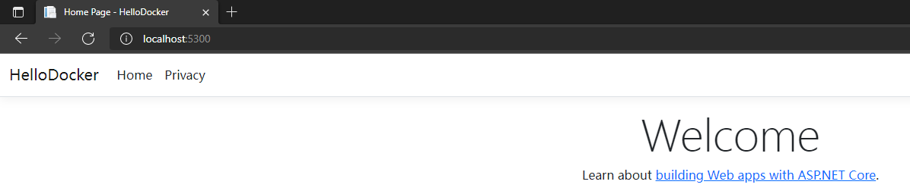
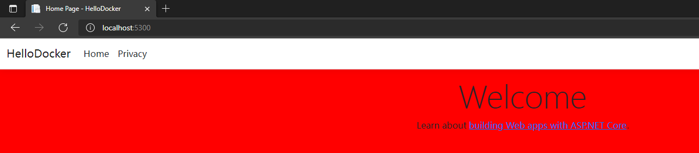
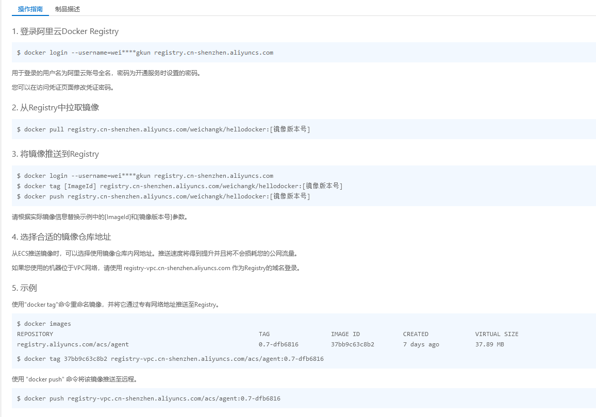
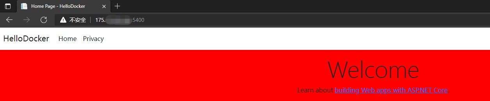

### 创建 ASP.NET Core MVC 项目

......


### 添加 Dockerfile 文件

```shell
# 基础镜像
FROM mcr.microsoft.com/dotnet/aspnet:6.0

# 复制应用程序发布文件到镜像指定文件目录
COPY dist /app

# 设置镜像工作目录
WORKDIR /app

# 公开HTTP端口
EXPOSE 80/tcp

# 运行应用程序
ENTRYPOINT [ "dotnet", "HelloDocker.dll" ]
```


### 生成发布文件

```shell
dotnet publish --configuration Release --output dist 
```

参考：https://docs.microsoft.com/zh-cn/dotnet/core/tools/dotnet-publish


### 创建 ASP.NET Core 项目镜像

Docker build 命令用于使用 Dockerfile 创建镜像

```shell
docker build . -t hellodocker:1.0 -f Dockerfile       
```

```shell
PS D:\baocai\docker\DockerDemo\HelloDocker\HelloDocker> docker build . -t hellodocker:1.0 -f Dockerfile       
[+] Building 10.7s (8/8) FINISHED
 => => sha256:d0346670a5ac086b63c3ec44c3025dd93a69495024b68fe9dc31a273c61b825e 9.44MB / 9.44MB                                                               5.6s 
 => => extracting sha256:f7a1c6dad28192bd417b78079d6ddc03cbca6d5ea46bba12769b235b6353c00c                                                                    1.6s 
 => => extracting sha256:977369f03a9d13e15c43962a73da976d4567902a6d7c4e7f48bace4fa821050d                                                                    0.6s 
 => => extracting sha256:d0b80bd47930e1a200fa704fe204e03b748fba290f06d73bd10c2f44dce64102                                                                    0.9s 
 => => extracting sha256:a340414b2a3df9ea7577f32c0c3a324041cfb63b9dadc9ffebef76ba6591a451                                                                    0.0s 
 => => extracting sha256:d0346670a5ac086b63c3ec44c3025dd93a69495024b68fe9dc31a273c61b825e                                                                    0.3s 
 => [2/3] COPY dist /app                                                                                                                                     0.3s 
 => [3/3] WORKDIR /app                                                                                                                                       0.0s 
 => exporting to image                                                                                                                                       0.1s 
 => => exporting layers                                                                                                                                      0.1s 
 => => writing image sha256:8c91717e9f23cd908249945e5ed0a13968a3a5b878e8f8c12b2244bd99280258                                                                 0.0s 
 => => naming to docker.io/library/hellodocker:1.0                                                                                                           0.0s 

Use 'docker scan' to run Snyk tests against images to find vulnerabilities and learn how to fix them
PS D:\baocai\docker\DockerDemo\HelloDocker\HelloDocker>
```

参考：https://www.coonote.com/docker/docker-cmd-build.html


```shell
PS D:\baocai\docker\DockerDemo\HelloDocker\HelloDocker> docker image ls
REPOSITORY    TAG       IMAGE ID       CREATED         SIZE
hellodocker   1.0       8c91717e9f23   2 minutes ago   217MB
mysql         latest    b05128b000dd   3 months ago    516MB
PS D:\baocai\docker\DockerDemo\HelloDocker\HelloDocker> docker ps
CONTAINER ID   IMAGE     COMMAND   CREATED   STATUS    PORTS     NAMES
PS D:\baocai\docker\DockerDemo\HelloDocker\HelloDocker> docker image inspect 8c9 #查看镜像详细信息
[
    {
        "Id": "sha256:8c91717e9f23cd908249945e5ed0a13968a3a5b878e8f8c12b2244bd99280258",
        "RepoTags": [
            "hellodocker:1.0"
        ],
        "RepoDigests": [],
        "Parent": "",
        "Comment": "buildkit.dockerfile.v0",
        "Created": "2022-03-08T09:32:46.3228522Z",
        "Container": "",
        "ContainerConfig": {
            "Hostname": "",
            "Domainname": "",
            "User": "",
            "AttachStdin": false,
            "AttachStdout": false,
            "AttachStderr": false,
            "Tty": false,
            "OpenStdin": false,
            "StdinOnce": false,
            "Env": null,
            "Cmd": null,
            "Image": "",
            "Volumes": null,
            "WorkingDir": "",
            "Entrypoint": null,
            "OnBuild": null,
            "Labels": null
        },
        "DockerVersion": "",
        "Author": "",
        "Config": {
            "Hostname": "",
            "Domainname": "",
            "User": "",
            "AttachStdin": false,
            "AttachStdout": false,
            "AttachStderr": false,
            "ExposedPorts": {
                "80/tcp": {}
            },
            "Tty": false,
            "OpenStdin": false,
            "StdinOnce": false,
            "Env": [
                "PATH=/usr/local/sbin:/usr/local/bin:/usr/sbin:/usr/bin:/sbin:/bin",
                "ASPNETCORE_URLS=http://+:80",
                "DOTNET_RUNNING_IN_CONTAINER=true",
                "DOTNET_VERSION=6.0.2",
                "ASPNET_VERSION=6.0.2",
                "Logging__Console__FormatterName=Json"
            ],
            "Cmd": null,
            "Image": "",
            "Volumes": null,
            "WorkingDir": "/app",
            "Entrypoint": [
                "dotnet",
                "HelloDocker.dll"
            ],
            "OnBuild": null,
            "Labels": null
        },
        "Architecture": "amd64",
        "Os": "linux",
        "Size": 216624965,
        "VirtualSize": 216624965,
        "GraphDriver": {
            "Data": {
                "LowerDir": "/var/lib/docker/overlay2/v97g9fpcdd1b2b2m5bnthy3cs/diff:/var/lib/docker/overlay2/3511ed941b0c7e5367f4696caf52c88d6d15135948f92f935539c7482ff4036c/diff:/var/lib/docker/overlay2/ccd8f213cb8e4ff9a320f57fe20124e45e904f29e914b042b4b013a335169fb9/diff:/var/lib/docker/overlay2/1dc9b037959fae22f7c367632044590fe694402267ec03485b57a8e23b36007d/diff:/var/lib/docker/overlay2/412aae60b57b82a2da55aeb9de76e35a5926a9107cba627336e1f308da32fd88/diff:/var/lib/docker/overlay2/9ea428c3043971bb62ac77c26f44d908d35302ddd143d5d379aa95c02083d416/diff",
                "MergedDir": "/var/lib/docker/overlay2/e6zwij0mrdt9r08i4bbf8cr5j/merged",
                "UpperDir": "/var/lib/docker/overlay2/e6zwij0mrdt9r08i4bbf8cr5j/diff",
                "WorkDir": "/var/lib/docker/overlay2/e6zwij0mrdt9r08i4bbf8cr5j/work"
            },
            "Name": "overlay2"
        },
        "RootFS": {
            "Type": "layers",
            "Layers": [
                "sha256:1401df2b50d5de5a743b7bac3238ef3b7ce905ae39f54707b0ebb8eda3ab10bc",
                "sha256:854b582cdd7910d4eb18f066a8c801bb394518fd3ebc44c519cc7a6acac816d9",
                "sha256:bca264a070b09f04f844bdd61fe4cf84d6d616b32c39abd88ef646eebacf981f",
                "sha256:9cba5008ddb05bd928dbc5264373efb33e55238f36ab44feaae5eef67d951fc6",
                "sha256:80e2b67d44b95ec1b5fe0c3c7af4419607c0977b3b8a0c226127671e01a2c999",
                "sha256:24c4432604744657148e292f64013fca94e6f2917e784d72807c326cab497abf",
                "sha256:5f70bf18a086007016e948b04aed3b82103a36bea41755b6cddfaf10ace3c6ef"
            ]
        },
        "Metadata": {
            "LastTagTime": "2022-03-08T09:32:46.4055165Z"
        }
    }
]
PS D:\baocai\docker\DockerDemo\HelloDocker\HelloDocker> 
```


### 使用镜像创建容器

```shell
PS D:\baocai\docker\DockerDemo\HelloDocker\HelloDocker> docker image ls
REPOSITORY    TAG       IMAGE ID       CREATED          SIZE
hellodocker   1.0       8c91717e9f23   11 minutes ago   217MB
mysql         latest    b05128b000dd   3 months ago     516MB
PS D:\baocai\docker\DockerDemo\HelloDocker\HelloDocker> docker create -p 5300:80 --name HelloDockerApp5300 8c91717e9f23
cd1fd3f57ae8a4fd927636af116b46e36966c887c157e5df01b55e009b7935c5
PS D:\baocai\docker\DockerDemo\HelloDocker\HelloDocker> docker ps
CONTAINER ID   IMAGE     COMMAND   CREATED   STATUS    PORTS     NAMES
PS D:\baocai\docker\DockerDemo\HelloDocker\HelloDocker> docker ps -a
CONTAINER ID   IMAGE          COMMAND                  CREATED          STATUS                    PORTS                               NAMES
cd1fd3f57ae8   8c91717e9f23   "dotnet HelloDocker.…"   18 seconds ago   Created                                                       HelloDockerApp5300
7dc360a769b9   mysql          "docker-entrypoint.s…"   6 days ago       Exited (255) 5 days ago   0.0.0.0:3306->3306/tcp, 33060/tcp   mysql-test
```

参考：https://www.coonote.com/docker/docker-cmd-create.html

### 启动容器

```shell
PS D:\baocai\docker\DockerDemo\HelloDocker\HelloDocker> docker start HelloDockerApp5300
HelloDockerApp5300
PS D:\baocai\docker\DockerDemo\HelloDocker\HelloDocker> docker ps -a
CONTAINER ID   IMAGE          COMMAND                  CREATED         STATUS                    PORTS                               NAMES
cd1fd3f57ae8   8c91717e9f23   "dotnet HelloDocker.…"   4 minutes ago   Up 13 seconds             0.0.0.0:5300->80/tcp                HelloDockerApp5300
7dc360a769b9   mysql          "docker-entrypoint.s…"   6 days ago      Exited (255) 5 days ago   0.0.0.0:3306->3306/tcp, 33060/tcp   mysql-test
```


### 打开网站测试




### 修改正在运行容器文件

```shell
PS D:\baocai\docker\DockerDemo\HelloDocker\HelloDocker> docker exec -it HelloDockerApp5300 /bin/bash # 进入容器
root@cd1fd3f57ae8:/app# ls 
HelloDocker.deps.json  HelloDocker.exe  HelloDocker.runtimeconfig.json  appsettings.json  wwwroot
HelloDocker.dll        HelloDocker.pdb  appsettings.Development.json    web.config
root@cd1fd3f57ae8:/app# cd wwwroot
root@cd1fd3f57ae8:/app/wwwroot# ls
HelloDocker.styles.css  css  favicon.ico  js  lib
root@cd1fd3f57ae8:/app/wwwroot# cd css
root@cd1fd3f57ae8:/app/wwwroot/css# ls
site.css
root@cd1fd3f57ae8:/app/wwwroot/css# vim site.css # 编辑 site.css
bash: vim: command not found # 还没安装vim
root@cd1fd3f57ae8:/app/wwwroot/css# cat site.css # 查看 site.css
html {
  font-size: 14px;
}

@media (min-width: 768px) {
  html {
    font-size: 16px;
  }
}

html {
  position: relative;
  min-height: 100%;
}

body {
  margin-bottom: 60px;
}
root@cd1fd3f57ae8:/app/wwwroot/css# apt-get update # 更新apt的资源列表
Hit:1 http://security.debian.org/debian-security bullseye-security InRelease
Get:2 http://deb.debian.org/debian bullseye InRelease [116 kB]
Get:3 http://deb.debian.org/debian bullseye-updates InRelease [39.4 kB]
Get:4 http://deb.debian.org/debian bullseye/main amd64 Packages [8183 kB]
Get:5 http://deb.debian.org/debian bullseye-updates/main amd64 Packages [2596 B]
Fetched 8341 kB in 1min 40s (83.3 kB/s)                                                                                                                           
Reading package lists... Done
root@cd1fd3f57ae8:/app/wwwroot/css# apt-get install vim # 安装vim
Reading package lists... Done
Building dependency tree... Done
Reading state information... Done
The following additional packages will be installed:
  libgpm2 vim-common vim-runtime xxd
Suggested packages:
  gpm ctags vim-doc vim-scripts
The following NEW packages will be installed:
  libgpm2 vim vim-common vim-runtime xxd
0 upgraded, 5 newly installed, 0 to remove and 0 not upgraded.
Need to get 8174 kB of archives.
After this operation, 36.9 MB of additional disk space will be used.
Do you want to continue? [Y/n] y
Get:1 http://deb.debian.org/debian bullseye/main amd64 xxd amd64 2:8.2.2434-3+deb11u1 [192 kB]
Get:2 http://deb.debian.org/debian bullseye/main amd64 vim-common all 2:8.2.2434-3+deb11u1 [226 kB]
Get:3 http://deb.debian.org/debian bullseye/main amd64 libgpm2 amd64 1.20.7-8 [35.6 kB]
Get:4 http://deb.debian.org/debian bullseye/main amd64 vim-runtime all 2:8.2.2434-3+deb11u1 [6226 kB]
Get:5 http://deb.debian.org/debian bullseye/main amd64 vim amd64 2:8.2.2434-3+deb11u1 [1494 kB]
Fetched 8174 kB in 1s (5656 kB/s)
debconf: delaying package configuration, since apt-utils is not installed
Selecting previously unselected package xxd.
(Reading database ... 6977 files and directories currently installed.)
Preparing to unpack .../xxd_2%3a8.2.2434-3+deb11u1_amd64.deb ...
Unpacking xxd (2:8.2.2434-3+deb11u1) ...
Selecting previously unselected package vim-common.
Preparing to unpack .../vim-common_2%3a8.2.2434-3+deb11u1_all.deb ...
Unpacking vim-common (2:8.2.2434-3+deb11u1) ...
Selecting previously unselected package libgpm2:amd64.
Preparing to unpack .../libgpm2_1.20.7-8_amd64.deb ...
Unpacking libgpm2:amd64 (1.20.7-8) ...
Selecting previously unselected package vim-runtime.
Preparing to unpack .../vim-runtime_2%3a8.2.2434-3+deb11u1_all.deb ...
Adding 'diversion of /usr/share/vim/vim82/doc/help.txt to /usr/share/vim/vim82/doc/help.txt.vim-tiny by vim-runtime'
Adding 'diversion of /usr/share/vim/vim82/doc/tags to /usr/share/vim/vim82/doc/tags.vim-tiny by vim-runtime'
Unpacking vim-runtime (2:8.2.2434-3+deb11u1) ...
Selecting previously unselected package vim.
Preparing to unpack .../vim_2%3a8.2.2434-3+deb11u1_amd64.deb ...
Unpacking vim (2:8.2.2434-3+deb11u1) ...
Setting up libgpm2:amd64 (1.20.7-8) ...
Setting up xxd (2:8.2.2434-3+deb11u1) ...
Setting up vim-common (2:8.2.2434-3+deb11u1) ...
Setting up vim-runtime (2:8.2.2434-3+deb11u1) ...
Setting up vim (2:8.2.2434-3+deb11u1) ...
update-alternatives: using /usr/bin/vim.basic to provide /usr/bin/vim (vim) in auto mode
update-alternatives: using /usr/bin/vim.basic to provide /usr/bin/vimdiff (vimdiff) in auto mode
update-alternatives: using /usr/bin/vim.basic to provide /usr/bin/rvim (rvim) in auto mode
update-alternatives: using /usr/bin/vim.basic to provide /usr/bin/rview (rview) in auto mode
update-alternatives: using /usr/bin/vim.basic to provide /usr/bin/vi (vi) in auto mode
update-alternatives: warning: skip creation of /usr/share/man/da/man1/vi.1.gz because associated file /usr/share/man/da/man1/vim.1.gz (of link group vi) doesn't exist
update-alternatives: warning: skip creation of /usr/share/man/de/man1/vi.1.gz because associated file /usr/share/man/de/man1/vim.1.gz (of link group vi) doesn't exist
update-alternatives: warning: skip creation of /usr/share/man/fr/man1/vi.1.gz because associated file /usr/share/man/fr/man1/vim.1.gz (of link group vi) doesn't exist
update-alternatives: warning: skip creation of /usr/share/man/it/man1/vi.1.gz because associated file /usr/share/man/it/man1/vim.1.gz (of link group vi) doesn't exist
update-alternatives: warning: skip creation of /usr/share/man/ja/man1/vi.1.gz because associated file /usr/share/man/ja/man1/vim.1.gz (of link group vi) doesn't exist
update-alternatives: warning: skip creation of /usr/share/man/pl/man1/vi.1.gz because associated file /usr/share/man/pl/man1/vim.1.gz (of link group vi) doesn't exist
update-alternatives: warning: skip creation of /usr/share/man/ru/man1/vi.1.gz because associated file /usr/share/man/ru/man1/vim.1.gz (of link group vi) doesn't exist
update-alternatives: warning: skip creation of /usr/share/man/man1/vi.1.gz because associated file /usr/share/man/man1/vim.1.gz (of link group vi) doesn't exist  
update-alternatives: using /usr/bin/vim.basic to provide /usr/bin/view (view) in auto mode
update-alternatives: warning: skip creation of /usr/share/man/da/man1/view.1.gz because associated file /usr/share/man/da/man1/vim.1.gz (of link group view) doesn't exist
update-alternatives: warning: skip creation of /usr/share/man/de/man1/view.1.gz because associated file /usr/share/man/de/man1/vim.1.gz (of link group view) doesn't exist
update-alternatives: warning: skip creation of /usr/share/man/fr/man1/view.1.gz because associated file /usr/share/man/fr/man1/vim.1.gz (of link group view) doesn't exist
update-alternatives: warning: skip creation of /usr/share/man/it/man1/view.1.gz because associated file /usr/share/man/it/man1/vim.1.gz (of link group view) doesn't exist
update-alternatives: warning: skip creation of /usr/share/man/ja/man1/view.1.gz because associated file /usr/share/man/ja/man1/vim.1.gz (of link group view) doesn't exist
update-alternatives: warning: skip creation of /usr/share/man/pl/man1/view.1.gz because associated file /usr/share/man/pl/man1/vim.1.gz (of link group view) doesn't exist
update-alternatives: warning: skip creation of /usr/share/man/ru/man1/view.1.gz because associated file /usr/share/man/ru/man1/vim.1.gz (of link group view) doesn't exist
update-alternatives: warning: skip creation of /usr/share/man/man1/view.1.gz because associated file /usr/share/man/man1/vim.1.gz (of link group view) doesn't exist
update-alternatives: using /usr/bin/vim.basic to provide /usr/bin/ex (ex) in auto mode
update-alternatives: warning: skip creation of /usr/share/man/da/man1/ex.1.gz because associated file /usr/share/man/da/man1/vim.1.gz (of link group ex) doesn't exist
update-alternatives: warning: skip creation of /usr/share/man/de/man1/ex.1.gz because associated file /usr/share/man/de/man1/vim.1.gz (of link group ex) doesn't exist
update-alternatives: warning: skip creation of /usr/share/man/fr/man1/ex.1.gz because associated file /usr/share/man/fr/man1/vim.1.gz (of link group ex) doesn't exist
update-alternatives: warning: skip creation of /usr/share/man/it/man1/ex.1.gz because associated file /usr/share/man/it/man1/vim.1.gz (of link group ex) doesn't exist
update-alternatives: warning: skip creation of /usr/share/man/ja/man1/ex.1.gz because associated file /usr/share/man/ja/man1/vim.1.gz (of link group ex) doesn't exist
html {
update-alternatives: warning: skip creation of /usr/share/man/pl/man1/ex.1.gz because associated file /usr/share/man/pl/man1/vim.1.gz (of link group ex) doesn't exist
update-alternatives: warning: skip creation of /usr/share/man/ru/man1/ex.1.gz because associated file /usr/share/man/ru/man1/vim.1.gz (of link group ex) doesn't exist
update-alternatives: warning: skip creation of /usr/share/man/man1/ex.1.gz because associated file /usr/share/man/man1/vim.1.gz (of link group ex) doesn't exist  
update-alternatives: using /usr/bin/vim.basic to provide /usr/bin/editor (editor) in auto mode
update-alternatives: warning: skip creation of /usr/share/man/da/man1/editor.1.gz because associated file /usr/share/man/da/man1/vim.1.gz (of link group editor) doesn't exist
update-alternatives: warning: skip creation of /usr/share/man/de/man1/editor.1.gz because associated file /usr/share/man/de/man1/vim.1.gz (of link group editor) doesn't exist
update-alternatives: warning: skip creation of /usr/share/man/fr/man1/editor.1.gz because associated file /usr/share/man/fr/man1/vim.1.gz (of link group editor) doesn't exist
update-alternatives: warning: skip creation of /usr/share/man/it/man1/editor.1.gz because associated file /usr/share/man/it/man1/vim.1.gz (of link group editor) doesn't existupdate-alternatives: warning: skip creation of /usr/share/man/ja/man1/editor.1.gz because associated file /usr/share/man/ja/man1/vim.1.gz (of link group editor) doesn't existupdate-alternatives: warning: skip creation of /usr/share/man/pl/man1/editor.1.gz because associated file /usr/share/man/pl/man1/vim.1.gz (of link group editor) doesn't existupdate-alternatives: warning: skip creation of /usr/share/man/ru/man1/editor.1.gz because associated file /usr/share/man/ru/man1/vim.1.gz (of link group editor) doesn't existupdate-alternatives: warning: skip creation of /usr/share/man/man1/editor.1.gz because associated file /usr/share/man/man1/vim.1.gz (of link group editor) doesn't existProcessing triggers for libc-bin (2.31-13+deb11u2) ...root@cd1fd3f57ae8:/app/wwwroot/css# vim site.css #进入编辑修改背景色
root@cd1fd3f57ae8:/app/wwwroot/css# 
```


刷新




### 使用容器创建新的镜像

```shell
PS D:\baocai\docker\DockerDemo\HelloDocker\HelloDocker> docker ps -a
CONTAINER ID   IMAGE          COMMAND                  CREATED       STATUS                    PORTS                               NAMES
cd1fd3f57ae8   8c91717e9f23   "dotnet HelloDocker.…"   3 hours ago   Up 3 hours                0.0.0.0:5300->80/tcp                HelloDockerApp5300
7dc360a769b9   mysql          "docker-entrypoint.s…"   6 days ago    Exited (255) 5 days ago   0.0.0.0:3306->3306/tcp, 33060/tcp   mysql-test
PS D:\baocai\docker\DockerDemo\HelloDocker\HelloDocker> docker commit -m="modify body background color" -a="weick" cd1fd3f57ae8 hellodocker:2.0
sha256:1d769fdffbd1ceba7ff868c309c2eb027a3fb7bce1b3c6aaa88940b55f69a822
PS D:\baocai\docker\DockerDemo\HelloDocker\HelloDocker> docker image ls
REPOSITORY    TAG       IMAGE ID       CREATED          SIZE
hellodocker   2.0       1d769fdffbd1   13 seconds ago   271MB
hellodocker   1.0       8c91717e9f23   3 hours ago      217MB
mysql         latest    b05128b000dd   3 months ago     516MB
PS D:\baocai\docker\DockerDemo\HelloDocker\HelloDocker> 
```

参考：https://www.runoob.com/docker/docker-commit-command.html

### 发布镜像到DockerHub

```shell
PS D:\baocai\docker\DockerDemo\HelloDocker\HelloDocker> docker login -u weichangk
Password: 
```

```shell
PS D:\baocai\docker\DockerDemo\HelloDocker\HelloDocker> docker push hellodocker:2.0
The push refers to repository [docker.io/library/hellodocker]
6de7c20e6a65: Preparing
5f70bf18a086: Preparing                                                                                                                                           
24c443260474: Preparing                                                                                                                                           
80e2b67d44b9: Preparing                                                                                                                                           
9cba5008ddb0: Preparing                                                                                                                                           
bca264a070b0: Waiting
854b582cdd79: Waiting                                                                                                                                             
1401df2b50d5: Waiting                                                                                                                                             
denied: requested access to the resource is denied
PS D:\baocai\docker\DockerDemo\HelloDocker\HelloDocker> 
```

报错：denied: requested access to the resource is denied

创建镜像时需要加上DockerHub账户前缀！！！

```shell
docker commit -m="modify body background color" -a="weick" cd1fd3f57ae8 weichangk/hellodocker:3.0
```

```shell
PS D:\baocai\docker\DockerDemo\HelloDocker\HelloDocker> docker push weichangk/hellodocker:3.0
The push refers to repository [docker.io/weichangk/hellodocker]
6de7c20e6a65: Layer already exists
5f70bf18a086: Pushed
24c443260474: Pushing [==================================================>]  8.344MB/8.344MB
80e2b67d44b9: Layer already exists
9cba5008ddb0: Layer already exists
bca264a070b0: Pushing [==================================================>]  70.61MB/70.61MB
854b582cdd79: Layer already exists
1401df2b50d5: Layer already exists
error parsing HTTP 408 response body: invalid character '<' looking for beginning of value: "<html><body><h1>408 Request Time-out</h1>\nYour browser didn't send a complete request in time.\n</body></html>\n\n"
PS D:\baocai\docker\DockerDemo\HelloDocker\HelloDocker> 
```

还是推送不成功！！！ 目前还没找到解决办法

### 发布镜像到阿里云上

进入案例云 - 容器镜像服务 开通个人实例仓库

创建一个镜像仓库，可以看到操作指南



##### 1. 登录阿里云Docker Registry

```
$ docker login --username=wei****gkun registry.cn-shenzhen.aliyuncs.com
```

用于登录的用户名为阿里云账号全名，密码为开通服务时设置的密码。

您可以在访问凭证页面修改凭证密码。 

##### 2. 从Registry中拉取镜像

```
$ docker pull registry.cn-shenzhen.aliyuncs.com/weichangk/hellodocker:[镜像版本号]
```

##### 3. 将镜像推送到Registry

```
$ docker login --username=wei****gkun registry.cn-shenzhen.aliyuncs.com
$ docker tag [ImageId] registry.cn-shenzhen.aliyuncs.com/weichangk/hellodocker:[镜像版本号]
$ docker push registry.cn-shenzhen.aliyuncs.com/weichangk/hellodocker:[镜像版本号]
```

请根据实际镜像信息替换示例中的[ImageId]和[镜像版本号]参数。

##### 4. 选择合适的镜像仓库地址

从ECS推送镜像时，可以选择使用镜像仓库内网地址。推送速度将得到提升并且将不会损耗您的公网流量。

如果您使用的机器位于VPC网络，请使用 registry-vpc.cn-shenzhen.aliyuncs.com 作为Registry的域名登录。

##### 5. 示例

使用"docker tag"命令重命名镜像，并将它通过专有网络地址推送至Registry。

```
$ docker imagesREPOSITORY                                                         TAG                 IMAGE ID            CREATED             VIRTUAL SIZEregistry.aliyuncs.com/acs/agent                                    0.7-dfb6816         37bb9c63c8b2        7 days ago          37.89 MB$ docker tag 37bb9c63c8b2 registry-vpc.cn-shenzhen.aliyuncs.com/acs/agent:0.7-dfb6816
```

使用 "docker push" 命令将该镜像推送至远程。

```
$ docker push registry-vpc.cn-shenzhen.aliyuncs.com/acs/agent:0.7-dfb6816
```


将本地镜像推送阿里云

```shell
$ docker login --username=wei****gkun registry.cn-shenzhen.aliyuncs.com # 登录
$ docker tag [ImageId] registry.cn-shenzhen.aliyuncs.com/weichangk/hellodocker:[镜像版本号] # 将 commit 好的镜像生成存放到阿里云仓库的镜像
$ docker push registry.cn-shenzhen.aliyuncs.com/weichangk/hellodocker:[镜像版本号] #推送镜像到阿里云仓库
```


### 可以通过对镜像导入导出的方式上传到 linux 环境上

导入（本地开发环境导入压缩文件）

```
docker image save mysql:5.7 -o mysql.image #导出镜像文件 （.image .tar .tar.gz）
```


通过工具上传到 linux 后将文件导出镜像

```
docker image load -i mysql.image #导入镜像文件还原镜像
```


### 在 linux 环境中使用镜像创建容器部署ASP.NET Core MVC 项目

从阿里云镜像仓库拉取镜像

```shell
[root@VM-20-7-centos /]# docker ps -a
CONTAINER ID   IMAGE     COMMAND                  CREATED        STATUS        PORTS                               NAMES
9f33b059f359   nginx     "/docker-entrypoint.…"   24 hours ago   Up 24 hours   0.0.0.0:80->80/tcp, :::80->80/tcp   nginx01
[root@VM-20-7-centos /]# docker image ls
REPOSITORY    TAG       IMAGE ID       CREATED        SIZE
nginx         latest    605c77e624dd   2 months ago   141MB
mysql         5.7       c20987f18b13   2 months ago   448MB
mysql         latest    3218b38490ce   2 months ago   516MB
hello-world   latest    feb5d9fea6a5   5 months ago   13.3kB
[root@VM-20-7-centos /]# docker pull registry.cn-shenzhen.aliyuncs.com/weichangk/hellodocker:3.0 #拉取镜像
3.0: Pulling from weichangk/hellodocker
f7a1c6dad281: Pull complete 
977369f03a9d: Pull complete 
d0b80bd47930: Pull complete 
a340414b2a3d: Pull complete 
d0346670a5ac: Pull complete 
3de042f16935: Pull complete 
4f4fb700ef54: Pull complete 
3b7270149c7d: Pull complete 
Digest: sha256:8389c4093ed25e7a2e070124a6a5f9b7bfcab70f24306a27daf55b30403426eb
Status: Downloaded newer image for registry.cn-shenzhen.aliyuncs.com/weichangk/hellodocker:3.0
registry.cn-shenzhen.aliyuncs.com/weichangk/hellodocker:3.0
[root@VM-20-7-centos /]# docker image ls
REPOSITORY                                                TAG       IMAGE ID       CREATED        SIZE
registry.cn-shenzhen.aliyuncs.com/weichangk/hellodocker   3.0       62942fd6a177   2 hours ago    271MB
nginx                                                     latest    605c77e624dd   2 months ago   141MB
mysql                                                     5.7       c20987f18b13   2 months ago   448MB
mysql                                                     latest    3218b38490ce   2 months ago   516MB
hello-world                                               latest    feb5d9fea6a5   5 months ago   13.3kB
[root@VM-20-7-centos /]# 

```

创建容器 启动容器

```shell
[root@VM-20-7-centos ~]# docker image ls
REPOSITORY                                                TAG       IMAGE ID       CREATED        SIZE
registry.cn-shenzhen.aliyuncs.com/weichangk/hellodocker   3.0       62942fd6a177   2 hours ago    271MB
nginx                                                     latest    605c77e624dd   2 months ago   141MB
mysql                                                     5.7       c20987f18b13   2 months ago   448MB
mysql                                                     latest    3218b38490ce   2 months ago   516MB
hello-world                                               latest    feb5d9fea6a5   5 months ago   13.3kB
[root@VM-20-7-centos ~]# docker create -p 5400:80 --name HelloDockerApp5400 62942fd6a177 # 创建容器
5c1bbec1a07c8521ce5daf4df5cb6efddc6773d08032af56e7a4f57f4942992f
[root@VM-20-7-centos ~]# docker ps -a
CONTAINER ID   IMAGE          COMMAND                  CREATED         STATUS        PORTS                               NAMES
5c1bbec1a07c   62942fd6a177   "dotnet HelloDocker.…"   8 seconds ago   Created                                           HelloDockerApp5400
9f33b059f359   nginx          "/docker-entrypoint.…"   24 hours ago    Up 24 hours   0.0.0.0:80->80/tcp, :::80->80/tcp   nginx01
[root@VM-20-7-centos ~]# docker start 5c1bbec1a07c #启动容器
5c1bbec1a07c
[root@VM-20-7-centos ~]# docker ps -a
CONTAINER ID   IMAGE          COMMAND                  CREATED              STATUS         PORTS                                   NAMES
5c1bbec1a07c   62942fd6a177   "dotnet HelloDocker.…"   About a minute ago   Up 3 seconds   0.0.0.0:5400->80/tcp, :::5400->80/tcp   HelloDockerApp5400
9f33b059f359   nginx          "/docker-entrypoint.…"   24 hours ago         Up 24 hours    0.0.0.0:80->80/tcp, :::80->80/tcp       nginx01
[root@VM-20-7-centos ~]# 

```

测试

服务器防火墙添加规则添加对应端口后进行访问测试




### 使用域名

域名备案


使用 nginx 代理


