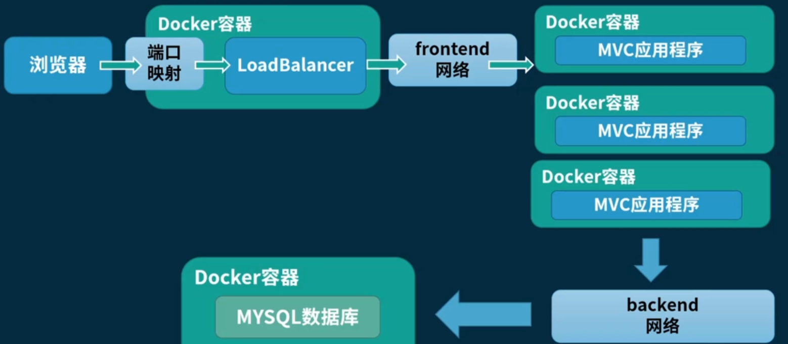

# 流程图



# 创建两个网络

```shell
docker network create -d bridge blog_backend_bridge
docker network create -d bridge blog_frontend_bridge

```


# mysql 连接网络

将  mysql 容器连接到 blog_backend_bridge bridge网络（这个容器之前创建时默认是docker0 bridge网络）

```shell
docker network connect blog_backend_bridge 566e3d764f8b

```


# 创建镜像

将一个 asp.net core 博客项目通过 Dockerfile build 镜像

```shell
docker build . -t blog:1.0 -f Dockerfile    

```


# save镜像到本地

```
docker image save blog:1.0 -o blog.image

```


# 镜像上传服务器

使用 xftp 上传 linux 服务器 


# 在服务器load镜像

```shell
docker image load -i blog.image 

```


# 配置文件上传服务器用于配置文件挂载

使用 xftp 上传 linux 服务器 


# 创建应用程序容器

容器创建并运行，连接到 blog_backend_bridge和 blog_frontend_bridge网络，挂载配置文件（在主机挂载的配置文件目录下执行），

```shell
docker run -d --name blogapp1 --network blog_backend_bridge -v "$(pwd)/appsettings.json:/app/appsettings.json" blog:1.0
docker run -d --name blogapp2 --network blog_backend_bridge -v "$(pwd)/appsettings.json:/app/appsettings.json" blog:1.0
docker run -d --name blogapp3 --network blog_backend_bridge -v "$(pwd)/appsettings.json:/app/appsettings.json" blog:1.0
docker run -d --name blogapp4 --network blog_backend_bridge -v "$(pwd)/appsettings.json:/app/appsettings.json" blog:1.0
docker network connect blog_frontend_bridge blogapp1
docker network connect blog_frontend_bridge blogapp2
docker network connect blog_frontend_bridge blogapp3
docker network connect blog_frontend_bridge blogapp4

```

连接字符串可以直接使用容器名

```shell
"ConnectionString": "Server=mysql-latest;User Id=root;Password=123456;Port=3306;Database=db;Allow User Variables=True"
```


# 使用 HAProxy 做负载均衡方案

参考：https://www.cnblogs.com/kevingrace/p/6138150.html


# haproxy.cfg 文件上传到服务器用于配置文件挂载

```json
defaults
    timeout connect 5000
    timeout client 50000
    timeout server 50000

frontend localnodes
    bind *:80
    mode http
    default_backend blogs

backend blogs
    mode http
    balance roundrobin
    server blogapp1 blogapp1:81 check
    server blogapp2 blogapp2:81 check
    server blogapp3 blogapp3:81 check
    server blogapp4 blogapp4:81 check
```

注意: linux 环境下配置文件编码使用UTF-8行尾选用LF

frontend localnodes bind *:80为默认端口，blogapp1:81为构建容器镜像的EXPOSE端口


使用 xftp 上传 linux 服务器 


# 使用 haproxy.cfg 文件创建负载均衡容器

创建并运行，连接到 blog_frontend_bridge bridge网络，创建配置文件挂载（haproxy.cfg文件当前目录下的执行）

```shell
docker run -d --name blogbalancer --network blog_frontend_bridge -v "$(pwd)/haproxy.cfg:/usr/local/etc/haproxy/haproxy.cfg" -p 9000:80 haproxy:1.7.0
```


# 备注

挂载到服务器中的配置文件为生产配置文件，更新容器时只要挂载路径保持，就可以从开发配置切换为生产配置。

创建的两个网络名称不一定要与 haproxy.cfg 配置文件的 frontend backend 节点同名


后续改用 docker compose 进行管理


