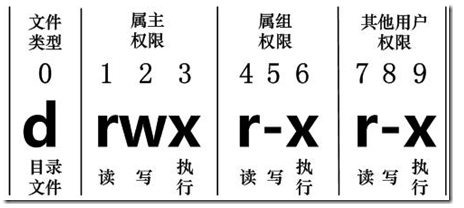

---

---

Linux 系统是一种典型的多用户系统，不同的用户处于不同的地位，拥有不同的权限。为了保护系统的安全性，Linux 系统对不同的用户访问同一文件（包括目录文件）的权限做了不同的规定。 


> 查看文件属性

```bash
[root@VM-20-7-centos /]# ls -al
total 84
dr-xr-xr-x.  20 root root  4096 Feb 23 21:43 .
dr-xr-xr-x.  20 root root  4096 Feb 23 21:43 ..
lrwxrwxrwx.   1 root root     7 Mar  7  2019 bin -> usr/bin
dr-xr-xr-x.   5 root root  4096 Feb 15 19:02 boot
drwxr-xr-x    2 root root  4096 Nov  5  2019 data
drwxr-xr-x   19 root root  2980 Feb 19 18:59 dev
drwxr-xr-x.  87 root root 12288 Feb 19 18:59 etc
drwxr-xr-x.   7 root root  4096 Feb 23 09:47 home
lrwxrwxrwx.   1 root root     7 Mar  7  2019 lib -> usr/lib
lrwxrwxrwx.   1 root root     9 Mar  7  2019 lib64 -> usr/lib64
drwx------.   2 root root 16384 Mar  7  2019 lost+found
drwxr-xr-x.   2 root root  4096 Apr 11  2018 media
drwxr-xr-x.   2 root root  4096 Apr 11  2018 mnt
drwxr-xr-x.   3 root root  4096 Mar  7  2019 opt
dr-xr-xr-x  107 root root     0 Feb 19 18:59 proc
dr-xr-x---.   7 root root  4096 Jan 14 11:29 root
drwxr-xr-x   25 root root   920 Feb 23 10:59 run
lrwxrwxrwx.   1 root root     8 Mar  7  2019 sbin -> usr/sbin
drwxr-xr-x.   2 root root  4096 Apr 11  2018 srv
dr-xr-xr-x   13 root root     0 Feb 21 23:54 sys
drwxrwxrwt.   9 root root  4096 Feb 23 10:59 tmp
drwxr-xr-x.  13 root root  4096 Mar  7  2019 usr
drwxr-xr-x.  19 root root  4096 Jan 14 11:27 var
drwxr-xr-x    7 root root  4096 Jan 14 11:29 www
```

每个文件的属性由左边 10 个字符来确定



从左至右用 **0-9** 这些数字来表示。第 **0** 位确定文件类型，第 **1-3** 位确定属主（该文件的所有者）拥有该文件的权限。 第4-6位确定属组（所有者的同组用户）拥有该文件的权限，第7-9位确定其他用户拥有该文件的权限。其中，第 **1、4、7** 位表示读权限，如果用 r 字符表示，则有读权限，如果用 - 字符表示，则没有读权限；第 **2、5、8** 位表示写权限，如果用 w 字符表示，则有写权限，如果用 - 字符表示没有写权限；第 **3、6、9** 位表示可执行权限，如果用 x 字符表示，则有执行权限，如果用 - 字符表示，则没有执行权限。 


> Linux文件属主和属组

对于文件来说，它都有一个特定的所有者，也就是对该文件具有所有权的用户（属主）。同时，在Linux系统中，用户是按组分类的，一个用户属于一个或多个组。文件所有者以外的用户又可以分为文件所有者的同组用户和其他用户属组（属组）。因此，Linux系统按文件所有者、文件所有者同组用户和其他用户来规定了不同的文件访问权限。

```bash
drwxr-xr-x    2 root root  4096 Nov  5  2019 data
```

  data 文件是一个目录文件，属主和属组都为 root，属主有可读、可写、可执行的权限；与属主同组的其他用户有可读和可执行的权限；其他用户也有可读和可执行的权限。对于 root 用户来说，一般情况下，文件的权限对其不起作用。


> 更改文件属性


