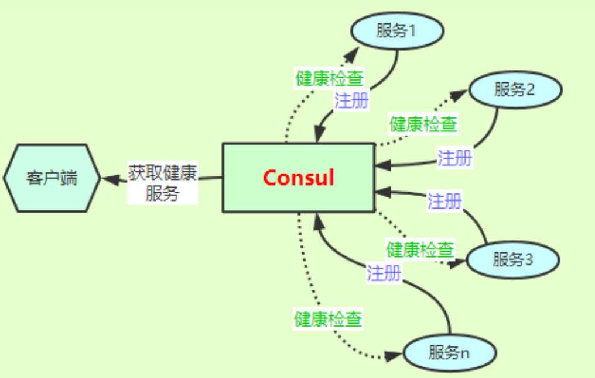

# 前言

在微服务架构中，对于一个系统，会划分出多个微服务，而且都是独立开发、独立部署，最后聚合在一起形成一个系统提供服务。当服务数量增多时，这些小服务怎么管理？调用方又怎么能确定服务的 IP 和端口？服务挂掉了又怎么办？单靠人工处理已经不太现实，使用系统统一管理就是最好的选择，常用的服务发现产品有：Consul、Zookeeper、Etcd、Eureka 等，而对于 Consul 在 .NetCore 中是很火的。


# Consul 简介

Consul 是一个支持多数据中心、分布式、高可用的服务发现和配置共享的系统，开箱即用，主要功能如下：

- **服务发现：**可以通过 Consul 客户端注册服务，这里服务可以是 API 站点、Redis 服务器、MySql 服务器等；当其他客户端需要使用对应的服务时，Consul 可以通过 DNS 或 HTTP 的形式将服务返回给所需客户端；无需再手动指定 IP 和端口，由 Consul 统一管理。
- **健康检查：**Consul 提供对各服务进行检查的功能，相关人员可以通过检查信息关注各服务的运行情况；而对于的服务的使用者，可以避免访问不健康的服务，如当一个 API 站点挂掉了，调用方从 Consul 中获取服务信息时就获取不到，而是返回健康的服务信息，从而保证调用 API 正常。
- **键值对存储：**可以存储键值对数据，很适合当配置中心使用。比如有多个服务，每个服务都一些配置信息，可以将其统一配置在 Consul 中，避免每一个服务重复配置，很大程度降低了配置错误导致的风险。
- **多数据中心：**Consul 支持多个开箱即用的数据中心，每个数据中心独立运行。


服务发现和健康检查的应用，大概的一个流程如下

- 各服务通过配置文件或代码的形式进行注册，即把信息报给 Consul。
- Consul 根据注册的信息，对已经注册服务进行健康检查；Grpc、TCP、HTTP方式都可以。
- 客户端如果需要使用服务信息，如 IP 和端口，可以通过 Consul 进行获取健康的服务(服务发现)；DNS 和HTTP 两种方式都可以。




Consul 主要做三件事：提供服务到 ip 地址的注册，提供服务到 ip 地址列表的查询，对提供服务方的健康检查。


# 开发环境 Consul 安装

- 官网：https://www.consul.io/

- Consul安装：直接在官网下载解压即可。
- Consul运行：在consul.exe目录下打开命令行执行 `consul.exe agent -dev`
- 浏览器访问：http://localhost:8500/


# 服务注册

**在服务代码中进行服务注册**

Nuget 安装 Consul，添加服务注册代码

```c#
public static class ConsulHelper
{
    /// <summary>
    /// 服务注册到 consul
    /// </summary>
    /// <param name="app"></param>
    /// <param name="lifetime"></param>
    public static IApplicationBuilder RegisterConsul(this IApplicationBuilder app, IConfiguration configuration, IHostApplicationLifetime lifetime)
    {
        var consulClient = new ConsulClient(c =>
                                            {
                                                // consul地址
                                                c.Address = new Uri(configuration["ConsulSetting:ConsulAddress"]);
                                            });

        var servicePort = Environment.GetEnvironmentVariable("SERVICEPORT");// 服务端口 如果要运行多个实例，端口不能在appsettings.json里配置，在 docker 容器运行时传入环境变量指定端口
        var registration = new AgentServiceRegistration()
        {
            ID = Guid.NewGuid().ToString(),// 服务实例唯一标识
            Name = configuration["ConsulSetting:ServiceName"],// 服务名
            Address = configuration["ConsulSetting:ServiceIP"], // 服务IP
            Port = string.IsNullOrEmpty(servicePort) ? int.Parse(configuration["ConsulSetting:ServicePort"]) : int.Parse(servicePort),
            Check = new AgentServiceCheck()
            {
                DeregisterCriticalServiceAfter = TimeSpan.FromSeconds(5),// 服务启动多久后注册
                Interval = TimeSpan.FromSeconds(10),// 健康检查时间间隔
                HTTP = $"http://{configuration["ConsulSetting:ServiceIP"]}:{configuration["ConsulSetting:ServicePort"]}{configuration["ConsulSetting:ServiceHealthCheck"]}",//健康检查地址
                Timeout = TimeSpan.FromSeconds(5)// 超时时间
            }
        };

        // 服务注册
        consulClient.Agent.ServiceRegister(registration).Wait();

        // 应用程序终止时，取消注册
        lifetime.ApplicationStopping.Register(() =>
                                              {
                                                  consulClient.Agent.ServiceDeregister(registration.ID).Wait();
                                              });

        return app;
    }
}
```


在 Startup Configure 中添加 Consul 服务注册配置

```c#
app.RegisterConsul(Configuration, lifetime);
```


appsettings.json 添加 Consul 配置

```json
"ConsulSetting": {
    "ServiceName": "MinishopAdminApiService",
    "ServiceIP": "localhost",
    "ServicePort": 5004, // 服务端口 如果要运行多个实例，端口不能在appsettings.json里配置，在 docker 容器运行时传入环境变量 SERVICEPORT 指定端口
    "ServiceHealthCheck": "/WeatherForecast", // 健康检测接口
    "ConsulAddress": "http://localhost:8500" // 注意，docker 容器内部无法使用 localhost 访问宿主机器，应该改为 host.docker.internal；如果是控制台启动的话就用 localhost
}
```


由于我的 demo 是通过 `docker-compose` 进行部署，在使用 `docker-compose scale` 进行服务扩展的时候无法指定给代码中的端口绑定实现多服务的注册。

为容器指定自己的配置文件启动容器，扩展服务。

```
docker create -p 50041:80 --name minishopadminapi-web-2 adminapi -v D:/dockervolumes/minishopadminapi-1/appsettings.json:/app/appsettings.json -v D:/dockervolumes/minishopadminapi-1/log:/app/log -e CONNECTIONSTRING="server=minishopadminapi-db-1;database=MiniShopAdminDB;uid=root;pwd=123456;SslMode=None;ConnectionReset=false;connect timeout=3600" --network=minishopadminapi_backend
```


```shell
docker run -d -p 50041:80 --name minishopadminapi-web-2 adminapi -v D:/dockervolumes/minishopadminapi-1/appsettings.json:/app/appsettings.json -v D:/dockervolumes/minishopadminapi-1/log:/app/log --network=minishopadminapi_backend
```


# 使用 Docker 安装 Consul 

参考：http://t.zoukankan.com/craigtaylor-p-13989921.html


windows 启动 Consul  下安装命令

```shell
docker run --publish 8600:8600 --publish 8500:8500 --publish 8300:8300 --publish ^ 8301:8301 --publish 8302:8302 --name consul-01 --restart always ^
--volume D:/dockervolumes/consul/data:/consul/data ^
--volume D:/dockervolumes/consul/config:/consul/config ^
consul:latest ^
agent -server ^
-bootstrap-expect=1 ^
-ui ^
-bind=0.0.0.0 ^
-client=0.0.0.0
```


启动 api 服务


```
docker-compose -f Docker-Compose-AdminApi.yml -p minishopadminapi --env-file adminapi.env up --detach --scale web=6
```


Consul 会加载`consul/config`目录下所有`*.josn` 服务配置文件


在挂载目录`D:/dockervolumes/consul/config`下添加 `minishopadmin-service.json` 文件

```json
{
  "service": {
    "name": "minishopadmin-service",
    "tags": ["master"],
    "address": "host.docker.internal",
    "port": 22044,
    "checks": [
      {
        "http": "http://host.docker.internal:22044/WeatherForecast",
        "interval": "5s"
      }
    ]
  }
}
```


重启 Consul 服务


Consul  在生产环境要建集群，要至少一台 server 多台 agent。Consul 重启后数据丢失怎么处理？ 


