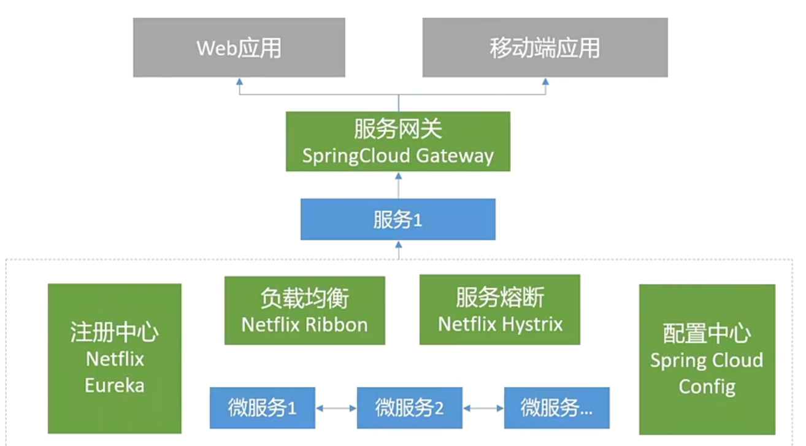
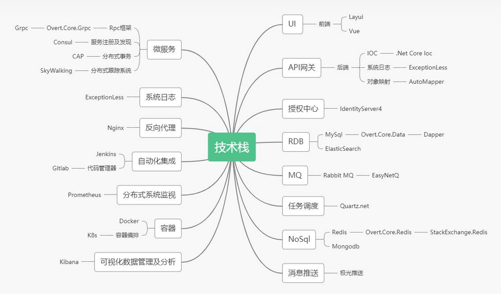

# 微服务产生的背景

软件系统架构演进历史

## 单体架构

是一种将所有功能打包在一个容器内运行的设计风格，一个实例集成了一个系统的所有功能，通过负载均衡软件/设备实现多实例调用。

优点

- 易开发

- 易调试

- 易部署

挑战

- 可靠性差
- 不易协调
- 升级困难

## 面向服务架构（SOA）

是一种分布式服务架构的常见方式，他将应用程序的不同功能单元（成为服务）进行拆分，并通过这些服务之间定义明确的接口和协议联系起来，进而实现跨服务单元/系统交互能力。

优点

- 松耦合
- 独立性
- 可重用

挑战

- 随着大型互联网公司和组织机构对大规模弹性部署和敏捷开发的需求，面向服务的架构逐渐难以应付。
- 伴随虚拟化技术、容器技术的不断发展，持续交付方案论的深入人心，微服务应运而生。

## 微服务

微服务（Microservices）是一种软件架构风格，它是以专注于单一职责与功能的小型功能区块（服务）为基础，服务之间相互协调相互配合，为用户提供最终价值。每个服务运行在独立的进程中，服务间采用轻量级通信机制相互沟通，每个服务都围绕着具体业务进行构建，并能够独立部署。

- 是一套架构方法和体系
- 由很多体量小实现特定功能或业务的服务构成
- 服务松耦合、独立开发部署
- 服务可用不同语言开发

微服务相比 SOA 优势

- 复用率更高
- 快速响应
- 弹性扩展
- 支持异构

## 微服务要解决的问题

- 服务划分
  - 划分原则
    - 业务边界清晰。各个服务有清晰的责任及边界，一个服务对应一块业务，服务间多为单向依赖。
    - 最小化的表更。新增或变更业务上有明确的服务对应，某一业务需求的变更受影响的服务应该尽可能的少。
    - 最大化的复用。服务设定要考虑复用场景，应该尽可能最大化的实现服务复用。
    - 面向对象设计中的三大原则，单一职责、高内聚、低耦合，同样适用于微服务的服务划分设计。
- 统一认证授权
- 服务治理(注册/发现/熔断)
- 服务网关、黑名单、分流、负载
- 延迟队列
- 缓存设计
- 分布式事务实现，数据的幂等、消息不丢失、服务之间的通讯(rpc or http)
- 分布式日志，日志归档如elk

微服务痛点

- 业务架构复杂
- 拆分粒度难以把握

- 数据一致性
- 多服务器运维
- 服务合理拆分
- 分布式通讯

## 微服务技术框架典型代表

- Spring Cloud

  Spring Cloud 是一个基于 Spring boot 实现的服务治理框架， Spring boot 专注于快速、方便集成多个单个个体， Spring Cloud关注全局服务治理。

  

  - 
      - Zuul：服务网关
      - Netflix Eureka：核心组件，负责服务注册管理服务列表。
      - Netflix Ribbon：提供客户端的软件负载均衡算法，将 Netflix 的中间层服务连接在一起。
      - Netflix Hystrix：隔离措施的一种实现，可以设置在某种超时或者失败的情况下断开依赖调用或者返回指定逻辑，从而提高分布式系统的稳定性。 
      - Spring Cloud Config：解决分布式系统的配置管理方案，包含了客户端和服务端两部分，将配置信息中央化保存。
      - SpringCloud Security：安全认证，用于构建安全的应用程序和服务，在Spring boot的基础上可快速创建实现常见模式的系统安全，如单点登录、令牌中继和交换
      - SpringCloud Sleuth：服务链路跟踪，能跟踪一个有用户请求过程，捕获跟踪数据，构建微服务整个调用链视图，是调试和监控微服务的重要工具。

- Dubbo

  Dubbo 是阿里开源的一款高性能轻量级分布式 RPC 框架，他提供了三大核心能力：面向接口的远程调用、智能容错和负载均衡、以及服务自动注册和发现。

## .Net Core 微服务技术选型

Spring cloud 是使用 java 开发的。使用 java 在 Spring cloud 下开发最舒服，使用 steelto（https://steeltoe.io/）这个开发包也可以使用 .Net Core 开发Spring cloud 下的微服务，但开发体验不如 java 高效，而且支持的软件版本更新不如 Java 快。使用 Zuul 时，可能需要编写一些 java 代码。

因此，如果整个项目的技术栈是spring cloud，那么 net core 开发者可以借助 steelto 的帮助下“寄居”。如果自己技术栈的选择权，那么你可以搭建更亲近  .Net Core  的微服务框架。

Service fabric 是微软开源的是微软内部使用的第三代微服务框架。它可以使用 .Net Core 或 Java 进行开发。但是目前的开源版本不适合普通厂商使用（困难；跨平台；通用性；支持私有云，但难度大）请谨慎使用。如果你愿意花钱在 Azure 云上使用 SF，你可以使用它。但是如果你想构建SF私有云，请谨慎使用。

如果使用 .Net Core 技术栈的第二代微服务框架，推荐使用腾讯（微信支付清算网关）在使用的架构：Consul + Ocelot + .Net Core + Plolly + ...... 。

开源项目NanoFabric（https://github.com/geffzhang/NanoFabric）基于Consul + .NET Core + Polly + Ocelot + Exceptionless + IdentityServer 等开源项目的微服务开发框架。

在 NanoFabric 中，Consul 做服务治理和服务发现，Polly 做熔断降级，Ocelot做网关。

在 .net core 中，服务之间的通讯的主流形式

- http：Restful webapi
- 二进制 RPC：二进制传输协议，Thrift、gRPC

## 微服务架构技术栈

https://zhuanlan.zhihu.com/p/126739662

