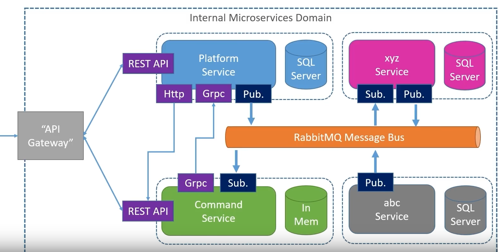
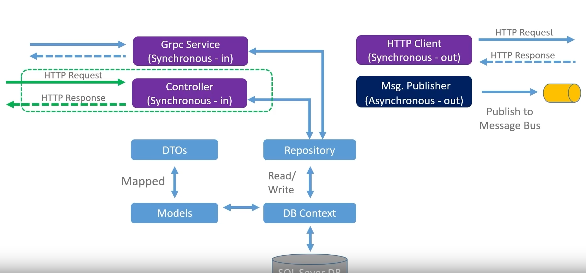

# 方案架构







创建一个 webapi 项目

```
dotnet new webapi -n PlatformService --framework net5.0
```


打开项目

```
code -r .\PlatformService\
```


添加依赖项（或 Ctrl + Shift +p 选择 NuGet Package Manager 添加 NuGet 包）

```
dotnet add package AutoMapper.Extensions.Microsoft.DependencyInjection -v 11.0.0
dotnet add package Microsoft.EntityFrameworkCore -v 5.0.15
dotnet add package Microsoft.EntityFrameworkCore.Design -v 5.0.15
dotnet add package Microsoft.EntityFrameworkCore.InMemory -v 5.0.15
dotnet add package Microsoft.EntityFrameworkCore.SqlServer -v 5.0.15
```


创建 model


创建 DB Context


