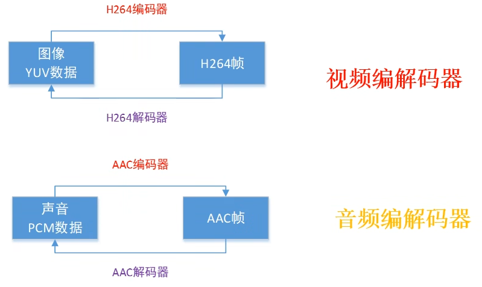
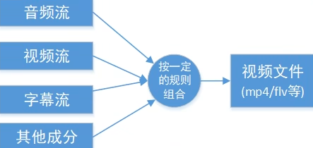
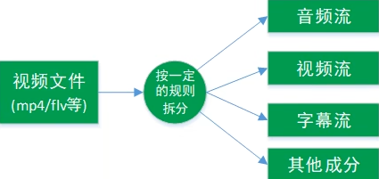
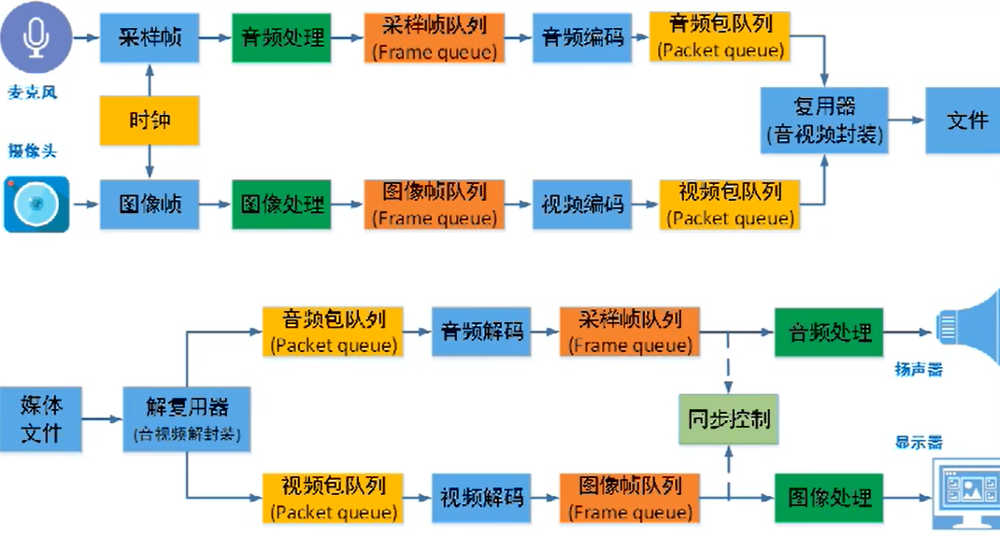

#### 容器/文件

即特定格式得多媒体文件，比如 mp4、flv、mkv 等。所谓封装格式就是将已经编码压缩好的视频轨和音频轨按照一定的格式放到一个文件中，也就是说仅仅是一个外壳，或者大家把它当成一个放视频轨和音频轨的文件夹也可以。说得通俗点，视频轨相当于饭，而音频轨相当于菜，封装格式就是一个碗，或者一个锅，用来盛放饭菜的容器。

**音频容器：**

- WAV， Windows平台中广泛使用的格式，也是44.1K的取样频率，16位量化数字，存储了音频的波形数据，在很多游戏包中见过；
- AIFF，广泛用于MacOS平台，支持16位44.1kHz立体声，是数字音频（波形）的数据；
- MP3，MPEG-1的第3层;
- MP4A 和 AAC，使用了 MPEG-4 的音频标准，对 MP3 的音质有所改善。

**视频容器：**

- AVI 英文全称为 Audio Video Interleaved，即音频视频交错格式。是将音频和视频同步组合在一起的容器格式。它采用了一种有损压缩方式，但压缩比较高，因此尽管画面质量不是太好，但其应用范围仍然非常广泛。AVI 支持 256 色和 RLE 压缩。
- IFF 是 Amiga 等超级图形处理平台上使用的一种图形文件格式。IFF 图形文件格式，好莱坞的特技大片多采用该格式进行处理，可逼真再现原景。
- ASF 是标准的 WMA 和 WMV 的容器，是 Advanced Streaming Format 高级串流格式的缩写，微软自Win98 时开始使用该格式。
- WMV 有 ASF 延伸得来，是一种微软推出的流媒体格式，WMV1 是微软采用 MPEG-4.Part2 改进出来的，到 WMV9 则成了 SMPTE 的一个独立标准 421M，也称为 VC-1，使用了档次的概念来区分所支持的不同应用和数据设置。
- FLV 专门用于 FlashVideo 的容器，可以使用 SorensonSpark 的编解码器，也可以使用 On2 公司的 VP6 编解码器。
- MOV 苹果公司开发的标准 QuickTime 视频容器。
- TS 是数字广播的标准容器，支持多种视频和音频流。
- MP4 针对 MPEG-4 多媒体组合的标准音视频容器。
- Ogg 针对 Xiph.org 编解码器的标准音频容器，但也可以作为视频容器。
- OGM 针对 Xiph.org 编解码器的标准视频容器。
- RM/RMA/RMV/RMVB 针对 Realvideo 和 RealAudio 的标准容器。
- MKV 不针对任何编解码器，是一个开放的容器格式。
- 3GP 移动电话多使用该格式。
- DV 用于 DV 磁带的存储与编辑格式。
- M2V M4V 多为 DVD 上的视频格式。

#### 媒体流（Stream）

常见流媒体协议包括HTTP渐进下载和基于RTMP/RTP的实时流媒体协议，这两种是完全不同的东西。直播中常见流媒体协议包括RTMP，HLS，HTTP FLV等。

**RTMP**

Real Time Messaging Protocol，实时消息传送协议是Adobe为Flash播放器和服务器间音视频传输开发的开放协议。基于TCP实现，一般延迟在1-3s左右。

**HLS**

HTTP Live  Streaming是苹果实现的基于HTTP的流媒体传输协议，可实现流媒体直播和点拨。HLS点播基本上就是常见的分段HTTP点播，不同的是它分段很小。基本原理就是把视频流切片成TS，并建立M3U8索引。相对于RTMP、RTSP等，HLS的客户端获取的并不是一个完整数据流，而是不断的下载并播放切片。这种特点决定了它的延迟一般高于普通的流媒体直播协议。

**HTTP-FLV**

基于HTTP长连接，和RTMP一样，每个时刻的数据收到后都会立刻转发，只是使用的是HTTP协议，一般延迟在1-3s

#### WebRTC

网页即时通讯技术Web Real-Time Communication是谷歌的一个实时通讯解决方案，它通过浏览器实现音视频的采集和播放，可以通过建立的通道进行音视频的数据共享，被纳入W3C推荐标准，被主流浏览器支持。详细介绍会在之后发出。

#### 数据帧/数据包（Frame/Packet）

通常一个媒体流是由大量的数据帧组成的，对于压缩数据，帧对应着编码器的最小处理单元，分属于不同媒体流的数据帧交错存储于容器之中。一般情况下，Frame对应压缩前的数据，Packet对应压缩后的数据。

#### 编解码器（Codec）

**软编解码**

如H264，H265，MPEG-4等编解码算法，更消耗CPU

**硬编解码**

由于高清视频的出现，编解码逐渐让CPU感到吃力。人们发现这种大数据量低难度的重复工作更适合让GPU干，称为硬编解码。实际上没有纯粹的硬编解码，只是其中大量运算的主力从CPU变为GPU。

**目前有最常见的编码方式：**

mpeg1：vcd使用的就是这种编码格式，分辨率是352*288，压缩比低

mpeg2：一般DVD使用，有NTSC(720*480)和PAL （720*576），和mpeg1一样属于即将被淘汰的编码格式。

mpeg4 ：目前使用最多的技术，avi文件始祖，大大提高压缩比，而质量堪比DVD

divx：基于mpeg4开发的，有一定算法优化

xvid：divx技术封锁之后被人破解开发的，也是基于mpeg4的编码技术更先进，采用开放源码，画质更好

h.261:早期的低码率编码，应用于352x288和176x144，现在已不用

h.263：在低码率下能够提供比H.261更好的图像效果，改进一些算法

h.263+：h.263的改进型

h.264 ：H.264集中了以往标准的优点，高效压缩，

RV.10 RV.13 RV.20 RV.30 RV40: real 公司推出的应用于网络的高压缩编码，是不同时期rm和rmvb的编码

以帧为单位实现压缩数据和原始数据之间的相互转换。

#### 复用（mux）解复用（demux）

把不同流按照某种容器的规则放入容器，这种行为叫做复用。

把不同的流从某种容器中解析出来。

#### 码率、帧率、分辨率

**码率**：

码率、码流、比特率是一个东西，又称二进制位速率。单位bit/s或bps，kbps，Mbps等。码率是视频编码中画面质量控制中最重要的部分，通常同分辨率下，码率越大，压缩比就越小，画面质量就越高。码率越高，代表单位时间采样率越大，数据精度高，越接近原始文件，画质更清晰，但对播放设备的解码能力要求也就越高，文件体积也越大。

文件体积 = 时间 * 码率 / 8

例如，一部 90 分钟 1Mbps 码率的 720P RMVB 文件，它的体积是 5400 * 1 / 8 = 675 MB。

通常，一个视频文件包括视频和音频，视频和音频都有各自不同的采样方式和比特率。而我们常说的一个视频文件的码率大小，一般是指视频文件里音视频码率的和。

**帧率：**

FPS（Frames Per Second），和游戏中的FPS一个概念。高帧率可以得到更流畅的效果。帧率越高，对CPU消耗也越大。

通常普通视频15-20fps，电影常用24fps。由于人眼视觉暂留效应，一般超过12fps就可以认为流畅（仅对视频而言）

**分辨率：**

视频中图像的尺寸大小。例如 720P 是1280 * 720 个像素点，1080P 是1920 * 1080 个像素点。

#### 图像存储，RGB 和 YUV

视频由一张张图片组成，视频的文件大小也直接受图片大小和数量影响。那么影响一张图片大小的因素有哪些？这就需要了解色彩空间和图像编码。

**RGB**

RGB是我们非常熟悉的一种颜色空间。RGB模型使用三原色亮度来定量表示颜色，这是一种加色混色模型，适用于显示器等发光体的显示，几乎人眼所能看到的所有颜色都可以用RGB表示。传统RGB三原色表示一个像素，每种原色占用一个字节，一个像素则需要3字节。

**YUV**

YUV（又称YCrCb）是被欧洲电视系统采用的一种颜色编码方法，和RGB区别很大。YUV模型根据一个亮度分量Y和两个色度分量UV（分别表示色调和饱和度）来定义颜色。它最大的优点在于只需要占用极少的带宽（RGB要求三个独立的视频信号同时传输），同时由于Y和UV是分离的，当只有Y分量时表现的图像就是黑白灰度图像，这样完成了彩色电视机和黑白电视机的兼容问题，黑白电视得以接收彩色电视信号。

YUV格式分为两大类：planar和packed。planar是先连续存储所有像素点的Y，紧接着存储所有像素点的U，随后是所有像素点的V。而packed格式则交替存储每个像素点的YUV分量。

YUV常见的几种编码格式有YUV444，422，420和411，其中YUV420最常用。它们的含义如下。

- YUV444：YUV三个分量采样率相同，每个像素的三个分量信息完整，一个像素占用3字节。
- YUV422：每两个Y分量公用一个UV分量，一个像素占用2字节。
- YUV420：每四个Y分量公用一个UV分量，一个像素占用1.5字节。
- YUV411：每四个Y分量公用一个UV分量，一个像素占用1.5字节。

通过对YUV分量比例和排列顺序和位置的不同，实际上可以分为很多种格式，例如安卓相机默认图像格式属于YUV420SP。但显而易见，YUV带来的好处很多，通过减少UV分量可以显著减少每个像素占用的空间，这是因为人眼对色度的敏感程度低于对亮度的敏感程度。相对于RGB而言YUV编码可以节省很大空间。

**一幅图像大小**

一张图像所占字节大小 = 分辨率 * 二进制颜色位数 / 8 

其中**二进制颜色位数**由色彩编码格式决定。例如 RGB24 的量化位数是24位，RGB32 是32位，YUV420 是12位。也可以直接转化为字节计算，例如一帧1024 * 768分辨率采用 YUV422     编码的图像数据流大小为1024 * 768  *  2 = 1572864字节，就是1.5 MB大小。

#### IBP帧，IDR帧和GOP

**I帧**

I帧即关键帧，可以看作一帧画面的完整保留，压缩比和JPEG差不多，I帧的压缩可以去掉空间的冗余信息。

- 是一个全帧压缩编码帧。它把全帧图像信息进行JPEG压缩编码及传输
- 解码时仅用I帧数据就可以重构完整图像
- I帧描述了图像背景和运动主体的详情
- I帧不需要参考其他画面生成
- I帧是P帧和B帧的参考帧，它的质量直接影响到同组里以后各帧质量
- I帧是帧组GOP的基础帧（第一帧），一组中只有一个I帧
- I帧不需要考虑运动矢量
- I帧所占数据信息量比较大

**P帧**

P帧（predictive-frame）：前向预测编码帧（预测帧）。通过将低于图像序列中前面已编码帧的时间冗余信息来压缩传输数据量的编码帧，是以I帧为参考帧，在I帧中找到P帧‘某点’的预测值和运动矢量，取预测差值和运动矢量一起传送。在接收端根据运动矢量从I帧中找出‘某点’预测值并与差值相加得到P帧‘某点’样值，从而得到完整的P帧。

- P帧是I帧后相隔1-2帧的编码帧
- P帧使用运动补偿方法传送它与前面的I或P帧的差值和运动矢量
- 解码时必须将I帧中的预测值和预测误差求和后才能重构完整的P帧图像
- P帧属于前向预测的帧间编码，它只参考前面最靠近它的I帧或P帧
- P帧可以是其后面P帧的参考帧，也可以是其前后B帧的参考帧
- P帧是参考帧，它可能造成解码错误的扩散
- 由于是差值传送，P帧压缩比较高

**B帧**

B帧（bi-directional interpolated prediction  frame）：双向预测内插编码帧（双向预测帧），既考虑与源图像序列前面已编码帧，也顾及图像序列后面已编码帧间的时间冗余信息来压缩传输数据量的编码帧，是以前面的I或P帧和后面的P帧为参考帧，找出B帧中某点预测值和两个运动矢量，并取预测值和运动矢量传送。接收端根据运动矢量在两个参考帧中算出预测值并与差值求和，得到B帧某点样值，从而得到完整B帧。

- B帧由前面的I或P和后面的P来预测
- B帧传送的是它和前面的I或P和后面的P帧间的预测误差和运动矢量
- B帧是双向预测编码帧
- B帧压缩比最高，预测比较准确
- B帧不是参考帧，不会造成编码错误的扩散
- 运算量多，因此对硬件要求高

**IDR帧**

IDR（Instantaneous Decoding  Refresh）:即时解码刷新。I帧和IDR帧都是使用帧内预测的，它们都是同一个东西，在编解码中为了方便，将首个I帧和其他I帧区别开，就把第一个I帧称为IDR。作用是立刻刷新，使错误不至于传播，从IDR开始重新算一个新的序列进行编码。对IDR帧来说，它之后的所有帧都不能引用任何它之前的帧内容。播放器永远可以从一个IDR帧播放，因为它后边没有任何帧引用之前的帧。

**DTS**

Decode Time Stamp，解码时间戳，标识读入内存中的bit流什么时候开始送到解码器里进行解码，在解码阶段使用。

**PTS**

Presentation Time Stamp，用于度量解码后的视频帧什么时候显示出来，主要用于视音频的同步和输出。

**GOP**

Group Of Picture，是两个I帧间形成的一组图片。可以设置两个I帧之间的帧数量。

一般来说，I帧压缩略是7，和JPG差不多；P是20；B可以达到50。所以B帧可以节省大量空间，节省出的空间可以用来多保存一些I帧，这样在相同码率下可以提供更好的画质。在码率不变的前提下GOP值越大，P、B帧数量越多，平均每个I、P、B帧所占字节数就越多，也更容易获取较好的图像质量。

如果一个GOP里丢失了I帧，那么后面的PB帧就没用了，必须丢掉。但TCP协议会保证通常I帧不会丢失，UDP也会有更多策略保证I帧正确传输。

#### 视频录制/播放流程

音视频开发成长之路与音视频知识总结：

https://blog.csdn.net/u011686167/article/details/122464692?ops_request_misc=%257B%2522request%255Fid%2522%253A%2522166107024216782390564879%2522%252C%2522scm%2522%253A%252220140713.130102334.pc%255Fall.%2522%257D&request_id=166107024216782390564879&biz_id=0&utm_medium=distribute.pc_search_result.none-task-blog-2~all~first_rank_ecpm_v1~rank_v33_ecpm-8-122464692-null-null.142

音视频知识参考：

https://so.csdn.net/so/search?q=%E9%9F%B3%E9%A2%91&spm=1001.2101.3001.7020

https://so.csdn.net/so/search?q=%E8%A7%86%E9%A2%91&urw=

